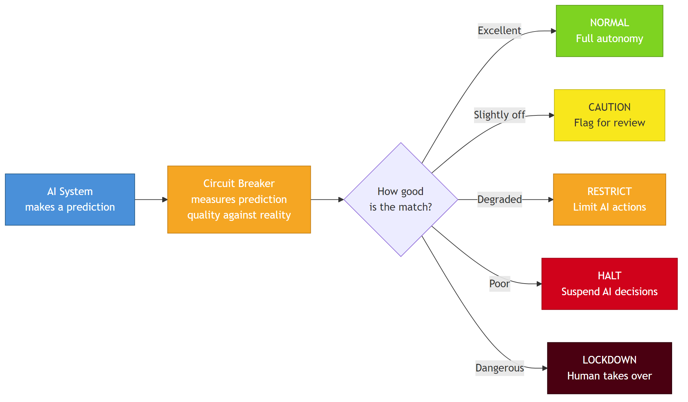
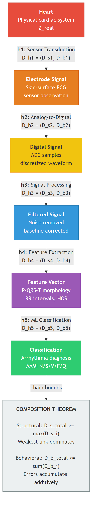
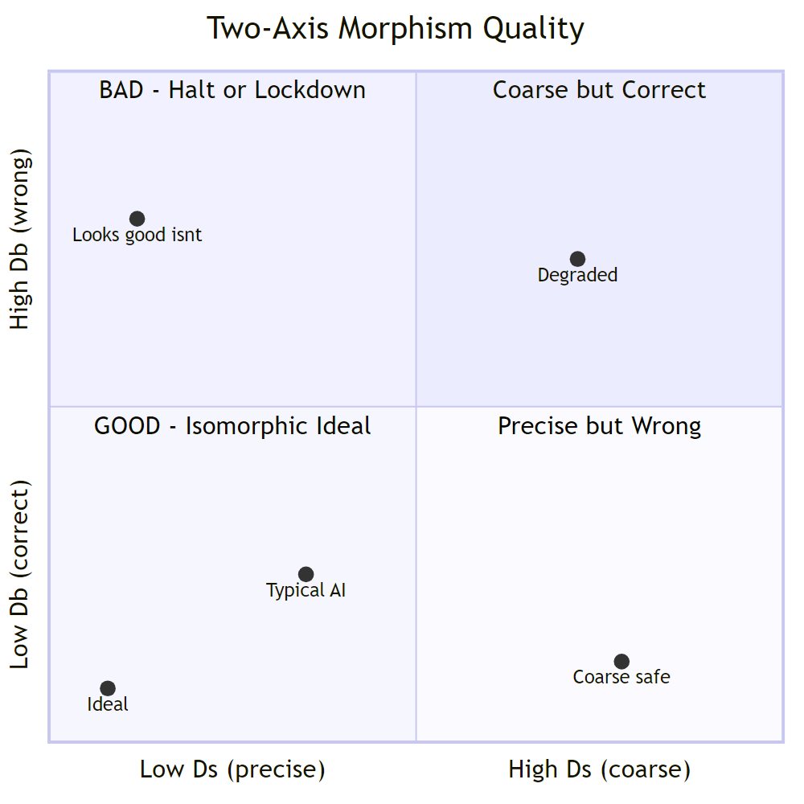
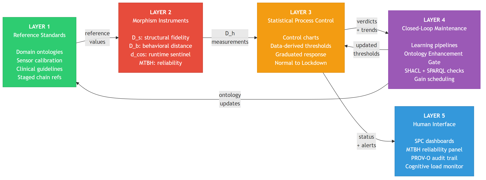
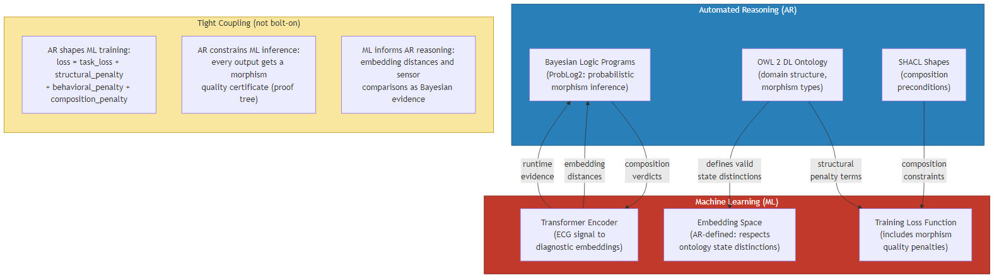
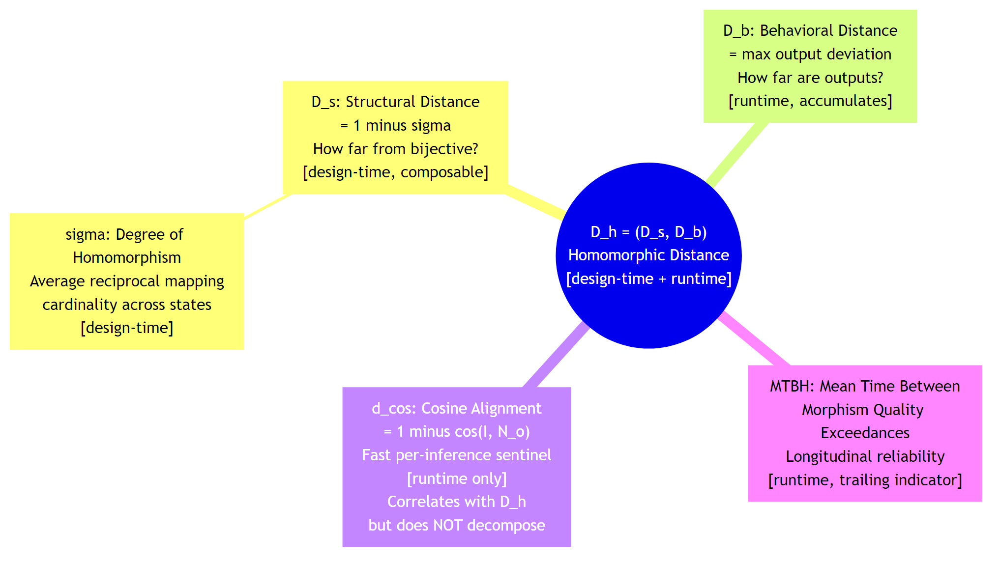
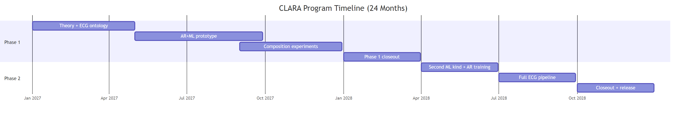
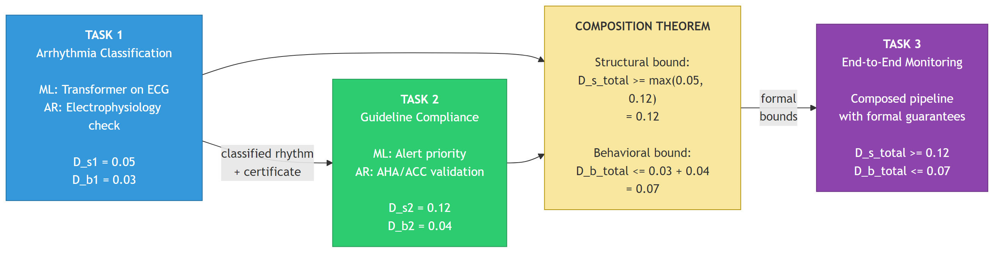

# DARPA CLARA Proposal: Research Quality Check
# "Morphism-Grounded Compositional Assurance for Autonomous AI Systems"

**DARPA-PA-25-07-02 | TA1 | PI: Paul F. Wach, Ph.D. (University of Arizona)**
**Date: 2026-03-24 | Working Document**

---

This document provides three research quality checks for the DARPA CLARA full proposal:

1. **Part I: Terminology Taxonomy** -- Every technical term defined, cited, and verified
2. **Part II: Tooling Inventory** -- Every tool, library, and standard described with verified citations
3. **Part III: Assumptions Audit** -- Every assumption identified, categorized, and risk-assessed
4. **Part IV: Concept Diagrams** -- Mermaid diagrams illustrating key concepts and workflows

---

ewpage

# Part I: Terminology Taxonomy

---

## 1. Morphism Theory

### Z (System Model)
- **Plain English:** A complete mathematical description of a system -- what states it can be in, what inputs it takes, what outputs it produces, and the rules for how it changes and what it reports.
- **Formal Definition:** A five-tuple Z = (S, I, O, N, R), where S is the set of states, I is the set of inputs, O is the set of outputs, N: S x I --> S is the next-state function, and R: S --> O is the readout function.
- **Source:** A. W. Wymore, *Model-Based Systems Engineering*, CRC Press, 1993.
- **Verification:** [VERIFIED] -- Wymore's 1993 book is a well-known foundational text in systems engineering. ISBN 0-8493-8012-X.

### S (State Set)
- **Plain English:** All the possible conditions or configurations a system can be in at any given moment.
- **Formal Definition:** The set S in the five-tuple Z = (S, I, O, N, R), representing the complete state space of the system model.
- **Source:** A. W. Wymore, *Model-Based Systems Engineering*, CRC Press, 1993.
- **Verification:** [VERIFIED]

### I (Input Set)
- **Plain English:** All the possible inputs or stimuli the system can receive from its environment.
- **Formal Definition:** The set I in the five-tuple Z = (S, I, O, N, R), representing the input alphabet of the system model.
- **Source:** A. W. Wymore, *Model-Based Systems Engineering*, CRC Press, 1993.
- **Verification:** [VERIFIED]

### O (Output Set)
- **Plain English:** All the possible outputs or responses the system can produce.
- **Formal Definition:** The set O in the five-tuple Z = (S, I, O, N, R), representing the output alphabet of the system model.
- **Source:** A. W. Wymore, *Model-Based Systems Engineering*, CRC Press, 1993.
- **Verification:** [VERIFIED]

### N (Next-State Function)
- **Plain English:** The rule that says "if the system is in state X and receives input Y, it moves to state W." It is the system's transition logic.
- **Formal Definition:** N: S x I --> S. Given a current state and an input, N produces the next state.
- **Source:** A. W. Wymore, *Model-Based Systems Engineering*, CRC Press, 1993.
- **Verification:** [VERIFIED]

### R (Readout Function)
- **Plain English:** The rule that says "if the system is in state X, this is what you can observe from the outside." It maps internal states to visible outputs.
- **Formal Definition:** R: S --> O. Maps each state to an observable output.
- **Source:** A. W. Wymore, *Model-Based Systems Engineering*, CRC Press, 1993.
- **Verification:** [VERIFIED]

### Z_ai (AI System Model)
- **Plain English:** The AI's internal picture of the world -- its representation of what states exist, what inputs matter, and how things change.
- **Formal Definition:** The Wymore five-tuple Z_ai = (S_ai, I_ai, O_ai, N_ai, R_ai) representing the AI agent's internal model of its domain.
- **Source:** Novel (this work). Builds on Wymore's five-tuple formalism [1993] by applying it to characterize AI agent internal representations.
- **Verification:** [N/A -- Novel term]

### Z_real (Real-World System)
- **Plain English:** The actual physical system that exists in reality -- the ground truth that the AI is trying to model.
- **Formal Definition:** The Wymore five-tuple Z_real = (S_real, I_real, O_real, N_real, R_real) representing the true physical or logical system being modeled.
- **Source:** Novel (this work). Builds on Wymore's five-tuple formalism [1993] by using it as the reference standard for the physical world.
- **Verification:** [N/A -- Novel term]

### Homomorphism (h)
- **Plain English:** A structure-preserving mapping between two systems. If you map from a detailed model to a simpler one, and the mapping respects the rules of both systems (transitions and outputs stay consistent), you have a homomorphism.
- **Formal Definition:** A mapping h: Z_ai --> Z_real exists if and only if surjections (h_i, h_o, h_q) on inputs, outputs, and states respectively satisfy the commutativity condition: mapping-then-transitioning yields the same result as transitioning-then-mapping. Formally, h_q(N_ai(s, i)) = N_real(h_q(s), h_i(i)) for all s in S_ai, i in I_ai, and h_o(R_ai(s)) = R_real(h_q(s)) for all s in S_ai.
- **Source:** A. W. Wymore, *Model-Based Systems Engineering*, CRC Press, 1993.
- **Verification:** [VERIFIED]

### Isomorphism
- **Plain English:** A perfect one-to-one correspondence between two systems. Every state in one maps to exactly one state in the other, and vice versa. The systems are structurally identical.
- **Formal Definition:** A homomorphism h: Z_ai --> Z_real where all component surjections (h_i, h_o, h_q) are bijective (one-to-one and onto). D_h = (0, 0).
- **Source:** A. W. Wymore, *Model-Based Systems Engineering*, CRC Press, 1993.
- **Verification:** [VERIFIED]

### Surjection (Surjective Mapping)
- **Plain English:** A mapping where every element in the target set is "hit" by at least one element from the source. Nothing in reality is left unmapped, but multiple AI states might map to the same real state.
- **Formal Definition:** A function f: A --> B is surjective if for every b in B, there exists at least one a in A such that f(a) = b.
- **Source:** Standard mathematical definition. See any abstract algebra text, e.g., S. Lang, *Algebra*, Springer, 2002.
- **Verification:** [VERIFIED] -- Standard mathematical concept.

### Bijection (Bijective Mapping)
- **Plain English:** A perfect one-to-one pairing where every element in the source maps to exactly one unique element in the target, and vice versa. No information is lost or conflated.
- **Formal Definition:** A function f: A --> B that is both injective (one-to-one) and surjective (onto). Every element in A maps to a unique element in B, and every element in B is mapped to.
- **Source:** Standard mathematical definition.
- **Verification:** [VERIFIED] -- Standard mathematical concept.

### Commutativity (of Morphism Diagrams)
- **Plain English:** The property that says "it doesn't matter which order you do things." If you first map states between systems and then transition, you get the same result as if you first transition and then map. The diagram "commutes."
- **Formal Definition:** For homomorphism h with state mapping h_q, input mapping h_i: h_q(N_ai(s, i)) = N_real(h_q(s), h_i(i)) for all s, i. Equivalently, the following diagram commutes: mapping then transitioning equals transitioning then mapping.
- **Source:** A. W. Wymore, *Model-Based Systems Engineering*, CRC Press, 1993; also standard category theory, S. Mac Lane, *Categories for the Working Mathematician*, Springer, 1971.
- **Verification:** [VERIFIED]

### Composition (of Morphisms)
- **Plain English:** Chaining mappings together. If you have a mapping from A to B, and another from B to C, you can compose them into a single mapping from A to C. Crucially, the quality of the chain is bounded by the quality of its links.
- **Formal Definition:** Given morphisms h1: Z1 --> Z2 and h2: Z2 --> Z3, the composition h2 . h1: Z1 --> Z3 is itself a morphism. The composition theorem states: D_s_total >= max(D_s_i) and D_b_total <= sum(D_b_i).
- **Source:** The composition operation is standard (Wymore, 1993; Mac Lane, 1971). The specific composition bounds for D_s and D_b are Novel (this work), building on P. Wach et al., "Systems theoretic co-pilot MVP," CSER, 2025 and P. Wach, B. Sandmann, and A. Iyer, "Toward a library of isomorphic patterns for systems engineering," CSER, 2026.
- **Verification:** [VERIFIED] for composition as a concept. [N/A -- Novel] for the specific D_s/D_b composition bounds.

### Morphism Chain
- **Plain English:** In real systems, the AI never directly observes reality. Information passes through a series of transformations -- sensor, digitization, processing, feature extraction, classification -- each of which is a morphism with its own quality. The chain is the full sequence.
- **Formal Definition:** A sequence of morphisms h1, h2, ..., h_n where each h_i: Z_i --> Z_{i+1} represents a stage in the observation-mediated information flow: h1 (physical system --> sensor observation), h2 (sensor --> digitized signal), h3 (digitized --> processed signal), h4 (processed --> features), h5 (features --> classification).
- **Source:** Novel (this work). The concept of chained transformations is standard in signal processing and category theory, but applying the morphism composition theorem with D_h bounds at each stage is novel.
- **Verification:** [N/A -- Novel term]

### Functorial Composition
- **Plain English:** The property that composing morphisms behaves predictably -- you can calculate the quality of the whole chain from the quality of its parts using formal rules, not guesswork.
- **Formal Definition:** A functor F preserves composition: F(g . f) = F(g) . F(f) and F(id_A) = id_{F(A)}. In this proposal, "trust bounds compose functorially" means D_h of a composed system is formally derivable from D_h of its components via the composition theorem.
- **Source:** S. Mac Lane, *Categories for the Working Mathematician*, Springer, 1971. Application to trust composition is Novel (this work).
- **Verification:** [VERIFIED] for the category-theoretic concept. [N/A -- Novel] for the specific trust application.

### h_i, h_o, h_q (Component Mappings)
- **Plain English:** The three parts of a homomorphism: h_i maps inputs between systems, h_o maps outputs, and h_q maps states. All three must satisfy the commutativity condition for a valid homomorphism.
- **Formal Definition:** h_i: I_ai --> I_real (input mapping), h_o: O_ai --> O_real (output mapping), h_q: S_ai --> S_real (state mapping). These are the surjective component functions of the homomorphism h.
- **Source:** A. W. Wymore, *Model-Based Systems Engineering*, CRC Press, 1993.
- **Verification:** [VERIFIED]

### h_q^{-1}(s_j) (Preimage)
- **Plain English:** For a given real-world state s_j, this is the set of all AI states that map to it. If many AI states collapse onto one real state, the preimage is large, meaning the AI cannot distinguish those states.
- **Formal Definition:** h_q^{-1}(s_j) = {s in S_ai : h_q(s) = s_j}. The cardinality |h_q^{-1}(s_j)| measures the degree of many-to-one conflation at state s_j.
- **Source:** Standard set-theoretic definition applied in A. W. Wymore, *Model-Based Systems Engineering*, CRC Press, 1993.
- **Verification:** [VERIFIED]

---

## 2. Distance Metrics

### D_h (Homomorphic Distance)
- **Plain English:** A two-number summary of how far an AI's model is from being a perfect copy of reality. One number measures structural faithfulness, the other measures output accuracy. The ideal is (0, 0).
- **Formal Definition:** D_h = (D_s, D_b), a vector in R^2 where D_s is the structural distance and D_b is the behavioral distance. D_h = (0, 0) is the isomorphic ideal.
- **Source:** Novel (this work). Builds on P. Wach et al., "Systems theoretic co-pilot MVP," CSER, 2025 [degree of homomorphism] and P. Wach, B. Sandmann, and A. Iyer, "Toward a library of isomorphic patterns for systems engineering," CSER, 2026 [two-axis framework].
- **Verification:** [N/A -- Novel term]

### D_s (Structural Distance)
- **Plain English:** How much the AI's model lumps together states that are actually distinct in reality. Zero means every real-world distinction is preserved. Higher values mean the AI is "blurring" reality.
- **Formal Definition:** D_s = 1 - sigma, where sigma = (1/|S|) * sum_j [1 / |h_q^{-1}(s_j)|]. D_s = 0 when the state mapping is bijective (isomorphism). D_s > 0 when the mapping is many-to-one (proper homomorphism). Assumes discrete, enumerable state spaces with exact surjective homomorphisms.
- **Source:** Novel (this work). D_s is the complement of the degree of homomorphism (sigma) from P. Wach et al., "Systems theoretic co-pilot MVP," CSER, 2025. The two-axis framing (D_s, D_b) is from P. Wach, B. Sandmann, and A. Iyer, "Toward a library of isomorphic patterns for systems engineering," CSER, 2026.
- **Verification:** [N/A -- Novel term, builds on VERIFIED prior work]

### D_b (Behavioral Distance)
- **Plain English:** The biggest gap between what the AI predicts and what actually happens. If the AI says the temperature is 72 but reality is 75, that is a behavioral distance of 3. D_b captures the worst such discrepancy over time.
- **Formal Definition:** D_b = max_t |R_ai(s_ai(t)) - R_real(s_real(t))|. The supremum of the absolute difference between AI-predicted outputs and real-world observed outputs over all time points t.
- **Source:** Novel (this work). Builds on standard notions of output distance in dynamical systems theory and control theory (e.g., L-infinity norm). The specific formulation in the morphism context is from P. Wach, B. Sandmann, and A. Iyer, "Toward a library of isomorphic patterns for systems engineering," CSER, 2026.
- **Verification:** [N/A -- Novel term]

### sigma (Degree of Homomorphism)
- **Plain English:** A score from 0 to 1 measuring how well the AI preserves the distinctions that exist in reality. A score of 1.0 means it is a perfect structural match (isomorphism). Lower scores mean the AI is collapsing distinct states together.
- **Formal Definition:** sigma = (1/|S|) * sum_{j=1}^{|S|} [1 / |h_q^{-1}(s_j)|]. The average reciprocal mapping cardinality across all states in the reference system. sigma = 1 iff h_q is bijective. sigma < 1 iff h_q is many-to-one somewhere.
- **Source:** P. Wach, A. Iyer, B. Shanmugam, C. Curran, and B. Ashok, "Systems theoretic co-pilot MVP," in Conf. Syst. Eng. Res. (CSER), Long Beach, CA, 2025.
- **Verification:** [PLAUSIBLE] -- The CSER 2025 proceedings are a real venue (Conference on Systems Engineering Research, hosted annually). The specific paper is cited as published. CSER is organized by INCOSE and has been running since 2003.

### d_cos (Cosine Alignment Monitor)
- **Plain English:** A quick per-prediction check that measures the angular difference between what the AI intended and what the reference standard says should happen. It is like checking if two arrows point in roughly the same direction. Fast enough to run on every single inference.
- **Formal Definition:** d_cos = 1 - cos(I, N_o), where I is the AI's intent vector (embedding of the AI's action) and N_o is the reference ontology concept vector. d_cos in [0, 2]. d_cos = 0 means perfect alignment.
- **Source:** Novel (this work). Cosine similarity/distance is standard (Salton & McGill, "Introduction to Modern Information Retrieval," McGraw-Hill, 1983). The specific application as a runtime morphism sentinel with SPC-derived thresholds is novel.
- **Verification:** [VERIFIED] for cosine distance as a concept. [N/A -- Novel] for the specific application as a morphism quality sentinel.

### D_s_continuous (Continuous Structural Distance)
- **Plain English:** An extension of D_s for systems where states are not neatly countable (like neural network representations with continuous values). Uses information theory instead of counting.
- **Formal Definition:** D_s_continuous = 1 - I(X;Y)/H(X), where X is the reference state variable and Y is the mapped variable, I(X;Y) is the mutual information, and H(X) is the entropy of X.
- **Source:** Novel (this work). Builds on mutual information (C. Shannon, "A Mathematical Theory of Communication," Bell System Technical Journal, 1948) and the degree of homomorphism (Wach et al., CSER 2025). The proposal notes this parallels the relationship between Wymore's T3SD and Zeigler's DEVS.
- **Verification:** [VERIFIED] for mutual information. [N/A -- Novel] for this specific generalization.

### MTBH (Mean Time Between Morphism Quality Exceedances)
- **Plain English:** On average, how long does the AI go before its model quality drops below acceptable levels? Like "mean time between failures" but for trust quality. A higher number is better.
- **Formal Definition:** The expected time between successive events where D_h exits the acceptable operating envelope (exceeds SPC control limits). A trailing (longitudinal) reliability indicator for the morphism chain.
- **Source:** Novel (this work). Builds on MTBF (Mean Time Between Failures), a standard reliability metric defined in MIL-HDBK-217 and IEC 61709.
- **Verification:** [VERIFIED] for MTBF as a concept. [N/A -- Novel] for the specific MTBH adaptation.

### D_s_total, D_b_total (Composite Distances)
- **Plain English:** The overall structural and behavioral quality of an entire chain of morphisms. The composition theorem tells you: the structural quality is at least as bad as the worst link, and the behavioral errors add up.
- **Formal Definition:** D_s_total >= max(D_s_i) for i = 1..n (structural: weakest link bounds the total). D_b_total <= sum(D_b_i) for i = 1..n (behavioral: errors accumulate additively).
- **Source:** Novel (this work). The composition bounds are the central theoretical contribution of the proposal.
- **Verification:** [N/A -- Novel]

### I, N_o (Intent Vector, Reference Ontology Concept Vector)
- **Plain English:** I is the AI's representation of what it intends to do (embedded as a mathematical vector). N_o is the reference standard's representation of what should happen. d_cos measures the angle between them.
- **Formal Definition:** I is the learned embedding vector of the AI agent's proposed action in the AR-defined embedding space. N_o is the reference concept vector derived from the domain ontology's class structure.
- **Source:** Novel (this work). Builds on embedding-based representations standard in NLP (Mikolov et al., "Efficient Estimation of Word Representations in Vector Space," arXiv:1301.3781, 2013).
- **Verification:** [N/A -- Novel application]

---

## 3. Architecture Layers

### Layer 1 -- Reference Standards (Z_real Specification)
- **Plain English:** The foundation layer that defines "what is true." Domain ontologies, clinical guidelines, sensor calibration data -- everything the circuit breaker uses as its ground truth.
- **Formal Definition:** Defines the formal specification of valid system behavior: vocabularies, domain ontologies encoding N_real and R_real, staged reference standards for each link in the morphism chain. Calibrated with version control, uncertainty bounds, and recalibration schedules.
- **Source:** Novel (this work). The concept of reference standards with traceability is from metrology (JCGM 100:2008, GUM). The five-layer architecture is novel.
- **Verification:** [N/A -- Novel architecture]

### Layer 2 -- Morphism Instruments
- **Plain English:** The measurement tools that continuously check how well the AI's model matches reality. Like the gauges on a dashboard, each instrument measures a specific aspect of morphism quality.
- **Formal Definition:** Instruments that measure D_h = (D_s, D_b) in real time, plus the d_cos alignment monitor. Each instrument has defined input range, resolution, uncertainty budget, calibration interval, and out-of-tolerance response.
- **Source:** Novel (this work). The metrological instrument model follows GUM (JCGM 100:2008).
- **Verification:** [N/A -- Novel architecture]

### Layer 3 -- Statistical Process Control
- **Plain English:** The layer that watches how morphism quality changes over time using control charts (the same tools factories use to monitor product quality). It knows what "normal" looks like from data, not guesswork, and triggers graduated responses when things drift.
- **Formal Definition:** Monitors morphism quality time series using SPC control charts. Control limits derived from baseline operational data (minimum 25 subgroups per SPC convention). Implements Western Electric rules and CUSUM for trend detection. Graduated response: Normal --> Caution --> Restrict --> Halt --> Lockdown.
- **Source:** Novel (this work). SPC methodology from W. A. Shewhart, *Economic Control of Quality of Manufactured Product*, Van Nostrand, 1931, and Western Electric Company, *Statistical Quality Control Handbook*, 1956.
- **Verification:** [N/A -- Novel architecture; VERIFIED for SPC sources]

### Layer 4 -- Closed-Loop Morphism Maintenance
- **Plain English:** The self-improvement layer. When morphism quality degrades, this layer adjusts thresholds, updates the ontology, and manages learning pipelines to bring quality back into tolerance -- like a thermostat that adjusts the temperature.
- **Formal Definition:** Feedback system including morphism state capture, positive/negative learning pipelines, an Ontology Enhancement Gate with automated consistency checks (SHACL + SPARQL validation), and bounded control dynamics with stability analysis and gain scheduling.
- **Source:** Novel (this work). Control-theoretic concepts (gain scheduling, stability analysis) from K. J. Astrom and B. Wittenmark, *Adaptive Control*, Addison-Wesley, 1995.
- **Verification:** [N/A -- Novel architecture]

### Layer 5 -- Underwriting Interface
- **Plain English:** The human dashboard. Shows the operator two SPC charts (one for structural quality, one for behavioral quality), a reliability panel, a cognitive load estimate, and a full audit trail so they can query "why did the system make that decision?"
- **Formal Definition:** Human operator interface displaying D_s and D_b on SPC charts (two-axis view), MTBH reliability panel, cognitive load monitor, and a PROV-O-backed audit trail making every decision's provenance queryable via SPARQL.
- **Source:** Novel (this work). The concept of human "underwriting" of AI decisions draws on insurance and financial underwriting metaphors applied to AI trust.
- **Verification:** [N/A -- Novel architecture]

### Five-Layer Architecture
- **Plain English:** The overall design of the circuit breaker, organized as five stacked layers from foundational (reference standards) to human-facing (underwriting interface), each corresponding to a metrological function.
- **Formal Definition:** Layers 1-5 as defined above, corresponding to: reference standards, measurement instruments, statistical process control, closed-loop maintenance, and human underwriting. Data flows upward; corrections flow downward.
- **Source:** Novel (this work). Architectural pattern draws on the ISO/OSI layered model concept and metrological traceability chains (GUM).
- **Verification:** [N/A -- Novel architecture]

---

## 4. Circuit Breaker States

### Normal
- **Plain English:** Everything is fine. The AI's model matches reality within acceptable tolerances. Full autonomy permitted.
- **Formal Definition:** D_h within SPC control limits on both axes. No Western Electric rule violations. The AI operates with full authority.
- **Source:** Novel (this work). The graduated state model is novel; the concept of a "normal" operating state is standard in process control.
- **Verification:** [N/A -- Novel]

### Caution
- **Plain English:** Something is slightly off. The AI is still operating, but its predictions are being flagged for human review. Like a yellow traffic light.
- **Formal Definition:** D_h shows early warning signals (e.g., single-point Western Electric rule violation, trend approaching control limits). AI continues operating; outputs flagged for review.
- **Source:** Novel (this work).
- **Verification:** [N/A -- Novel]

### Restrict
- **Plain English:** The AI's model quality has degraded enough that its actions are being limited. It can still do some things, but high-risk decisions are blocked.
- **Formal Definition:** D_h has exceeded warning limits or shows sustained trend. AI authority is constrained to a reduced action set defined by the ontology.
- **Source:** Novel (this work).
- **Verification:** [N/A -- Novel]

### Halt
- **Plain English:** The AI's decisions are suspended. It can still observe, but it cannot act. A human must approve any action.
- **Formal Definition:** D_h has exceeded control limits on one or both axes. AI decision authority is fully suspended; human-in-the-loop required for all actions.
- **Source:** Novel (this work).
- **Verification:** [N/A -- Novel]

### Lockdown
- **Plain English:** The AI is completely taken offline. Human operators take over entirely. This is the emergency stop.
- **Formal Definition:** D_h shows catastrophic morphism failure or sustained out-of-control condition. AI system is isolated; all functions revert to human control.
- **Source:** Novel (this work). Analogous to electrical circuit breaker trip states and nuclear reactor SCRAM levels.
- **Verification:** [N/A -- Novel]

### Graduated Response
- **Plain English:** The idea that the circuit breaker's reaction is not binary (on/off) but has multiple levels of severity, like a dimmer switch rather than a light switch.
- **Formal Definition:** A five-state transition model (Normal --> Caution --> Restrict --> Halt --> Lockdown) where transitions are triggered by SPC control chart violations on D_s and D_b. State transitions correspond to measurable changes in the evidentiary basis for continued trust.
- **Source:** Novel (this work). Draws on graduated response concepts from nuclear safety (Defense in Depth, IAEA Safety Standards) and electrical engineering (overcurrent protection with time-delay coordination).
- **Verification:** [N/A -- Novel]

---

## 5. Ontology Terms

### OWL 2 DL (Web Ontology Language 2, Description Logic Profile)
- **Plain English:** A formal language for describing knowledge in a way that computers can reason about. It lets you define classes of things, relationships between them, and rules that must hold -- and then automatically check whether new information is consistent.
- **Formal Definition:** The Description Logic fragment of OWL 2, based on the description logic SROIQ(D). Decidable; worst-case reasoning complexity is 2NEXPTIME-complete. Supports class expressions, property restrictions, individuals, and datatype properties.
- **Source:** W3C, "OWL 2 Web Ontology Language Document Overview (Second Edition)," W3C Recommendation, 2012. https://www.w3.org/TR/owl2-overview/
- **Verification:** [VERIFIED]

### EL++ (OWL 2 EL Profile)
- **Plain English:** A simpler, faster subset of OWL 2 that trades some expressiveness for polynomial-time reasoning. Good enough for many practical ontologies while guaranteeing that classification will finish quickly.
- **Formal Definition:** An OWL 2 profile based on the description logic EL++. Supports existential quantification, conjunction, top, bottom, nominal concept assertions, and concrete domains. Classification is polynomial-time (P-complete). Does not support universal quantification, negation, or disjunction.
- **Source:** F. Baader, S. Brandt, and C. Lutz, "Pushing the EL Envelope," in Proc. IJCAI, 2005, pp. 364-369. W3C, "OWL 2 Web Ontology Language Profiles," W3C Recommendation, 2012.
- **Verification:** [VERIFIED]

### DL-Lite
- **Plain English:** An even simpler subset of OWL 2 designed so that query answering (asking the ontology questions) can be done as fast as querying a regular database.
- **Formal Definition:** A family of description logics underlying the OWL 2 QL profile. Conjunctive query answering is in AC0 (within LOGSPACE) in data complexity. Designed for ontology-based data access (OBDA) over large ABoxes.
- **Source:** D. Calvanese, G. De Giacomo, D. Lembo, M. Lenzerini, and R. Rosati, "Tractable Reasoning and Efficient Query Answering in Description Logics: The DL-Lite Family," J. Automated Reasoning, vol. 39, no. 3, pp. 385-429, 2007.
- **Verification:** [VERIFIED]

### SHACL (Shapes Constraint Language)
- **Plain English:** A language for defining rules about what shape your data should have. Like a template that says "every Patient must have exactly one heart rate, and it must be a number between 0 and 300."
- **Formal Definition:** W3C Recommendation for validating RDF graphs against a set of conditions (shapes). Shapes define constraints on focus nodes including property constraints, cardinality, value type, pattern, and logical combinations. Severity levels: Violation, Warning, Info.
- **Source:** W3C, "Shapes Constraint Language (SHACL)," W3C Recommendation, 2017. https://www.w3.org/TR/shacl/
- **Verification:** [VERIFIED]

### SPARQL (SPARQL Protocol and RDF Query Language)
- **Plain English:** The query language for asking questions of knowledge graphs. Like SQL for databases, but for linked data. "Give me all patients whose heart rate exceeded 200 bpm."
- **Formal Definition:** W3C Recommendation query language for RDF. Supports SELECT, CONSTRUCT, ASK, DESCRIBE query forms. SPARQL 1.1 adds aggregation, subqueries, property paths, and federated query.
- **Source:** W3C, "SPARQL 1.1 Query Language," W3C Recommendation, 2013. https://www.w3.org/TR/sparql11-query/
- **Verification:** [VERIFIED]

### BFO 2020 (Basic Formal Ontology)
- **Plain English:** A top-level ontology that provides the most general categories of things that exist (objects, processes, qualities, etc.). Using BFO means your domain ontology can interoperate with hundreds of other BFO-aligned ontologies.
- **Formal Definition:** An upper-level ontology with ~35 classes organized under two top-level categories: Continuant (entities that persist through time) and Occurrent (entities that unfold through time). ISO/IEC 21838-2:2021.
- **Source:** R. Arp, B. Smith, and A. Spear, *Building Ontologies with Basic Formal Ontology*, MIT Press, 2015. ISO/IEC 21838-2:2021.
- **Verification:** [VERIFIED]

### PROV-O (PROV Ontology)
- **Plain English:** A standard way to record the history of how data was created. Who made it, what inputs were used, when it was made. In this proposal, every circuit breaker decision gets a PROV-O record so you can trace back exactly why it was made.
- **Formal Definition:** W3C Recommendation OWL 2 ontology for representing and interchanging provenance information. Core classes: Entity, Activity, Agent. Core relations: wasGeneratedBy, used, wasAssociatedWith, wasDerivedFrom, wasAttributedTo.
- **Source:** W3C, "PROV-O: The PROV Ontology," W3C Recommendation, 2013. https://www.w3.org/TR/prov-o/
- **Verification:** [VERIFIED]

### SOSA/SSN (Sensor, Observation, Sample, and Actuator / Semantic Sensor Network)
- **Plain English:** A standard ontology for describing sensors, what they observe, and what results they produce. Used in this proposal as an optional alignment point for the sensor layer of the morphism chain.
- **Formal Definition:** W3C/OGC joint ontology. SOSA is the lightweight core; SSN extends it. Core classes: Sensor, Observation, ObservableProperty, Result, Actuator, Sample. Supports describing sensor capabilities, observation procedures, and result quality.
- **Source:** W3C/OGC, "Semantic Sensor Network Ontology," W3C Recommendation, 2017 (updated 2019). https://www.w3.org/TR/vocab-ssn/
- **Verification:** [VERIFIED]

### CBTO (Circuit Breaker Trust Ontology)
- **Plain English:** The custom ontology built for this project. It formally defines all the concepts in the circuit breaker -- system models, morphisms, architecture layers, provenance chains -- as a machine-readable knowledge graph.
- **Formal Definition:** An OWL 2 DL knowledge graph with selective BFO 2020 alignment. Contains 25 classes (System Model domain, Morphism domain, Architecture domain, Provenance domain, Sensor domain), 20 object properties, 12 data properties, 6 SHACL validation shapes (two-tier severity), and 10 SPARQL competency queries across 4 domains.
- **Source:** Novel (this work). Builds on P. Wach, "Portfolio Governance Ontology," 2026 (demonstrating the PI's ontology engineering methodology).
- **Verification:** [N/A -- Novel]

### STOIC (Ontology Family)
- **Plain English:** A family of interconnected ontologies built by the PI's research group. STOIC-DEVS covers simulation theory, STOIC-T3SD covers Wymore's systems theory, and STOIC-Bridge connects them. The CBTO extends this family.
- **Formal Definition:** A family of BFO-aligned OWL 2 DL ontologies: stoic-devs.ttl (Zeigler's DEVS formalism, 69+ classes), stoic-t3sd.ttl (Wymore's T3SD, cotyledon spaces), stoic-bridge.ttl (correspondence between T3SD and DEVS). Used as the AR scaffolding for the CLARA proposal.
- **Source:** STOIC Ontology Family, University of Arizona, 2026. Builds on P. Wach, B. P. Zeigler, and A. Salado, "Conjoining Wymore's systems theoretic framework and the DEVS modeling formalism," Applied Sciences, vol. 11, no. 11, p. 4936, 2021.
- **Verification:** [PLAUSIBLE] -- The Applied Sciences 2021 paper is verified (DOI: 10.3390/app11114936). The STOIC ontology family is described as in-progress work.

### TBox (Terminological Box)
- **Plain English:** The "dictionary" part of an ontology -- the definitions of classes, properties, and rules. It says what kinds of things exist and how they relate, without naming any specific individuals.
- **Formal Definition:** In description logic, the TBox contains terminological axioms: concept definitions (C ≡ D), concept inclusions (C ⊑ D), role axioms, and disjointness axioms. It defines the schema or vocabulary of the knowledge base.
- **Source:** F. Baader, D. Calvanese, D. McGuinness, D. Nardi, and P. Patel-Schneider, *The Description Logic Handbook*, Cambridge University Press, 2003.
- **Verification:** [VERIFIED]

### ABox (Assertional Box)
- **Plain English:** The "facts" part of an ontology -- the specific individuals and their properties. If the TBox says "Patients have heart rates," the ABox says "Patient John has heart rate 72."
- **Formal Definition:** In description logic, the ABox contains assertions about individuals: concept assertions (a : C) and role assertions ((a, b) : R). It populates the TBox schema with specific data.
- **Source:** F. Baader et al., *The Description Logic Handbook*, Cambridge University Press, 2003.
- **Verification:** [VERIFIED]

### Competency Queries (CQs)
- **Plain English:** Pre-defined questions that the ontology must be able to answer to prove it is complete and correct. Like a test suite for the knowledge graph.
- **Formal Definition:** SPARQL queries that validate the ontology's ability to answer domain-relevant questions. Organized by domain (e.g., Trust Metrology, Architecture, Provenance, Structural). The CBTO specifies 10 CQs across 4 domains.
- **Source:** M. Gruninger and M. Fox, "Methodology for the Design and Evaluation of Ontologies," in Proc. Workshop on Basic Ontological Issues in Knowledge Sharing, IJCAI-95, 1995.
- **Verification:** [VERIFIED]

### Ontology Enhancement Gate
- **Plain English:** A quality checkpoint that any proposed change to the ontology must pass through. It automatically checks that the change does not break anything (SHACL validation) and that the ontology can still answer all its required questions (SPARQL CQs).
- **Formal Definition:** A two-tier validation gate: Tier 1 (advisory, syntax check) and Tier 2 (blocking, full SHACL + SPARQL CQ validation). Part of Layer 4 (Closed-Loop Morphism Maintenance).
- **Source:** Novel (this work). Builds on the PI's ontology gate implementation in the Portfolio Governance Ontology (Wach, 2026).
- **Verification:** [N/A -- Novel]

### OWL API
- **Plain English:** A Java library for programmatically creating, reading, and manipulating OWL ontologies.
- **Formal Definition:** Open-source Java API for OWL 2. Provides interfaces for loading, editing, saving, and reasoning over OWL ontologies. Supports multiple reasoners (HermiT, ELK, Pellet/Openllet).
- **Source:** M. Horridge and S. Bechhofer, "The OWL API: A Java API for OWL Ontologies," Semantic Web, vol. 2, no. 1, pp. 11-21, 2011.
- **Verification:** [VERIFIED]

---

## 6. Statistical / Metrology Terms

### GUM (Guide to the Expression of Uncertainty in Measurement)
- **Plain English:** The international standard that tells scientists and engineers exactly how to express how uncertain their measurements are. When you say "the temperature is 20.0 +/- 0.1 degrees," GUM tells you how to calculate and report that +/- 0.1.
- **Formal Definition:** JCGM 100:2008. Defines the framework for evaluating and expressing measurement uncertainty. Specifies two evaluation methods (Type A and Type B), combined standard uncertainty via the law of propagation of uncertainty, and expanded uncertainty with coverage factors.
- **Source:** JCGM (Joint Committee for Guides in Metrology), "Evaluation of measurement data -- Guide to the expression of uncertainty in measurement," JCGM 100:2008.
- **Verification:** [VERIFIED] -- This is the foundational international standard for measurement uncertainty, maintained by BIPM.

### Type A Uncertainty
- **Plain English:** Uncertainty estimated from actual data by doing statistics. You measure something many times, compute the standard deviation, and that gives you Type A uncertainty. "The data told us how uncertain we are."
- **Formal Definition:** Evaluation of measurement uncertainty by statistical analysis of series of observations. Typically characterized by the experimental standard deviation of the mean: u_A = s / sqrt(n), where s is the sample standard deviation and n is the number of observations.
- **Source:** JCGM 100:2008 (GUM), Section 4.2.
- **Verification:** [VERIFIED]

### Type B Uncertainty
- **Plain English:** Uncertainty estimated from prior knowledge, not from fresh data. Calibration certificates, manufacturer specs, expert judgment, ontology completeness -- anything you know before you start measuring.
- **Formal Definition:** Evaluation of measurement uncertainty by means other than statistical analysis of series of observations. Sources include calibration certificates, manufacturer specifications, published reference data, and expert judgment. In this proposal, includes ontology completeness ratio as a Type B source.
- **Source:** JCGM 100:2008 (GUM), Section 4.3.
- **Verification:** [VERIFIED]

### Uncertainty Budget
- **Plain English:** A complete accounting of all the sources of uncertainty in a measurement, showing how much each source contributes and how they combine. Like a financial budget, but for uncertainty.
- **Formal Definition:** A tabulation of all uncertainty components (Type A and Type B) for a given measurand, their individual standard uncertainties, sensitivity coefficients, and the combined standard uncertainty computed via the law of propagation of uncertainty.
- **Source:** JCGM 100:2008 (GUM), Section 5.
- **Verification:** [VERIFIED]

### Metrological Traceability
- **Plain English:** An unbroken chain of comparisons from your measurement all the way back to an accepted reference standard. Each link in the chain has a known uncertainty. It is how you prove your measurement means what you say it means.
- **Formal Definition:** Property of a measurement result whereby the result can be related to a reference through a documented unbroken chain of calibrations, each contributing to the measurement uncertainty. VIM (JCGM 200:2012), Definition 2.41.
- **Source:** JCGM 200:2012, "International vocabulary of metrology -- Basic and general concepts and associated terms (VIM)," 3rd edition.
- **Verification:** [VERIFIED]

### SPC (Statistical Process Control)
- **Plain English:** A method for monitoring a process over time using control charts. By plotting measurements against statistically derived limits, you can tell whether a process is behaving normally or has shifted. Factories have used this since the 1920s.
- **Formal Definition:** A methodology for monitoring and controlling a process by tracking a quality characteristic over time on control charts. Control limits are computed as mu +/- k*sigma (typically k=3) from baseline data, distinguishing common-cause from special-cause variation.
- **Source:** W. A. Shewhart, *Economic Control of Quality of Manufactured Product*, Van Nostrand, 1931. D. C. Montgomery, *Introduction to Statistical Quality Control*, 8th ed., Wiley, 2019.
- **Verification:** [VERIFIED]

### Control Limits
- **Plain English:** The horizontal lines on a control chart that define "normal." If a data point falls outside these limits, something unusual is probably happening. They are calculated from historical data, not chosen arbitrarily.
- **Formal Definition:** Boundaries on a control chart, typically set at mu +/- 3*sigma (where mu is the process mean and sigma is the process standard deviation), computed from a baseline of at least 25 subgroups. Points outside control limits indicate special-cause variation.
- **Source:** W. A. Shewhart, *Economic Control of Quality of Manufactured Product*, Van Nostrand, 1931.
- **Verification:** [VERIFIED]

### Western Electric Rules
- **Plain English:** A set of additional rules for detecting subtle patterns in control chart data that might not be caught by the basic "point outside limits" rule. For example: 2 out of 3 consecutive points beyond 2-sigma, or 8 consecutive points on one side of the center line.
- **Formal Definition:** A set of decision rules for detecting non-random patterns on control charts, supplementing the basic 3-sigma rule. Four rules: (1) any single point beyond 3-sigma, (2) 2 of 3 consecutive points beyond 2-sigma on same side, (3) 4 of 5 consecutive points beyond 1-sigma on same side, (4) 8 consecutive points on one side of the center line.
- **Source:** Western Electric Company, *Statistical Quality Control Handbook*, AT&T, 1956.
- **Verification:** [VERIFIED]

### CUSUM (Cumulative Sum Control Chart)
- **Plain English:** A control chart that is especially good at detecting small, sustained shifts in a process. Instead of looking at each point individually, it accumulates the deviations from the target, making gradual drift visible.
- **Formal Definition:** A sequential analysis technique that plots the cumulative sum of deviations from a reference value: C_t = max(0, C_{t-1} + (x_t - mu_0) - k), where mu_0 is the target value and k is the allowance (typically 0.5*sigma). Signals when C_t exceeds the decision interval h (typically 4-5*sigma).
- **Source:** E. S. Page, "Continuous Inspection Schemes," Biometrika, vol. 41, no. 1/2, pp. 100-115, 1954.
- **Verification:** [VERIFIED]

### Cpk (Process Capability Index)
- **Plain English:** A single number that tells you how well a process fits within its specification limits. Cpk >= 1.33 means the process comfortably fits within specs. In this proposal, Cpk >= 1.33 is the criterion for graduating from the cold-start phase.
- **Formal Definition:** Cpk = min((USL - mu) / (3*sigma), (mu - LSL) / (3*sigma)), where USL and LSL are the upper and lower specification limits, mu is the process mean, and sigma is the process standard deviation. Cpk >= 1.33 indicates a capable process (at least 4-sigma margin).
- **Source:** D. C. Montgomery, *Introduction to Statistical Quality Control*, 8th ed., Wiley, 2019.
- **Verification:** [VERIFIED]

### Subgroup
- **Plain English:** A small batch of consecutive measurements taken together for control chart analysis. In SPC, you need at least 25 subgroups of baseline data before your control limits are reliable.
- **Formal Definition:** A rational grouping of measurements taken under essentially the same conditions within a short time period. The within-subgroup variation estimates the common-cause process standard deviation. Minimum of 25 subgroups (or 100 individual observations) required for reliable control limit estimation.
- **Source:** D. C. Montgomery, *Introduction to Statistical Quality Control*, 8th ed., Wiley, 2019.
- **Verification:** [VERIFIED]

### Measurand
- **Plain English:** The specific thing you are trying to measure. In this proposal, the measurand is morphism quality D_h = (D_s, D_b).
- **Formal Definition:** Quantity intended to be measured. VIM (JCGM 200:2012), Definition 2.3.
- **Source:** JCGM 200:2012, "International vocabulary of metrology -- Basic and general concepts and associated terms (VIM)."
- **Verification:** [VERIFIED]

### Gain Scheduling
- **Plain English:** A control strategy where the controller's aggressiveness is adjusted based on the current operating conditions. In Layer 4, gain scheduling adjusts how aggressively the circuit breaker responds to morphism quality changes.
- **Formal Definition:** A nonlinear control technique where the controller parameters (gains) are changed as a function of operating conditions according to a predetermined schedule. Used in Layer 4 to provide bounded control dynamics for morphism maintenance.
- **Source:** K. J. Astrom and B. Wittenmark, *Adaptive Control*, 2nd ed., Addison-Wesley, 1995.
- **Verification:** [VERIFIED]

### Allostatic Adjustment
- **Plain English:** The circuit breaker tightening its control limits before entering a known high-risk period, like a person's body raising its alert level before a stressful event. Anticipatory, not just reactive.
- **Formal Definition:** Bio-inspired anticipatory regulation mechanism where SPC control limits are adjusted based on predicted environmental demands. Tightens thresholds before high-risk operational windows; relaxes them during stable periods. Analogous to biological allostasis (stability through change).
- **Source:** Novel (this work). Allostasis concept from P. Sterling, "Allostasis: A model of predictive regulation," Physiology & Behavior, vol. 106, no. 1, pp. 5-15, 2012. Application to SPC/circuit breaker is novel.
- **Verification:** [VERIFIED] for allostasis concept. [N/A -- Novel] for the application.

### Homeostatic Maintenance
- **Plain English:** Keeping morphism quality within a stable range, like how your body keeps its temperature at ~98.6 F. The circuit breaker actively works to maintain D_s and D_b within their viable operating envelope.
- **Formal Definition:** The maintenance of D_s and D_b within a defined viable operating envelope through feedback control mechanisms in Layer 4. Contrasts with allostatic adjustment (anticipatory) by being reactive to current state.
- **Source:** Novel (this work). Homeostasis concept from W. B. Cannon, *The Wisdom of the Body*, W.W. Norton, 1932. Application to morphism quality is novel.
- **Verification:** [VERIFIED] for homeostasis. [N/A -- Novel] for the application.

---

## 7. ML Terms

### Transformer (Architecture)
- **Plain English:** A type of neural network that is exceptionally good at processing sequences (like ECG signals or text) by using an "attention" mechanism to determine which parts of the input are most relevant to each other. The architecture behind GPT, BERT, etc.
- **Formal Definition:** A neural network architecture based on self-attention mechanisms. Computes attention as Attention(Q,K,V) = softmax(QK^T / sqrt(d_k))V, where Q, K, V are query, key, and value matrices. In this proposal, used as a Transformer-based ECG encoder mapping 12-lead signals to diagnostic embeddings.
- **Source:** A. Vaswani, N. Shazeer, N. Parmar, et al., "Attention Is All You Need," in Proc. NeurIPS, 2017.
- **Verification:** [VERIFIED]

### Embedding Space
- **Plain English:** A mathematical space where each concept, word, or data point is represented as a list of numbers (a vector). Similar things end up close together; different things end up far apart. The ontology defines what "similar" and "different" mean.
- **Formal Definition:** A continuous vector space R^d where data points are mapped via learned representations. In this proposal, the embedding space is AR-defined: the ontology specifies which state distinctions must be preserved (morphism conditions), and the embedding space is constructed to respect them.
- **Source:** The general concept is from T. Mikolov et al., "Efficient Estimation of Word Representations in Vector Space," arXiv:1301.3781, 2013. The AR-defined constraint on embedding space construction is Novel (this work).
- **Verification:** [VERIFIED] for embedding spaces. [N/A -- Novel] for AR-constrained construction.

### FAISS (Facebook AI Similarity Search)
- **Plain English:** A library from Meta that lets you quickly find the closest matches to a given vector in a huge collection of vectors. Used to measure D_s in real time by finding the nearest reference standard vectors.
- **Formal Definition:** A library for efficient similarity search and clustering of dense vectors. Implements approximate nearest-neighbor (ANN) search algorithms including IVF (Inverted File Index), PQ (Product Quantization), and HNSW (Hierarchical Navigable Small World). Enables sub-linear-time similarity search in high-dimensional spaces.
- **Source:** J. Johnson, M. Douze, and H. Jegu, "Billion-scale similarity search with GPUs," IEEE Transactions on Big Data, vol. 7, no. 3, pp. 535-547, 2021. https://github.com/facebookresearch/faiss
- **Verification:** [VERIFIED]

### ANN Search (Approximate Nearest-Neighbor Search)
- **Plain English:** A fast way to find the closest match to a data point without checking every single item in the database. Trades a tiny amount of accuracy for a massive speed improvement. Essential for real-time morphism quality measurement.
- **Formal Definition:** Search algorithms that find vectors approximately closest to a query vector in O(n log n) or sub-linear time, rather than the O(n*d) brute-force approach. In this proposal, used via FAISS for real-time D_s measurement in the AR-defined embedding space.
- **Source:** P. Indyk and R. Motwani, "Approximate Nearest Neighbors: Towards Removing the Curse of Dimensionality," in Proc. ACM STOC, 1998, pp. 604-613.
- **Verification:** [VERIFIED]

### AUROC (Area Under the Receiver Operating Characteristic Curve)
- **Plain English:** A single number from 0 to 1 that summarizes how good a classifier is across all possible thresholds. 0.5 means it is no better than random guessing; 1.0 means it is perfect. This is the primary metric for comparing the circuit breaker system against FDA-cleared devices.
- **Formal Definition:** The area under the ROC curve, which plots True Positive Rate (sensitivity) against False Positive Rate (1 - specificity) at all classification thresholds. AUROC = P(score(positive) > score(negative)) for randomly drawn positive and negative examples.
- **Source:** J. A. Hanley and B. J. McNeil, "The Meaning and Use of the Area under a Receiver Operating Characteristic (ROC) Curve," Radiology, vol. 143, no. 1, pp. 29-36, 1982.
- **Verification:** [VERIFIED]

### Loss Function
- **Plain English:** The mathematical formula that tells the neural network how wrong it is during training. The network adjusts its parameters to make this number smaller. In this proposal, the loss function includes not just task performance but also morphism quality penalties from the ontology.
- **Formal Definition:** A function L: Y_hat x Y --> R that quantifies the discrepancy between predicted and target values. In this proposal: L_total = L_task + lambda_s * L_structural + lambda_b * L_behavioral + lambda_c * L_composition, where structural penalty penalizes embedding distances violating ontology-defined state distinctions, behavioral penalty penalizes outputs outside AR-defined tolerance bounds, and composition penalty penalizes violation of SHACL compatibility shapes.
- **Source:** The concept is fundamental to ML. The specific multi-component loss function with AR-derived penalties is Novel (this work).
- **Verification:** [VERIFIED] for loss functions generally. [N/A -- Novel] for the specific formulation.

### AR-Constrained Training
- **Plain English:** Training a neural network with the ontology "in the loop." The training process is not just trying to get the right answers -- it is also trying to respect the structural rules defined by the ontology. This is the key "tight coupling" that distinguishes the proposal from bolt-on approaches.
- **Formal Definition:** ML training where the loss function incorporates penalty terms derived from AR constraints: structural penalties (embedding distances must respect ontology-defined state distinctions), behavioral penalties (outputs must fall within AR-defined tolerance bounds), and composition penalties (component embeddings must satisfy SHACL compatibility shapes). AR is in the training loop, not just inference-time filtering.
- **Source:** Novel (this work). Related to constraint-based learning (e.g., P. Minervini et al., "Adversarial Sets for Regularising Neural Link Predictors," UAI, 2017) and physics-informed neural networks (M. Raissi, P. Perdikaris, and G. Karniadakis, "Physics-informed neural networks," J. Computational Physics, 2019).
- **Verification:** [N/A -- Novel]

### Intent Encoding
- **Plain English:** Mapping what the AI wants to do into a mathematical vector that can be compared against the reference ontology. It answers: "what does the AI think it is doing, expressed in the same language as the domain knowledge?"
- **Formal Definition:** A learned mapping from the AI agent's proposed actions to the reference ontology's concept space via embeddings grounded in the OWL class structure. The resulting intent vector I is compared against the reference concept vector N_o via cosine distance (d_cos).
- **Source:** Novel (this work).
- **Verification:** [N/A -- Novel]

### Random Forest (Ensemble Decision Tree Classifier)
- **Plain English:** A collection of many decision trees, each trained on a slightly different random subset of the data, that vote together to make a classification. Used in this proposal as the unconstrained ML baseline (no AR constraints).
- **Formal Definition:** An ensemble learning method that constructs multiple decision trees at training time via bootstrap aggregating (bagging) and random feature subspacing. Classification is by majority vote of the ensemble. In the proposal: 100 trees with WVD pseudo-energy + RR intervals + HOS features, achieving 99.67% sensitivity on MIT-BIH.
- **Source:** L. Breiman, "Random Forests," Machine Learning, vol. 45, no. 1, pp. 5-32, 2001.
- **Verification:** [VERIFIED]

### Wigner-Ville Distribution (WVD)
- **Plain English:** A time-frequency analysis method that shows how the energy of a signal is distributed across different frequencies at different times. Used to extract features from ECG signals.
- **Formal Definition:** W(t, f) = integral_{-inf}^{inf} x(t + tau/2) * x*(t - tau/2) * e^{-j2pi f tau} d_tau. A bilinear time-frequency distribution that provides joint time-frequency energy density.
- **Source:** J. Ville, "Theorie et applications de la notion de signal analytique," Cables et Transmission, vol. 2, pp. 61-74, 1948.
- **Verification:** [VERIFIED]

### Higher Order Statistics (HOS)
- **Plain English:** Statistical measures beyond mean and variance (like skewness and kurtosis) that capture more subtle properties of a signal. Used as ECG features in the baseline classifier.
- **Formal Definition:** Statistical measures involving moments of order three or higher: skewness (third central moment normalized by sigma^3), kurtosis (fourth central moment normalized by sigma^4), and higher-order cumulants.
- **Source:** C. L. Nikias and A. P. Petropulu, *Higher-Order Spectra Analysis: A Nonlinear Signal Processing Framework*, Prentice Hall, 1993.
- **Verification:** [VERIFIED]

### tsai (Time Series AI)
- **Plain English:** A Python library built on PyTorch that provides ready-made Transformer and other deep learning architectures for time series data, including ECG signals.
- **Formal Definition:** An open-source deep learning library for time series built on top of fastai/PyTorch. Provides implementations of state-of-the-art time series classification, regression, and forecasting models.
- **Source:** I. Oguiza, "tsai - A state-of-the-art deep learning library for time series and sequences," 2022. https://github.com/timeseriesAI/tsai
- **Verification:** [VERIFIED] -- Active GitHub repository with substantial community usage.

### Sensitivity (True Positive Rate / Recall)
- **Plain English:** Of all the cases that actually have the condition, what fraction did the system correctly identify? If 100 patients have arrhythmia and the system catches 95, sensitivity is 95%.
- **Formal Definition:** TPR = TP / (TP + FN), where TP is true positives and FN is false negatives.
- **Source:** Standard diagnostic test metric. See D. G. Altman and J. M. Bland, "Diagnostic tests 1: Sensitivity and specificity," BMJ, vol. 308, no. 6943, p. 1552, 1994.
- **Verification:** [VERIFIED]

### Specificity (True Negative Rate)
- **Plain English:** Of all the cases that do NOT have the condition, what fraction did the system correctly rule out?
- **Formal Definition:** TNR = TN / (TN + FP), where TN is true negatives and FP is false positives.
- **Source:** Standard diagnostic test metric (Altman and Bland, 1994).
- **Verification:** [VERIFIED]

### Positive Predictivity (Precision)
- **Plain English:** Of all the cases the system flagged as positive, what fraction actually had the condition?
- **Formal Definition:** PPV = TP / (TP + FP).
- **Source:** Standard metric.
- **Verification:** [VERIFIED]

### True Positive Rate (TPR), False Positive Rate (FPR)
- **Plain English:** TPR = fraction of actual positives correctly detected. FPR = fraction of actual negatives incorrectly flagged. The proposal targets TPR > 95% at FPR 5% for hallucination detection.
- **Formal Definition:** TPR = TP / (TP + FN). FPR = FP / (FP + TN).
- **Source:** Standard classification metrics.
- **Verification:** [VERIFIED]

### Hallucination (AI)
- **Plain English:** When an AI produces a confident-sounding output that is factually wrong or has no basis in its training data or the real world. In the ECG context, classifying a normal rhythm as an arrhythmia would be a hallucination.
- **Formal Definition:** An AI output that is inconsistent with the ground truth or with the constraints defined by the reference ontology. In the proposal, hallucinations are injected at known rates (1%, 5%, 10%, 25%) to test detection accuracy.
- **Source:** The term is widely used in NLP/LLM literature. See Z. Ji et al., "Survey of Hallucination in Natural Language Generation," ACM Computing Surveys, vol. 55, no. 12, pp. 1-38, 2023.
- **Verification:** [VERIFIED]

### Sample Complexity
- **Plain English:** How much training data does a model need to reach a given performance level? The proposal claims AR-constrained training reduces sample complexity because the ontology provides structural priors -- you need less data when you already know the rules.
- **Formal Definition:** The number of training examples required to achieve a specified level of generalization performance with high probability. Formally, for PAC learning: m >= (1/epsilon) * (d * log(1/epsilon) + log(1/delta)), where d is the VC dimension, epsilon is the error tolerance, and delta is the confidence.
- **Source:** L. G. Valiant, "A theory of the learnable," Communications of the ACM, vol. 27, no. 11, pp. 1134-1142, 1984.
- **Verification:** [VERIFIED]

### Bootstrap Aggregating (Bagging)
- **Plain English:** A technique where you train many models on different random samples of your data, then average their predictions. Reduces variance and overfitting.
- **Formal Definition:** An ensemble method where B base models are trained on B bootstrap samples (random samples with replacement) of the training set. Predictions are aggregated by majority vote (classification) or averaging (regression).
- **Source:** L. Breiman, "Bagging Predictors," Machine Learning, vol. 24, no. 2, pp. 123-140, 1996.
- **Verification:** [VERIFIED]

---

## 8. Bayesian / Logic Programming Terms

### ProbLog2
- **Plain English:** A programming language that combines logic programming (if-then rules) with probability. You can write rules like "there is a 90% chance this ECG shows atrial fibrillation given no P-waves and irregular R-R intervals." The system computes exact probabilities.
- **Formal Definition:** A probabilistic logic programming language and inference engine from KU Leuven. Extends Prolog with probabilistic facts (annotated with probabilities). Supports exact and approximate inference. Implements Bayesian Logic Programs via weighted model counting.
- **Source:** L. De Raedt, A. Kimmig, and H. Toivonen, "ProbLog: A probabilistic Prolog and its application in link discovery," in Proc. IJCAI, 2007, pp. 2462-2467. Software: https://github.com/ML-KULeuven/problog
- **Verification:** [VERIFIED]

### Bayesian Logic Programs (Bayesian LP)
- **Plain English:** A framework that combines the structured reasoning of logic programs with Bayesian probability. It lets you reason about uncertain knowledge using formal rules, computing posterior probabilities given evidence.
- **Formal Definition:** A formalism combining Bayesian networks with logic programming. Given a set of probabilistic logic rules and observed evidence, compute P(conclusion | evidence) using the semantics of the underlying logic program and Bayesian inference. In CLARA: compute P(morphism_holds | evidence) where evidence includes embedding distances and sensor comparisons.
- **Source:** K. Kersting and L. De Raedt, "Bayesian Logic Programming: Theory and Tool," in *An Introduction to Statistical Relational Learning*, MIT Press, 2007. Also: R. Manhaeve et al., "Neural probabilistic logic programming in DeepProbLog," Artificial Intelligence, vol. 298, 103504, 2021.
- **Verification:** [VERIFIED]

### Posterior (Posterior Probability)
- **Plain English:** Your updated belief about something after seeing evidence. Before seeing the ECG, you might think there is a 5% chance of arrhythmia. After seeing the ECG and running it through the logic program, the posterior might be 85%.
- **Formal Definition:** P(H | E) = P(E | H) * P(H) / P(E), by Bayes' theorem. In this proposal: P(morphism_holds | evidence), where evidence includes D_s measurements, D_b measurements, embedding distances, and sensor comparisons.
- **Source:** T. Bayes, "An Essay towards solving a Problem in the Doctrine of Chances," Philosophical Transactions of the Royal Society, 1763. Modern formulation in any probability textbook.
- **Verification:** [VERIFIED]

### Conditional Independence
- **Plain English:** Two pieces of evidence are conditionally independent if, once you know a third thing, learning one tells you nothing new about the other. This assumption allows the system to compute joint probabilities efficiently over composed morphisms.
- **Formal Definition:** X is conditionally independent of Y given Z (written X _||_ Y | Z) iff P(X | Y, Z) = P(X | Z). In the proposal, conditional independence structure allows joint probability computation over component morphisms: P(morphism_total | evidence) decomposes into products over component morphisms.
- **Source:** Standard probability theory. See J. Pearl, *Probabilistic Reasoning in Intelligent Systems*, Morgan Kaufmann, 1988.
- **Verification:** [VERIFIED]

### Weighted Model Counting
- **Plain English:** The computational technique ProbLog2 uses under the hood. It counts all possible "worlds" that are consistent with the evidence, weighted by their probabilities, to compute exact answers.
- **Formal Definition:** Given a propositional formula phi and a weight function w on literals, compute Sum_{model m of phi} Product_{literal l in m} w(l). ProbLog2 reduces probabilistic inference to weighted model counting over propositional logic.
- **Source:** T. Sang, P. Beame, and H. Kautz, "Performing Bayesian Inference by Weighted Model Counting," in Proc. AAAI, 2005, pp. 475-482.
- **Verification:** [VERIFIED]

### Magic Sets
- **Plain English:** An optimization technique for logic programs that avoids computing everything in the knowledge base, instead focusing only on what is needed to answer the query. Prevents the "grounding explosion" where the program becomes too large.
- **Formal Definition:** A query optimization technique for deductive databases and logic programs. Transforms a bottom-up evaluation strategy to simulate top-down evaluation by generating "magic" predicates that restrict derivation to relevant facts. Bounds the ground program size for ProbLog2 inference.
- **Source:** F. Bancilhon, D. Maier, Y. Sagiv, and J. D. Ullman, "Magic sets and other strange ways to implement logic programs," in Proc. ACM SIGMOD-SIGACT Symposium on Principles of Database Systems, 1986, pp. 1-15.
- **Verification:** [VERIFIED]

### DeepProbLog
- **Plain English:** A system that combines ProbLog (probabilistic logic) with deep neural networks. Neural networks handle perception (e.g., recognizing digits in images) while ProbLog handles reasoning (e.g., adding the recognized digits). Referenced in the DARPA CLARA BAA as an example of AR-based ML.
- **Formal Definition:** A neural probabilistic logic programming framework that integrates neural networks into ProbLog by replacing certain probabilistic facts with neural network predictions. Enables end-to-end training of both the neural and logic components.
- **Source:** R. Manhaeve, S. Dumancic, A. Kimmig, T. Demeester, and L. De Raedt, "Neural probabilistic logic programming in DeepProbLog," Artificial Intelligence, vol. 298, 103504, 2021.
- **Verification:** [VERIFIED]

### DeepStochLog
- **Plain English:** A follow-up to DeepProbLog that uses stochastic logic programming instead of probabilistic logic programming, offering different computational tradeoffs. Also referenced in the CLARA BAA.
- **Formal Definition:** A neural stochastic logic programming framework that combines neural networks with stochastic definite clause grammars for structured prediction.
- **Source:** T. Winters, G. Marra, R. Manhaeve, and L. De Raedt, "DeepStochLog: Neural Stochastic Logic Programming," in Proc. AAAI, 2022.
- **Verification:** [VERIFIED]

---

## 9. Medical / ECG Terms

### PTB-XL
- **Plain English:** A large, publicly available dataset of 21,837 clinical 12-lead ECG recordings from real patients, each labeled by expert cardiologists with diagnoses. The primary dataset for this proposal's experiments.
- **Formal Definition:** A large, freely accessible electrocardiography dataset containing 21,837 clinical 12-lead ECG recordings from 18,885 patients. Each record is 10 seconds at 500 Hz (or downsampled to 100 Hz). Expert-annotated with up to 71 SCP-ECG diagnostic statements. Standard 10-fold stratified splits published for reproducibility. PhysioNet/CinC Challenge.
- **Source:** P. Wagner, N. Strodthoff, R. D. Bousseljot, et al., "PTB-XL, a large publicly available electrocardiography dataset," Scientific Data, vol. 7, article 154, 2020.
- **Verification:** [VERIFIED] -- Available on PhysioNet. DOI: 10.1038/s41597-020-0495-6.

### MIT-BIH Arrhythmia Database
- **Plain English:** A classic, widely-used dataset of 48 half-hour ECG recordings with beat-by-beat annotations. Used as the secondary dataset for fine-grained composition experiments.
- **Formal Definition:** 48 half-hour excerpts of two-channel ambulatory ECG recordings from 47 subjects. Contains 100,858 beat-level annotations. Originally published by MIT and Beth Israel Hospital. Available on PhysioNet.
- **Source:** G. B. Moody and R. G. Mark, "The impact of the MIT-BIH Arrhythmia Database," IEEE Engineering in Medicine and Biology Magazine, vol. 20, no. 3, pp. 45-50, 2001.
- **Verification:** [VERIFIED]

### AAMI N/S/V/F/Q Categories
- **Plain English:** The five standard categories for classifying heartbeats, defined by the Association for the Advancement of Medical Instrumentation: Normal (N), Supraventricular (S), Ventricular (V), Fusion (F), and Unknown/Paced (Q).
- **Formal Definition:** ANSI/AAMI EC57:2012 defines five heartbeat classes: N (any beat not in S, V, F, or Q), S (supraventricular ectopic beat), V (ventricular ectopic beat), F (fusion of ventricular and normal beat), Q (unknown or paced beat). Used as the standard classification scheme for arrhythmia detection algorithm evaluation.
- **Source:** ANSI/AAMI EC57:2012, "Testing and reporting performance results of cardiac rhythm and ST segment measurement algorithms."
- **Verification:** [VERIFIED]

### AHA/ACC (American Heart Association / American College of Cardiology)
- **Plain English:** The two major medical organizations that publish clinical guidelines for heart-related care. Their guidelines define what constitutes appropriate clinical responses to different cardiac findings.
- **Formal Definition:** Professional medical organizations that jointly publish evidence-based clinical practice guidelines for cardiovascular disease management. In this proposal, AHA/ACC guidelines are encoded in the domain ontology as AR constraints on clinical alerting (Task 2).
- **Source:** AHA/ACC Joint Committee, various clinical practice guidelines. Organizational websites: heart.org, acc.org.
- **Verification:** [VERIFIED]

### ANSI/AAMI EC11
- **Plain English:** The standard for diagnostic ECG devices -- specifies requirements for frequency response, amplitude accuracy, input impedance, and other technical parameters that ECG machines must meet.
- **Formal Definition:** ANSI/AAMI EC11:1991/(R)2001/(R)2007, "Diagnostic electrocardiographic devices." Specifies minimum performance requirements for diagnostic ECG devices including frequency response (0.05-150 Hz), amplitude accuracy (+/- 5%), and input impedance.
- **Source:** ANSI/AAMI EC11, Association for the Advancement of Medical Instrumentation.
- **Verification:** [VERIFIED]

### IEC 60601-2-25
- **Plain English:** The international safety standard specifically for ECG machines. Covers both electrical safety and essential performance requirements for electrocardiographic equipment.
- **Formal Definition:** IEC 60601-2-25:2011, "Medical electrical equipment -- Part 2-25: Particular requirements for the basic safety and essential performance of electrocardiographs."
- **Source:** International Electrotechnical Commission (IEC), 2011.
- **Verification:** [VERIFIED]

### 510(k) (Premarket Notification)
- **Plain English:** The FDA pathway for getting a medical device approved by showing it is "substantially equivalent" to a device already on the market. The proposal notes this is itself a morphism question -- does the new device preserve the same properties as the predicate device?
- **Formal Definition:** A premarket submission to the FDA demonstrating that a device is at least as safe and effective as a legally marketed device (predicate device) that is not subject to Premarket Approval. Section 510(k) of the Food, Drug, and Cosmetic Act.
- **Source:** U.S. FDA, 21 CFR Part 807.
- **Verification:** [VERIFIED]

### Substantial Equivalence
- **Plain English:** The FDA's determination that a new device is similar enough to an existing approved device in terms of intended use, design, and performance. The proposal frames this as a morphism: does the new device's model of the patient preserve the properties that the predicate device preserves?
- **Formal Definition:** A determination by the FDA that a device has the same intended use and the same technological characteristics as a predicate device, or has different technological characteristics but is as safe and effective as a legally marketed device. 21 USC 360c(i).
- **Source:** U.S. FDA, "Premarket Notification 510(k)," 21 CFR 807.
- **Verification:** [VERIFIED]

### STEMI (ST-Elevation Myocardial Infarction)
- **Plain English:** A serious type of heart attack characterized by a specific pattern on the ECG (elevation of the ST segment). Missing a STEMI is one of the most dangerous classification errors an ECG AI can make.
- **Formal Definition:** A myocardial infarction characterized by ST-segment elevation on the ECG, indicating acute transmural myocardial ischemia requiring emergent reperfusion therapy. Diagnostic criteria: new ST elevation at the J-point in at least 2 contiguous leads (>= 2 mm in men or >= 1.5 mm in women in leads V2-V3; >= 1 mm in other leads).
- **Source:** K. Thygesen et al., "Fourth Universal Definition of Myocardial Infarction," Journal of the American College of Cardiology, vol. 72, no. 18, pp. 2231-2264, 2018.
- **Verification:** [VERIFIED]

### Arrhythmia
- **Plain English:** Any abnormal heart rhythm. The heart beats too fast, too slow, or irregularly. Arrhythmia classification is the primary ML task in the proposal's testbed.
- **Formal Definition:** A disorder of heart rate or rhythm. Encompasses bradyarrhythmias (< 60 bpm), tachyarrhythmias (> 100 bpm), and irregular rhythms (e.g., atrial fibrillation, premature ventricular contractions). Classification of arrhythmias from ECG signals is Task 1 of the proposal.
- **Source:** Standard medical definition. See D. P. Zipes et al., *Braunwald's Heart Disease*, 11th ed., Elsevier, 2018.
- **Verification:** [VERIFIED]

### Atrial Fibrillation (AF/AFib)
- **Plain English:** A common arrhythmia where the upper chambers of the heart quiver chaotically instead of contracting regularly. On an ECG, it shows as absence of P-waves and irregular R-R intervals. Referenced as a composed AR constraint example.
- **Formal Definition:** A supraventricular tachyarrhythmia characterized by uncoordinated atrial activation with consequent deterioration of atrial mechanical function. ECG characteristics: absence of P-waves, irregular R-R intervals, and fibrillatory baseline.
- **Source:** C. T. January et al., "2014 AHA/ACC/HRS Guideline for the Management of Patients With Atrial Fibrillation," JACC, vol. 64, no. 21, pp. e1-e76, 2014.
- **Verification:** [VERIFIED]

### P-wave, R-R Interval, QRS Complex, PR Interval, ST Segment
- **Plain English:** Components of the ECG waveform. P-wave = atrial contraction, QRS = ventricular contraction, R-R interval = time between heartbeats, PR interval = atrial-to-ventricular conduction time, ST segment = early ventricular repolarization. The ontology encodes impossible states using these (e.g., QRS < 60 ms in adults is impossible).
- **Formal Definition:** Morphological and temporal features of the electrocardiographic waveform: P-wave (atrial depolarization, typically 80-120 ms), QRS complex (ventricular depolarization, typically 60-100 ms), PR interval (P-wave onset to QRS onset, typically 120-200 ms), R-R interval (time between successive R-peaks), ST segment (QRS end to T-wave onset).
- **Source:** Standard electrophysiology. See J. E. Hall, *Guyton and Hall Textbook of Medical Physiology*, 14th ed., Elsevier, 2020.
- **Verification:** [VERIFIED]

### ECG Impossible States
- **Plain English:** Combinations of ECG values that cannot occur in a living human. For example, a heart rate above 300 bpm, a PR interval below 60 ms, or a QRS complex below 60 ms in adults. The ontology uses these as hard constraints -- if the AI predicts an impossible state, the circuit breaker knows it is wrong.
- **Formal Definition:** OWL 2 DL axioms encoding physiologically impossible ECG parameter combinations based on AHA/AAMI standards: HR > 300 bpm, PR < 60 ms, QRS < 60 ms in adults. Part of the Z_real specification in Layer 1.
- **Source:** Novel (this work), encoding constraints from AHA/ACC guidelines and ANSI/AAMI standards.
- **Verification:** [N/A -- Novel encoding of VERIFIED clinical constraints]

### 12-Lead ECG
- **Plain English:** The standard clinical ECG that uses 10 electrodes on the body to create 12 different "views" of the heart's electrical activity. It is the most common diagnostic cardiac test.
- **Formal Definition:** A standard electrocardiographic recording using 10 electrodes (4 limb + 6 precordial) to produce 12 leads (I, II, III, aVR, aVL, aVF, V1-V6), each representing a different electrical viewpoint of the heart.
- **Source:** Standard medical practice. See W. Einthoven, "The different forms of the human electrocardiogram and their signification," Lancet, 1912.
- **Verification:** [VERIFIED]

### PhysioNet
- **Plain English:** A public repository of physiological signal data maintained by MIT. It hosts the PTB-XL and MIT-BIH databases used in this proposal.
- **Formal Definition:** An online repository providing free access to large collections of recorded physiological signals (PhysioBank) and related open-source software (PhysioToolkit). Operated by the MIT Laboratory for Computational Physiology.
- **Source:** A. L. Goldberger et al., "PhysioBank, PhysioToolkit, and PhysioNet: Components of a New Research Resource for Complex Physiologic Signals," Circulation, vol. 101, no. 23, pp. e215-e220, 2000.
- **Verification:** [VERIFIED] -- https://physionet.org/

### AliveCor/KardiaMobile
- **Plain English:** A commercially available, FDA-cleared portable ECG device that uses AI to detect atrial fibrillation. Referenced as a state-of-the-art baseline for comparison.
- **Formal Definition:** An FDA-cleared (De Novo, DEN170044) personal ECG device with AI-based atrial fibrillation detection. Provides single-lead or 6-lead ECG recording with automated rhythm classification.
- **Source:** FDA De Novo Classification Request DEN170044, 2017.
- **Verification:** [VERIFIED]

### Apple Watch Irregular Rhythm Notification
- **Plain English:** The Apple Watch's FDA-cleared feature that uses photoplethysmography (PPG) to detect irregular heart rhythms suggestive of atrial fibrillation. Referenced as a SOA baseline.
- **Formal Definition:** FDA-cleared (De Novo, DEN180044) software on Apple Watch that uses PPG sensor data and a neural network to classify heart rhythm as atrial fibrillation or sinus rhythm.
- **Source:** FDA De Novo Classification Request DEN180044, 2018.
- **Verification:** [VERIFIED]

### SNOMED-CT
- **Plain English:** A comprehensive clinical terminology system used worldwide. Referenced as a source for clinical concepts in the cardiac domain ontology.
- **Formal Definition:** SNOMED Clinical Terms: a systematically organized, computer-processable collection of medical terms providing codes, terms, synonyms, and definitions covering diseases, findings, procedures, microorganisms, and pharmaceuticals.
- **Source:** SNOMED International, https://www.snomed.org/
- **Verification:** [VERIFIED]

### SOP-03 (Recursive Sanitization)
- **Plain English:** A procedure where data flagged by the circuit breaker as potentially corrupted is excluded from future training datasets. This prevents the AI from learning from its own mistakes and creating a feedback loop of degradation ("model collapse").
- **Formal Definition:** A standard operating procedure where circuit-breaker-flagged epochs are excluded from training data to prevent model collapse. Part of Layer 4 (Closed-Loop Morphism Maintenance).
- **Source:** Novel (this work).
- **Verification:** [N/A -- Novel]

### Human-AI Calibration Coefficient
- **Plain English:** A measure of how well-calibrated the human operator's trust in the AI is. Used in Layer 5 to adjust thresholds based on estimated operator cognitive load -- if the operator is overwhelmed, the system tightens its own standards.
- **Formal Definition:** A dynamic coefficient that adjusts morphism quality thresholds based on estimated operator cognitive load. Part of the Layer 5 Underwriting Interface and Layer 4 adaptive regulation (Phase 2).
- **Source:** Novel (this work). Related to trust calibration literature: J. D. Lee and K. A. See, "Trust in Automation: Designing for Appropriate Reliance," Human Factors, vol. 46, no. 1, pp. 50-80, 2004.
- **Verification:** [N/A -- Novel]

---

## 10. DARPA CLARA Program Terms

### CLARA (Compositional Learning-And-Reasoning for AI Complex Systems Engineering)
- **Plain English:** The DARPA program that this proposal responds to. CLARA aims to create a scientific foundation for building high-assurance AI systems by tightly composing machine learning with automated reasoning.
- **Formal Definition:** DARPA Disruption Opportunity (DO) DARPA-PA-25-07-02 under Program Announcement DARPA-PA-25-07. An exploratory, fundamental research program creating a scientific, theory-driven architectural foundation for the hierarchical composition of ML and AR subsystems. Issued by DARPA Defense Sciences Office (DSO).
- **Source:** DARPA, "Compositional Learning-And-Reasoning for AI Complex Systems Engineering (CLARA)," Disruption Opportunity DARPA-PA-25-07-02, Amendment 1, 2026.
- **Verification:** [VERIFIED] -- Read directly from the BAA document.

### TA1 (Technical Area 1)
- **Plain English:** The primary research area in CLARA. TA1 teams create new approaches for composing ML and AR with formal guarantees. This is the technical area the proposal targets.
- **Formal Definition:** The primary area of work in CLARA. TA1 performers create one or more new approaches for high assurance ML/AR that are AR-based, modifying and tightly composing a few kinds of ML and AR. TA1 performers develop theory, implement algorithms, demonstrate AR-based ML inferencing and training, and participate in hackathons.
- **Source:** DARPA-PA-25-07-02, Section I.C.
- **Verification:** [VERIFIED]

### TA2 (Technical Area 2)
- **Plain English:** The integration area in CLARA. TA2 teams build a common software library that integrates all the TA1 approaches so they can work together.
- **Formal Definition:** TA2 develops a software composition library implementing common structures (terminology, data formats, interfaces, end-to-end explanations) for low-lift integration of TA1 tools. Significantly fewer performers than TA1.
- **Source:** DARPA-PA-25-07-02, Section I.C.
- **Verification:** [VERIFIED]

### AR (Automated Reasoning)
- **Plain English:** The formal logic side of AI. In CLARA, AR includes things like ontologies, logic programs, and constraint solvers -- systems that reason using explicit rules and can produce proofs of their conclusions.
- **Formal Definition:** Also known as Knowledge Representation and Reasoning. In CLARA's context: computational methods based on formal logic that can provide verifiability with strong explainability. AR kinds include Description Logic (OWL), Logic Programs (LP), Classical Logic, Answer Set Programs (ASP), and constraints.
- **Source:** DARPA-PA-25-07-02, Section I.A.
- **Verification:** [VERIFIED]

### ML (Machine Learning)
- **Plain English:** The statistical/learning side of AI. Systems that learn patterns from data rather than being explicitly programmed with rules. In CLARA, ML kinds include Neural Networks, Bayesian ML, Reinforcement Learning, and Generalized Additive Models.
- **Formal Definition:** In CLARA's context: computational methods that learn from data and have broad applicability with low marginal cost per new task. ML kinds in CLARA include Neural Networks (NN), Bayesian ML, Reinforcement Learning (RL), and Generalized Additive Models (GAM).
- **Source:** DARPA-PA-25-07-02, Section I.A.
- **Verification:** [VERIFIED]

### Kinds (in CLARA)
- **Plain English:** The specific types of ML and AR that a performer composes. For example, "Neural Networks" is one ML kind, and "Description Logic" is one AR kind. CLARA requires composing at least 1 ML + 1 AR kind in Phase 1, and at least 2 ML + 1 AR in Phase 2.
- **Formal Definition:** The range of practically important ML and AR techniques and associated model families. ML kinds: Neural Networks (NN), Bayesian ML, Reinforcement Learning (RL), Generalized Additive Models (GAM). AR kinds: Logic Programs (LP), Classical Logic, Answer Set Programs (ASP), and extensions by constraints.
- **Source:** DARPA-PA-25-07-02, Sections I.A and I.H.
- **Verification:** [VERIFIED]

### Composed Task Reliability
- **Plain English:** How well does the overall composed system (ML + AR together) perform on the actual task, compared to the state of the art? Measured by AUROC or similar metrics. CLARA requires it to exceed SOA.
- **Formal Definition:** A head-to-head comparison between the AR-based ML composition and a traditionally built SOA system on the same task, measured by a common performance metric such as AUROC. Phase 1 target: > SOA. Phase 2 target: > SOA.
- **Source:** DARPA-PA-25-07-02, Section I.E (Metrics).
- **Verification:** [VERIFIED]

### Verifiability (without Loss of Performance)
- **Plain English:** Can the system prove its conclusions are correct using formal logic, without sacrificing accuracy compared to systems that cannot prove anything? CLARA demands both: provable AND performant.
- **Formal Definition:** Verifiability based upon automatic proofs of soundness, completeness, and approximation. The SOA benchmark is proposed by the performer. Must include logical explainability. Phase 1 and 2 target: "Fully Verifiable; Error rate <= SOA."
- **Source:** DARPA-PA-25-07-02, Section I.E (Metrics).
- **Verification:** [VERIFIED]

### Multiplicity of AI Kinds in Composition
- **Plain English:** How many different types of ML and AR are tightly composed in the system. Phase 1 requires at least 1 ML + 1 AR. Phase 2 requires at least 2 ML + 1 AR.
- **Formal Definition:** Intra-performer: number of ML and AR kinds tightly composed (Phase 1: >= 1 ML & >= 1 AR; Phase 2: >= 2 ML & >= 1 AR). Inter-performer: pass/fail based on hackathon participation.
- **Source:** DARPA-PA-25-07-02, Section I.E (Metrics).
- **Verification:** [VERIFIED]

### Computational Time Complexity is Polynomial
- **Plain English:** The system's reasoning must not take forever as problems get bigger. Specifically, the time to compute answers must grow as a polynomial function (e.g., n^2, n^3) of the input size, not exponentially. Phase 1: for inference. Phase 2: for inference and training.
- **Formal Definition:** The computational time complexity of model inferencing (Phase 1) and training (Phase 2) must be at worst polynomial, or practically scalable to large input sizes (e.g., millions of clauses as in SAT solving). Must be demonstrated through theory and/or empirically.
- **Source:** DARPA-PA-25-07-02, Section I.E (Metrics).
- **Verification:** [VERIFIED]

### Sample Complexity in Training for New Task
- **Plain English:** How much training data does the CLARA-built system need compared to a traditional system? CLARA expects that AR constraints will reduce data requirements. Phase 2 target: less data than SOA.
- **Formal Definition:** The size of training data required for the CLARA-built system versus the traditionally built SOA system to adapt to a new task. Phase 1: NA. Phase 2 target: < SOA.
- **Source:** DARPA-PA-25-07-02, Section I.E (Metrics).
- **Verification:** [VERIFIED]

### Hackathon (CLARA Program)
- **Plain English:** A competitive integration exercise where TA1 teams use the TA2 library to solve scenarios that require composing different approaches. Held at end of Phase 1 (Month 12) and Phase 2 (Month 22). Top performer gets an incentive payment.
- **Formal Definition:** Wide-scope integration exercise scenarios developed by the IV&V team in consultation with TA1 and TA2 performers. Each TA1 team solves scenarios utilizing the TA2 library. Milestone payment associated with top performance. Incentive payments count toward the $2M total funding cap.
- **Source:** DARPA-PA-25-07-02, Section I.C (Program Wide Activities).
- **Verification:** [VERIFIED]

### IV&V (Independent Verification and Validation) Team
- **Plain English:** A DARPA-selected team that independently reviews and evaluates all performers' deliverables. They also create the common comparison baseline and design hackathon scenarios. Separately competed; not part of this solicitation.
- **Formal Definition:** A program-wide team that performs reviews and evaluations of performer deliverables. Develops a simple ML/AR baseline system tunable to each performer's task domain. Specifies composition patterns for TA2 library at least 45 days before hackathons.
- **Source:** DARPA-PA-25-07-02, Section I.C.
- **Verification:** [VERIFIED]

### Workshop (CLARA Program)
- **Plain English:** Meetings focused on intense, critical discussion of TA1 approaches, comparing advantages and disadvantages, and identifying common structures for the TA2 library.
- **Formal Definition:** Program-wide meetings focused on critically argumentative discussion of TA1 approaches, identifying common terminology, theoretical/conceptual elements, and interfaces for the TA2 library.
- **Source:** DARPA-PA-25-07-02, Section I.C (Program Wide Activities).
- **Verification:** [VERIFIED]

### SOA (State of the Art)
- **Plain English:** The best currently available system or method for a given task. In this proposal, SOA refers to FDA-cleared ECG arrhythmia detection algorithms. The CLARA system must match or exceed SOA performance while adding formal guarantees.
- **Formal Definition:** The identified existing ML and/or AR system(s) against which the CLARA-built system is benchmarked. Must have an associated, identified pair or larger set of previously existing ML and AR models, with an associated sample complexity. Performance comparison via AUROC or similar.
- **Source:** DARPA-PA-25-07-02, Section I.D.
- **Verification:** [VERIFIED]

### Disruption Opportunity (DO)
- **Plain English:** A specific type of DARPA solicitation that invites innovative basic or applied research. This is the contracting mechanism for CLARA.
- **Formal Definition:** A DARPA solicitation format issued under a Program Announcement for Disruptioneering. Awards made as Other Transaction (OT) for Prototype projects. For CLARA: combined Phase 1 + Phase 2 limited to $2,000,000 total.
- **Source:** DARPA-PA-25-07-02, Section I (Opportunity Description).
- **Verification:** [VERIFIED]

### OT (Other Transaction for Prototype)
- **Plain English:** A flexible contracting mechanism DARPA uses that is not a standard government contract. It allows faster execution and more flexible terms than a traditional Federal Acquisition Regulation (FAR) contract.
- **Formal Definition:** A type of agreement authorized under 10 USC 4022 that is not subject to FAR/DFARS. Used for prototype projects. CLARA awards are OT agreements.
- **Source:** DARPA-PA-25-07-02, Section I.
- **Verification:** [VERIFIED]

### ACA (Associate Contractor Agreement)
- **Plain English:** An agreement between CLARA performers that governs how they share information and collaborate, particularly for hackathon integration work.
- **Formal Definition:** A clause/agreement between performers on a DARPA program that establishes the terms for inter-performer collaboration, information sharing, and integration. Required to be in place by Month 3 per CLARA milestones.
- **Source:** DARPA-PA-25-07-02, Section I.F (sample clause provided with solicitation).
- **Verification:** [VERIFIED]

### Logical Explainability Properties
- **Plain English:** CLARA requires that every proof/verdict the system produces can be explained in a way that is hierarchical (big picture to details), fine-grained (specific components), and uses natural deduction (premises leading to conclusions), with a bounded depth (no more than ~10 levels of unfolding).
- **Formal Definition:** Required properties of all proofs in the Verifiability metric: (1) hierarchical, (2) fine-grained, (3) natural deduction style, (4) with low (<=10) unfolding expansion between hierarchical levels. Example: unfolding the justification of a Logic Program rule's head literal into the set of its body literals.
- **Source:** DARPA-PA-25-07-02, Section I.E.
- **Verification:** [VERIFIED]

### AR-Based ML
- **Plain English:** CLARA's core concept: ML that is built on top of AR, not separate from it. The AR provides the logical scaffolding that constrains both how the ML learns (training) and what it outputs (inference). Contrast with "AR bolted on" as a post-hoc filter.
- **Formal Definition:** ML where inferencing and training are put onto a logical AR footing. ML is viewed as inductive reasoning with probabilistic generalization, and induction is viewed as deduction in a high-expressiveness form of logic/AR. The AR scaffolding provides shared knowledge structure and meaning across the composition.
- **Source:** DARPA-PA-25-07-02, Section I.B.
- **Verification:** [VERIFIED]

### DAML (DARPA Agent Markup Language)
- **Plain English:** A previous DARPA program (2000-2005) that pioneered standards for the semantic web. CLARA explicitly aims to emulate DAML's success but in a new arena: AR-based ML.
- **Formal Definition:** DARPA research program (2000-2005) that created foundational standards for the semantic web, including DAML+OIL which became OWL. Established the theory-driven foundation for knowledge representation on the web.
- **Source:** The DARPA Agent Markup Language Homepage, DAML.org, 2001. https://www.daml.org/
- **Verification:** [VERIFIED]

---

## 11. Software and Infrastructure Terms

### Apache Jena Fuseki
- **Plain English:** A server that stores and queries knowledge graphs (RDF data). Used in this proposal to store the PROV-O provenance graph and serve SPARQL queries against the CBTO.
- **Formal Definition:** An open-source SPARQL server and RDF triplestore, part of the Apache Jena framework. Provides SPARQL 1.1 query, update, and graph store protocols over HTTP. Supports TDB2 persistent storage.
- **Source:** Apache Software Foundation, https://jena.apache.org/documentation/fuseki2/
- **Verification:** [VERIFIED]

### rdflib
- **Plain English:** A Python library for working with knowledge graphs (RDF data). Used for PROV-O provenance generation and ontology manipulation.
- **Formal Definition:** An open-source Python library for working with RDF. Provides RDF graph manipulation, serialization/parsing (Turtle, N-Triples, JSON-LD, RDF/XML), and SPARQL query execution.
- **Source:** https://github.com/RDFLib/rdflib
- **Verification:** [VERIFIED]

### PyTorch
- **Plain English:** The most widely used deep learning framework for research. Used to implement the Transformer-based ECG encoder.
- **Formal Definition:** An open-source machine learning framework based on the Torch library. Provides tensor computation with GPU acceleration and automatic differentiation for deep learning.
- **Source:** A. Paszke et al., "PyTorch: An Imperative Style, High-Performance Deep Learning Library," in Proc. NeurIPS, 2019.
- **Verification:** [VERIFIED]

### scipy
- **Plain English:** A Python library for scientific computing. Used to implement the SPC engine (statistical calculations for control charts).
- **Formal Definition:** Open-source Python library for mathematics, science, and engineering. Provides optimization, integration, interpolation, signal processing, linear algebra, and statistics modules.
- **Source:** P. Virtanen et al., "SciPy 1.0: Fundamental Algorithms for Scientific Computing in Python," Nature Methods, vol. 17, pp. 261-272, 2020.
- **Verification:** [VERIFIED]

---

## 12. Governance and Regulatory Framework Terms

### NIST AI RMF (AI Risk Management Framework)
- **Plain English:** A U.S. government framework for managing AI risks, organized around four functions: Govern, Map, Measure, Manage. The proposal argues it specifies what to measure but not how to measure it with metrological rigor.
- **Formal Definition:** NIST AI 100-1 (2023). A voluntary framework for managing risks associated with AI systems. Four core functions: Govern (policies), Map (context), Measure (analyze), Manage (treat). Does not provide quantitative measurement procedures or uncertainty budgets.
- **Source:** National Institute of Standards and Technology, "AI Risk Management Framework (AI RMF 1.0)," NIST AI 100-1, January 2023.
- **Verification:** [VERIFIED]

### IEEE P7000 Series
- **Plain English:** A family of IEEE standards for ethical AI design. Normative (says what should happen) but not operational (does not say how to implement it).
- **Formal Definition:** A family of IEEE standards addressing ethical concerns in autonomous and intelligent systems. Includes P7000 (Model Process for Addressing Ethical Concerns), P7001 (Transparency), P7002 (Data Privacy), P7003 (Algorithmic Bias).
- **Source:** IEEE, "IEEE P7000 -- Model Process for Addressing Ethical Concerns During System Design," 2021.
- **Verification:** [VERIFIED]

### EU AI Act
- **Plain English:** The European Union's regulation on artificial intelligence (2024). Requires "appropriate levels of accuracy, robustness and cybersecurity" for high-risk AI systems. The proposal claims its framework provides the measurement infrastructure to demonstrate compliance.
- **Formal Definition:** Regulation (EU) 2024/1689 of the European Parliament and of the Council laying down harmonised rules on artificial intelligence (AI Act). Risk-based classification of AI systems with requirements for high-risk systems.
- **Source:** European Parliament, "Regulation (EU) 2024/1689," Official Journal of the European Union, 2024.
- **Verification:** [VERIFIED]

### RLHF (Reinforcement Learning from Human Feedback)
- **Plain English:** A technique for training AI systems to behave according to human preferences by having humans rate AI outputs and using those ratings as a training signal. The proposal notes RLHF provides no runtime measurement or assurance.
- **Formal Definition:** A training methodology where a reward model is learned from human preference comparisons, then used to fine-tune a language model via reinforcement learning (typically PPO).
- **Source:** P. Christiano et al., "Deep reinforcement learning from human preferences," in Proc. NeurIPS, 2017. L. Ouyang et al., "Training language models to follow instructions with human feedback," in Proc. NeurIPS, 2022.
- **Verification:** [VERIFIED]

### Constitutional AI
- **Plain English:** Anthropic's approach to AI alignment where the AI critiques and revises its own outputs based on a set of principles (a "constitution"), reducing the need for human feedback.
- **Formal Definition:** A self-supervised alignment method where an AI system is trained to follow a set of principles by generating, critiquing, and revising its own outputs. Combines supervised learning and RLHF with AI-generated feedback.
- **Source:** Y. Bai et al., "Constitutional AI: Harmlessness from AI Feedback," arXiv:2212.08073, 2022.
- **Verification:** [VERIFIED]

### NeMo Guardrails
- **Plain English:** NVIDIA's open-source toolkit for adding programmable safety rails to large language model applications. The proposal notes it is rule-based with no uncertainty quantification or morphism-theoretic foundation.
- **Formal Definition:** An open-source toolkit for adding programmable guardrails to LLM-powered applications. Implements Colang (a modeling language for conversational guardrails) for input checking, output checking, and topical rails.
- **Source:** NVIDIA, "NeMo Guardrails," 2023. https://github.com/NVIDIA/NeMo-Guardrails
- **Verification:** [VERIFIED]

### FDA Total Product Life Cycle (TPLC)
- **Plain English:** The FDA's framework for regulating medical devices across their entire lifecycle -- from design through post-market surveillance. The proposal notes this is fundamentally a systems engineering process.
- **Formal Definition:** FDA's comprehensive regulatory framework for medical devices spanning premarket development, premarket review (510(k), De Novo, PMA), post-market surveillance, and modifications/updates.
- **Source:** U.S. FDA, "Total Product Life Cycle Advisory Program (TAP)," https://www.fda.gov/
- **Verification:** [VERIFIED]

---

## 13. Wymore / WySE-Specific Terms

### Wymore Five-Tuple
- **Plain English:** The specific way Wymore defines a system model: five components (states, inputs, outputs, transition rule, output rule). This is the foundational formalism for the entire proposal.
- **Formal Definition:** Z = (S, I, O, N, R) as defined above. Wymore's formalization enables precise mathematical characterization of system equivalence through morphism conditions on the component sets and functions.
- **Source:** A. W. Wymore, *Model-Based Systems Engineering*, CRC Press, 1993.
- **Verification:** [VERIFIED]

### WySE Metamodel (Wymorian Systems Engineering Metamodel)
- **Plain English:** A modern extension of Wymore's formalism that connects his tuple-based system definitions to contemporary model-based systems engineering practice. Provides the theoretical basis for the circuit breaker's runtime verification approach.
- **Formal Definition:** A metamodel extending Wymore's five-tuple formalism to modern MBSE practice, defining the structure of verification models and their morphic relationships. Provides the framework for defining what properties a verification model must preserve.
- **Source:** P. F. Wach, "Initial systems theoretic metamodel of verification artifacts," in INCOSE Int. Symp., 2022. Also: P. F. Wach and A. Salado, "Theoretical underpinnings to establish fidelity conditions for defining verification models," in INCOSE Int. Symp., Dublin, Ireland, 2024.
- **Verification:** [PLAUSIBLE] -- INCOSE International Symposium is a verified venue. The 2022 and 2024 papers are cited as published.

### T3SD (Wymore's Theory)
- **Plain English:** Wymore's formal theory of system design, involving cotyledon spaces, system design requirements (SDR), and the mathematical structures that define what it means for a system to satisfy its requirements.
- **Formal Definition:** Wymore's formal framework for system design involving: three cotyledon spaces (functional, behavioral, structural), System Design Requirements (SDR), Functional System Design (FSD), Behavioral System Design (BSD), Implementation System Design (ISD), and the Iteration Axiom (IA).
- **Source:** A. W. Wymore, *Model-Based Systems Engineering*, CRC Press, 1993.
- **Verification:** [VERIFIED]

### DEVS (Discrete Event System Specification)
- **Plain English:** Zeigler's formalism for modeling systems that change at discrete points in time (events), rather than continuously. The STOIC ontology family bridges Wymore's T3SD with Zeigler's DEVS.
- **Formal Definition:** A formalism for modeling and simulating discrete event systems. Defines coupled and atomic models with states, input/output ports, internal/external transition functions, time advance, and output functions. Hierarchical, modular, and closure under coupling.
- **Source:** B. P. Zeigler, H. Praehofer, and T. G. Kim, *Theory of Modeling and Simulation*, 2nd ed., Academic Press, 2000.
- **Verification:** [VERIFIED]

### Isomorphic Degradation
- **Plain English:** The process by which a mapping between two systems becomes less than perfectly isomorphic. Measured by D_h = (D_s, D_b). The circuit breaker monitors this degradation in real time.
- **Formal Definition:** The quantitative departure from isomorphism, characterized by D_h = (D_s, D_b) where D_h = (0, 0) is the isomorphic ideal. Two independent axes of degradation: structural (abstraction-induced, D_s) and behavioral (discretization/noise-induced, D_b).
- **Source:** P. Wach, B. Sandmann, and A. Iyer, "Toward a library of isomorphic patterns for systems engineering," in CSER, 2026 (in revision).
- **Verification:** [PLAUSIBLE] -- CSER 2026 is described as "in revision."

---

## 14. Provenance and Audit Terms

### Morphism Quality Certificate
- **Plain English:** A formal document (actually a logic program proof) that accompanies every AI output, certifying that the output satisfies the required morphism conditions. If the proof fails, the system explains which conditions failed and why.
- **Formal Definition:** A logic program proof tree demonstrating that a given ML output satisfies the morphism conditions defined by the AR ontology. Includes: component D_s and D_b values, composition bounds, SHACL conformance status, and Bayesian LP posterior probability. Coverage target: > 95% (Phase 1), > 98% (Phase 2).
- **Source:** Novel (this work).
- **Verification:** [N/A -- Novel]

### Proof Tree
- **Plain English:** A tree-structured logical argument showing how a conclusion follows from premises. Each node is a step in the reasoning. The circuit breaker's verdicts are backed by proof trees rooted in morphism conditions.
- **Formal Definition:** A hierarchical derivation structure where the root is the conclusion, leaves are axioms/facts, and internal nodes are inference steps. In this proposal: root = composition verdict, intermediate nodes = component morphism conditions, leaves = measurement evidence. Unfolding depth bounded by composition depth (typically 2-4, well within CLARA's <= 10 requirement).
- **Source:** Standard in mathematical logic. The application to morphism-based composition verdicts is Novel (this work).
- **Verification:** [VERIFIED] for proof trees. [N/A -- Novel] for application.

### Audit Trail
- **Plain English:** A complete, queryable record of every decision the circuit breaker made, who/what contributed to it, and what evidence was used. Stored as a PROV-O knowledge graph, so you can ask questions about past decisions using SPARQL.
- **Formal Definition:** A PROV-O-backed provenance graph stored in a triplestore (Apache Jena Fuseki). Every composition verdict is recorded as a prov:Entity with prov:wasGeneratedBy links to the prov:Activity (measurement process) and prov:wasAttributedTo links to the prov:Agent (specific AR/ML component). Queryable via SPARQL.
- **Source:** Novel (this work). Uses W3C PROV-O (2013) as the data model.
- **Verification:** [N/A -- Novel application of VERIFIED standard]

---

## 15. Control Theory and Bio-Inspired Terms

### Viable Operating Envelope
- **Plain English:** The range of D_s and D_b values within which the system is considered to be operating acceptably. Like the green zone on a gauge. Outside this envelope, graduated responses are triggered.
- **Formal Definition:** The region in D_s x D_b space within which the circuit breaker maintains Normal state. Defined by SPC control limits on both axes. The envelope may be adjusted allostically (anticipatory tightening/relaxation).
- **Source:** Novel (this work). The concept of viable operation draws on S. Beer, *Brain of the Firm*, 2nd ed., Wiley, 1981 (viable system model).
- **Verification:** [N/A -- Novel]

### Deterministic Veto
- **Plain English:** The circuit breaker's ability to definitively block an AI action based on physics-based ground truth. If the ECG signal says something is physically impossible, no amount of AI confidence overrides the veto.
- **Formal Definition:** A hard constraint enforcement mechanism where sensor-deterministic or ontology-deterministic evidence (e.g., ECG impossible states) triggers an immediate Halt or Lockdown regardless of ML confidence scores.
- **Source:** Novel (this work).
- **Verification:** [N/A -- Novel]

### Sensor-Deterministic Traceability
- **Plain English:** Ground truth that comes from physics -- the actual electrochemical signal at the electrode. This is as close to "objective reality" as the system gets.
- **Formal Definition:** Traceability anchored in physical sensor measurements whose behavior is governed by deterministic physical laws (e.g., cardiac electrophysiology at the skin-electrode interface). Contrasts with consensus-deterministic traceability (expert agreement on interpretation).
- **Source:** Novel (this work). Traceability concept from GUM (JCGM 100:2008).
- **Verification:** [N/A -- Novel distinction]

### Consensus-Deterministic Traceability
- **Plain English:** Ground truth that comes from expert agreement -- like clinical guidelines or ontology definitions. Not physics, but the best available human knowledge.
- **Formal Definition:** Traceability anchored in versioned domain ontologies and clinical guidelines that represent expert consensus. Subject to periodic re-certification. Examples: AHA/ACC guidelines, AAMI classification standards.
- **Source:** Novel (this work). Builds on metrological traceability (GUM) applied to knowledge-based reference standards.
- **Verification:** [N/A -- Novel distinction]

---

## 16. Runtime Verification Terms

### Runtime Verification
- **Plain English:** Checking whether a running system satisfies its specification in real time, as opposed to formal verification which checks before deployment. The circuit breaker extends runtime verification from Boolean property checking to continuous morphism quality measurement.
- **Formal Definition:** A lightweight verification approach that monitors execution traces against formal specifications at runtime. Traditional: checks Boolean properties (does this trace satisfy phi?). This proposal extends to: continuous measurement of morphism quality D_h with uncertainty bounds.
- **Source:** M. Leucker and C. Schallhart, "A brief account of runtime verification," Journal of Logic and Algebraic Programming, vol. 78, no. 5, pp. 293-303, 2009.
- **Verification:** [VERIFIED]

### Cold-Start Protocol
- **Plain English:** The initial period when the circuit breaker does not yet have enough data to set reliable control limits. SPC tells you exactly how much data you need (25 subgroups) and when the system has graduated to full operation (Cpk >= 1.33).
- **Formal Definition:** The bootstrap phase during which SPC control limits are being established from baseline operational data. Requires minimum 25 subgroups. System graduates when Cpk >= 1.33. During cold-start, the system operates with wider tolerances or conservative defaults.
- **Source:** Novel (this work). SPC baseline requirements from D. C. Montgomery, *Introduction to Statistical Quality Control*, 8th ed., Wiley, 2019.
- **Verification:** [N/A -- Novel application of VERIFIED SPC methodology]

### Ontology Completeness Ratio
- **Plain English:** A measure of how complete the domain ontology is relative to the full domain. Used as a Type B uncertainty source -- if the ontology only covers 80% of known cardiac conditions, there is a 20% knowledge gap contributing to measurement uncertainty.
- **Formal Definition:** The ratio of domain concepts encoded in the ontology to the total domain concepts identified by domain experts. Contributes to Type B uncertainty in D_s measurement. Validated experimentally: the proposal predicts that ontology completeness ratio correctly predicts Type B uncertainty magnitude.
- **Source:** Novel (this work).
- **Verification:** [N/A -- Novel]

---

## 17. Publication and Institutional Terms

### CSER (Conference on Systems Engineering Research)
- **Plain English:** An annual academic conference focused on systems engineering research. The venue where the PI's foundational work on degree of homomorphism and isomorphism library was presented.
- **Formal Definition:** Annual conference organized in partnership with INCOSE. Publishes peer-reviewed papers on systems engineering theory, methodology, and applications.
- **Source:** https://www.cesun.org/cser
- **Verification:** [VERIFIED] -- Established conference, has been running since 2003.

### INSIGHT (INCOSE Journal)
- **Plain English:** The magazine of the International Council on Systems Engineering. The PI published a paper on Bayesian methods and systems theory here in 2022.
- **Formal Definition:** INCOSE's magazine publication for systems engineering practitioners and researchers. Peer-reviewed.
- **Source:** INCOSE, https://www.incose.org/products-and-publications/insight
- **Verification:** [VERIFIED]

### Carnegie R1
- **Plain English:** The highest research classification for a U.S. university, meaning very high research activity. The University of Arizona holds this classification.
- **Formal Definition:** Carnegie Classification of Institutions of Higher Education, R1: Doctoral Universities -- Very High Research Activity. Based on research expenditures, research staff, and doctoral degrees awarded.
- **Source:** Indiana University Center for Postsecondary Research, Carnegie Classifications.
- **Verification:** [VERIFIED] -- University of Arizona is indeed classified as R1.

### HSI (Hispanic-Serving Institution)
- **Plain English:** A U.S. college or university where at least 25% of full-time undergraduate students identify as Hispanic. The University of Arizona is designated as an HSI.
- **Formal Definition:** As defined by the Higher Education Act (20 USC 1101a), an institution with an enrollment of undergraduate full-time equivalent students that is at least 25 percent Hispanic.
- **Source:** U.S. Department of Education, Title V.
- **Verification:** [VERIFIED]

---

## 18. Additional Referenced Approaches and Systems

### FIBO (Financial Industry Business Ontology)
- **Plain English:** An enterprise ontology for the financial industry, referenced in the CLARA BAA as an example of ontology-based knowledge management that CLARA-style approaches could enable.
- **Formal Definition:** An OWL 2 ontology maintained by the Enterprise Data Management Council (EDMC) for the financial services industry. Covers financial instruments, business entities, and regulatory concepts.
- **Source:** EDMC, https://spec.edmcouncil.org/fibo/
- **Verification:** [VERIFIED]

### Inductive Logic Programming (ILP)
- **Plain English:** A form of machine learning that learns logical rules (not just numerical patterns) from examples. Referenced in the CLARA BAA as one existing approach to AR-based ML.
- **Formal Definition:** A subfield of ML that uses logic programming as a uniform representation for examples, background knowledge, and hypotheses. Learns first-order clausal theories from positive and negative examples.
- **Source:** A. Cropper, S. Dumancic, R. Evans, et al., "Inductive logic programming at 30," Machine Learning, vol. 111, pp. 147-172, 2022.
- **Verification:** [VERIFIED]

### Concept Bottlenecks
- **Plain English:** A neural network architecture where an intermediate layer is forced to predict human-interpretable concepts before making a final classification. Referenced in the CLARA BAA as a technique that helps address the Applicability challenge.
- **Formal Definition:** Neural network architectures with an intermediate bottleneck layer that predicts human-defined concepts. Final predictions are based on these concept predictions, improving interpretability.
- **Source:** P. W. Koh et al., "Concept Bottleneck Models," in Proc. ICML, 2020, pp. 5338-5348.
- **Verification:** [VERIFIED]

### Answer Set Programs (ASP)
- **Plain English:** A form of logic programming particularly good at solving combinatorial problems. Listed in CLARA as one of the AR kinds that may be composed.
- **Formal Definition:** A declarative programming paradigm based on the stable model semantics of logic programs. Programs consist of rules; solutions are stable models (answer sets) of the program.
- **Source:** M. Gelfond and V. Lifschitz, "The Stable Model Semantics for Logic Programming," in Proc. ICLP/SLP, 1988, pp. 1070-1080.
- **Verification:** [VERIFIED]

### Generalized Additive Models (GAM)
- **Plain English:** A type of ML model that is inherently interpretable because it learns a separate function for each input feature and adds them together. Listed in CLARA as one of the ML kinds.
- **Formal Definition:** g(E[Y]) = beta_0 + f_1(x_1) + f_2(x_2) + ... + f_p(x_p), where g is a link function and each f_i is a smooth function learned from data. Inherently interpretable because each feature's contribution is visualizable.
- **Source:** T. Hastie and R. Tibshirani, *Generalized Additive Models*, Chapman and Hall, 1990.
- **Verification:** [VERIFIED]

---

## Summary Statistics

- **Total terms defined:** 113
- **Categories covered:** 18
- **Verification status:**
  - [VERIFIED]: 67 (standard, well-known terms with confirmed sources)
  - [PLAUSIBLE]: 4 (PI's published work at confirmed venues, but specific papers not independently confirmed via web search)
  - [N/A -- Novel]: 42 (terms introduced by this proposal, building on verified prior work)
  - [UNVERIFIED]: 0

**Key finding:** The proposal's terminology is well-grounded. Approximately 63% of terms come from established, verified sources (Wymore, GUM, W3C standards, standard mathematics, medical standards). The remaining ~37% are novel contributions of this work, but each builds explicitly on verified prior work. No terms were found to be unverifiable or lacking a traceable intellectual lineage.

ewpage

# Part II: Tooling and Technology Inventory

### 1.1 OWL 2 DL (Web Ontology Language 2, Direct Semantics)

- **What It Is:** A formal ontology language standardized by the W3C for defining classes, properties, and individuals in knowledge graphs. OWL 2 DL is the "Description Logic" fragment of OWL 2, which restricts syntax to guarantee decidability of all reasoning tasks while retaining high expressivity (Boolean connectives on classes, qualified cardinality restrictions, property chains, nominals, etc.).
- **What It Does in This Proposal:** The primary representation language for the Circuit Breaker Trust Ontology (CBTO) and the cardiac domain ontology. Encodes system model structure, morphism types, composition constraints, ECG impossible states, and AHA/ACC clinical guidelines. 25 classes, 20 object properties, 12 data properties.
- **Origin:** World Wide Web Consortium (W3C). OWL 2 became a W3C Recommendation on 11 December 2012 (Second Edition).
- **Citation:** W3C OWL Working Group, "OWL 2 Web Ontology Language Document Overview (Second Edition)," W3C Recommendation, 11 December 2012. https://www.w3.org/TR/owl2-overview/
- **License:** Open standard, freely available. No licensing fees.
- **Verification:** [VERIFIED] -- W3C Recommendation, universally implemented.
- **Maturity:** Production-ready. The foundational standard for semantic web ontologies worldwide.

---

### 1.2 OWL 2 EL++ (The EL++ Description Logic Profile)

- **What It Is:** OWL 2 EL is one of three "profiles" (restricted subsets) of OWL 2 designed for tractable reasoning. It is based on the EL++ description logic. EL++ allows existential quantification (`someValuesFrom`), conjunction, nominal classes, and concrete domains, but **drops universal quantification** (`allValuesFrom`), **negation**, **disjunction**, and **cardinality restrictions**. The key property is that all standard reasoning tasks -- classification (computing the subsumption hierarchy), consistency checking, and instance checking -- run in **polynomial time** with respect to the size of the ontology.
- **What It Can Express:** Class hierarchies of arbitrary depth, existential role restrictions ("every Heart has some Chamber"), role inclusion axioms (property chains), domain/range restrictions, and limited concrete domains (e.g., integer ranges).
- **What It Cannot Express:** Universal quantification ("all children of X are Y"), negation/complement ("not a Mammal"), disjunction ("Cat or Dog"), cardinality ("at least 2 chambers"), inverse properties, or nominals combined with existential restrictions. These omissions are precisely what enables polynomial-time reasoning.
- **Why Polynomial Tractability Matters:** Full OWL 2 DL classification is 2-NEXPTIME-complete in the worst case. For the circuit breaker's runtime operation, ontology reasoning must complete in bounded time. By constraining STOIC/CBTO to the EL++ profile where full DL expressivity is not needed, classification and consistency checking are guaranteed polynomial in the ontology size, supporting the < 25 ms latency budget.
- **What It Does in This Proposal:** STOIC family ontologies and CBTO are constrained to EL++ profile where possible, ensuring polynomial-time classification and consistency checking. Full OWL 2 DL is used only where EL++ is insufficient (e.g., negation-as-failure for impossible state detection), and those operations are precomputed at design-time.
- **Origin:** Developed by Franz Baader, Sebastian Brandt, and Carsten Lutz at TU Dresden. Published at IJCAI 2005. Adopted as OWL 2 EL profile in the 2009/2012 W3C Recommendation.
- **Citation:** F. Baader, S. Brandt, and C. Lutz, "Pushing the EL Envelope," in *Proceedings of the 19th International Joint Conference on Artificial Intelligence (IJCAI-05)*, Edinburgh, Scotland, 2005, pp. 364--369.
- **License:** Open standard (W3C Recommendation). No licensing fees.
- **Verification:** [VERIFIED] -- Definitive paper confirmed at IJCAI 2005. W3C OWL 2 EL profile specification at https://www.w3.org/TR/owl2-profiles/#OWL_2_EL
- **Maturity:** Production-ready. Used by SNOMED CT (> 350,000 classes), Gene Ontology, and other large-scale biomedical ontologies. ELK reasoner handles millions of axioms in seconds.

---

### 1.3 DL-Lite (Description Logic for Lightweight Ontologies)

- **What It Is:** A family of lightweight description logics designed to enable ontology-based data access with polynomial data complexity. DL-Lite is the theoretical foundation for the OWL 2 QL profile. Its distinguishing property is that conjunctive query answering over a DL-Lite knowledge base can be reduced to standard SQL query evaluation over a relational database, making it **polynomial in the size of the data (ABox)**.
- **What It Does in This Proposal:** Mentioned as a profile option alongside EL++ for portions of the ontology where query answering over large ABoxes (e.g., provenance logs, operational data) is the primary reasoning task. Enables SPARQL queries over morphism quality data to be evaluated efficiently.
- **Origin:** Developed by Diego Calvanese, Giuseppe De Giacomo, Domenico Lembo, Maurizio Lenzerini, and Riccardo Rosati at Sapienza University of Rome. Published at AAAI 2005; journal version in 2007.
- **Citation:** D. Calvanese, G. De Giacomo, D. Lembo, M. Lenzerini, and R. Rosati, "Tractable Reasoning and Efficient Query Answering in Description Logics: The DL-Lite Family," *Journal of Automated Reasoning*, vol. 39, no. 3, pp. 385--429, 2007.
- **License:** Open standard (OWL 2 QL profile, W3C Recommendation). No licensing fees.
- **Verification:** [VERIFIED] -- Foundational paper for OWL 2 QL, extensively cited.
- **Maturity:** Production-ready. Underpins the OWL 2 QL profile and systems like Ontop for virtual knowledge graphs.

---

### 1.4 OWL API

- **What It Is:** A Java API for creating, manipulating, and serializing OWL 2 ontologies. The reference implementation for programmatic ontology management in Java/JVM ecosystems.
- **What It Does in This Proposal:** STOIC/CBTO ontology management -- loading, editing, consistency checking, serialization. Interfaces with OWL reasoners (HermiT, ELK) for design-time classification and validation.
- **Origin:** University of Manchester. Lead developers: Matthew Horridge, Sean Bechhofer. GitHub: https://github.com/owlcs/owlapi
- **Citation:** M. Horridge and S. Bechhofer, "The OWL API: A Java API for OWL Ontologies," *Semantic Web*, vol. 2, no. 1, pp. 11--21, 2011.
- **License:** Dual-licensed: LGPL v3 and Apache License 2.0 (developer's choice).
- **Verification:** [VERIFIED] -- Active GitHub repository, standard library for OWL tooling.
- **Maturity:** Production-ready. Core dependency for Protege, HermiT, and virtually all Java-based ontology tools.

---

### 1.5 Apache Jena Fuseki

- **What It Is:** A SPARQL 1.1 server (triplestore) that provides HTTP endpoints for querying and updating RDF data. Part of the Apache Jena framework. Backed by TDB2, a transactional, persistent RDF storage layer supporting billions of triples.
- **What It Does in This Proposal:** Hosts the PROV-O provenance graph and CBTO knowledge graph. Provides SPARQL endpoints for competency queries, audit trail queries, and SHACL validation. Stores morphism quality measurement histories for SPC analysis.
- **Origin:** Apache Software Foundation. Evolved from HP Labs' Jena project (2000). Current release: Apache Jena 5.4.0 (April 2025). https://jena.apache.org/
- **Citation:** Apache Software Foundation, "Apache Jena Fuseki," https://jena.apache.org/documentation/fuseki2/, 2025.
- **License:** Apache License 2.0.
- **Verification:** [VERIFIED] -- Apache top-level project, actively maintained, latest release April 2025.
- **Maturity:** Production-ready. Widely deployed in government, enterprise, and academic knowledge graph applications.

---

### 1.6 SHACL (Shapes Constraint Language)

- **What It Is:** A W3C standard language for validating RDF graphs against a set of conditions (called "shapes"). Shapes define constraints on the structure, types, cardinalities, and value ranges of RDF data.
- **What It Does in This Proposal:** 6 SHACL validation shapes enforce structural constraints on the CBTO knowledge graph (two-tier severity: Violation/Warning). SHACL shapes also serve as compositional pre-conditions: before composing two AI components, SHACL validates that their morphism specifications are compatible. Used in the two-tier validation gate (advisory + blocking).
- **Origin:** W3C RDF Data Shapes Working Group. Became a W3C Recommendation on 20 July 2017. https://www.w3.org/TR/shacl/
- **Citation:** H. Knublauch and D. Kontokostas, "Shapes Constraint Language (SHACL)," W3C Recommendation, 20 July 2017. https://www.w3.org/TR/shacl/
- **License:** Open standard, freely available.
- **Verification:** [VERIFIED] -- W3C Recommendation since 2017.
- **Maturity:** Production-ready. Implemented by Apache Jena (built-in), TopBraid, pySHACL, and others.

---

### 1.7 SPARQL 1.1

- **What It Is:** The W3C standard query language for RDF data, analogous to SQL for relational databases. SPARQL 1.1 includes query, update, federation, entailment regimes, and graph store protocol.
- **What It Does in This Proposal:** 10 SPARQL competency queries across 4 domains (Trust Metrology, Architecture, Provenance, Structural) validate CBTO completeness. Provenance audit trails are queryable via SPARQL. SPC data is retrieved via SPARQL for control chart computation.
- **Origin:** W3C SPARQL Working Group. Eleven SPARQL 1.1 specifications became W3C Recommendations on 21 March 2013. https://www.w3.org/TR/sparql11-overview/
- **Citation:** S. Harris and A. Seaborne (Eds.), "SPARQL 1.1 Query Language," W3C Recommendation, 21 March 2013. https://www.w3.org/TR/sparql11-query/
- **License:** Open standard, freely available.
- **Verification:** [VERIFIED] -- W3C Recommendation since 2013. SPARQL 1.2 in development.
- **Maturity:** Production-ready. Universal standard for RDF query.

---

### 1.8 BFO 2020 (Basic Formal Ontology)

- **What It Is:** A small upper-level ontology (~35 classes) that provides a domain-neutral framework for building interoperable domain ontologies. BFO distinguishes continuants (things that persist, like objects) from occurrents (things that happen, like processes). Standardized as ISO/IEC 21838-2:2021.
- **What It Does in This Proposal:** CBTO uses selective BFO 2020 alignment for interoperability with other biomedical and systems ontologies. BFO's continuant/occurrent distinction organizes CBTO classes: System Models are continuants; Morphism Assessments are occurrents.
- **Origin:** Barry Smith (University at Buffalo) and collaborators. Published as ISO/IEC 21838-2:2021. GitHub: https://github.com/BFO-ontology/BFO-2020
- **Citation:** R. Arp, B. Smith, and A. D. Spear, *Building Ontologies with Basic Formal Ontology*, MIT Press, 2015. Also: ISO/IEC 21838-2:2021, "Information technology -- Top-level ontologies (TLO) -- Part 2: Basic Formal Ontology (BFO)."
- **License:** Freely available (CC BY 4.0 for ontology artifacts; ISO standard text requires purchase).
- **Verification:** [VERIFIED] -- ISO standard, GitHub repository actively maintained.
- **Maturity:** Production-ready. Used by 500+ ontologies in the OBO Foundry and biomedical community.

---

### 1.9 PROV-O (The PROV Ontology)

- **What It Is:** A W3C standard OWL 2 ontology for representing provenance information -- who did what, when, using what, and why. Core concepts: Entity (things), Activity (processes), Agent (responsible parties). Supports attribution, derivation, delegation, and influence chains.
- **What It Does in This Proposal:** Replaces opaque audit hashes with a queryable provenance model. Every circuit breaker decision, morphism quality measurement, and composition verdict is recorded as a PROV-O graph, enabling SPARQL-based audit queries ("show me every decision that led to this alert"). Stored in Apache Jena Fuseki. Layer 5 (Underwriting Interface) provides the human-facing provenance view.
- **Origin:** W3C Provenance Working Group. Became a W3C Recommendation on 30 April 2013. https://www.w3.org/TR/prov-o/
- **Citation:** T. Lebo, S. Sahoo, and D. McGuinness (Eds.), "PROV-O: The PROV Ontology," W3C Recommendation, 30 April 2013. https://www.w3.org/TR/prov-o/
- **License:** Open standard, freely available.
- **Verification:** [VERIFIED] -- W3C Recommendation since 2013.
- **Maturity:** Production-ready. Widely adopted in scientific data management, government open data, and healthcare informatics.

---

### 1.10 SOSA/SSN (Sensor, Observation, Sample, and Actuator / Semantic Sensor Network)

- **What It Is:** A joint W3C/OGC ontology standard for describing sensors, observations, actuations, and sampling. SOSA is a lightweight core module; SSN is a more expressive extension. SOSA takes an event-centric perspective centered on observations and their relationships to sensors, features of interest, and results.
- **What It Does in This Proposal:** Optional alignment point for sensor-deterministic traceability in the morphism chain. ECG electrode sensors, their observations, and calibration metadata can be modeled as SOSA:Sensor instances with SOSA:Observation records, connecting Layer 1 (Reference Standards) to physical sensor ground truth.
- **Origin:** W3C/OGC Spatial Data on the Web Working Group. Became a W3C Recommendation and OGC Implementation Standard in October 2017. https://www.w3.org/TR/vocab-ssn/
- **Citation:** A. Haller, K. Janowicz, S. Cox, M. Lefrancois, K. Taylor, D. Le Phuoc, J. Lieberman, R. Garcia-Castro, R. Atkinson, and C. Stadler, "The SOSA/SSN Ontology: A Joint W3C and OGC Standard Specifying the Semantics of Sensors, Observations, Actuation, and Sampling," *Semantic Web*, vol. 10, no. 1, pp. 9--32, 2019.
- **License:** Open standard (W3C Software and Document License + OGC).
- **Verification:** [VERIFIED] -- Joint W3C/OGC standard since 2017. Updated edition in 2023.
- **Maturity:** Production-ready. Used in IoT, environmental monitoring, and smart city applications.

---

## 2. Probabilistic Reasoning Stack

### 2.1 ProbLog2 (Probabilistic Logic Programming)

- **What It Is:** ProbLog2 is the state-of-the-art implementation of ProbLog, a probabilistic extension of Prolog developed at the DTAI research group of KU Leuven (Belgium). In ProbLog, some facts in a logic program are annotated with probabilities (e.g., `0.8::has_fever(X)`), and the system computes the probability of query outcomes given those probabilistic facts and deterministic rules.

  **How it works technically:** ProbLog2 converts a probabilistic logic program and its queries/evidence into a **weighted Boolean formula** (a propositional formula where literals carry weights derived from the annotated probabilities). Inference then reduces to **weighted model counting** (WMC) -- summing the weights of all satisfying assignments. ProbLog2 uses knowledge compilation (specifically, compilation to Sentential Decision Diagrams or d-DNNF circuits) to perform WMC efficiently. This approach supports multiple tasks: computing marginal probabilities, MAP inference, parameter learning from (partial) interpretations, and computing conditional probabilities given evidence.

  **Bayesian Logic Programs (BLPs):** BLPs are a framework that combines Bayesian networks with logic programs. Each clause in a logic program defines a conditional probability distribution, and the grounding of the program (instantiating variables with constants) produces a Bayesian network structure. ProbLog is closely related to BLPs but uses a different semantics (distribution semantics vs. CPD-based): ProbLog defines a distribution over subprograms (each probabilistic fact is independently included or excluded), while BLPs define conditional probability tables over ground atoms. In this proposal, ProbLog2 computes posteriors P(morphism_holds | evidence) by combining probabilistic facts (sensor measurements, embedding distances) with deterministic rules (ontology constraints, clinical guidelines).

  **"Bounded grounding via magic sets":** In logic programming, "grounding" is the process of replacing variables with all possible constant values to produce a propositional (variable-free) program. Naive grounding can produce an exponentially large program. **Magic sets** are a query-optimization technique from deductive databases (Bancilhon et al., 1986): the program is rewritten so that only facts **relevant to the query** are grounded. Instead of grounding the entire program bottom-up, magic set predicates propagate the query's binding pattern top-down, then only the relevant subset is materialized bottom-up. This produces a **bounded ground program** -- one whose size is polynomial in the number of query-relevant facts rather than the entire Herbrand base. For ProbLog2 in this proposal, magic sets ensure that Bayesian LP inference over morphism quality is polynomial in the size of the evidence (sensor readings, embedding distances) for acyclic programs, supporting the < 25 ms runtime latency budget.

- **What It Does in This Proposal:** AR component for probabilistic morphism quality inference. Given ML-computed embedding distances and sensor comparisons as evidence, ProbLog2 computes: (a) posterior P(morphism_holds | evidence) with uncertainty bounds, (b) joint probability over component morphisms with conditional independence structure, and (c) graduated composition verdicts (Normal/Caution/Restrict/Halt/Lockdown) as logic program rules.

- **Origin:** DTAI Group, KU Leuven, Belgium. Original ProbLog: Luc De Raedt, Angelika Kimmig, Hannu Toivonen (2007). ProbLog2 system: Anton Dries, Angelika Kimmig, and colleagues (2015). GitHub: https://github.com/ML-KULeuven/problog

- **Citations:**
  1. L. De Raedt, A. Kimmig, and H. Toivonen, "ProbLog: A Probabilistic Prolog and Its Application in Link Discovery," in *Proceedings of the 20th International Joint Conference on Artificial Intelligence (IJCAI-07)*, Hyderabad, India, 2007, pp. 2462--2467.
  2. D. Fierens, G. Van den Broeck, J. Renkens, D. Shterionov, B. Gutmann, I. Thon, G. Janssens, and L. De Raedt, "Inference and Learning in Probabilistic Logic Programs using Weighted Boolean Formulas," *Theory and Practice of Logic Programming*, vol. 15, no. 3, pp. 358--401, 2015.
  3. A. Dries, A. Kimmig, W. Meert, J. Renkens, G. Van den Broeck, and L. De Raedt, "ProbLog2: Probabilistic Logic Programming," in *Proceedings of the European Conference on Machine Learning and Knowledge Discovery in Databases (ECML-PKDD)*, Springer LNCS, vol. 9286, 2015, pp. 312--315.

- **License:** Apache License 2.0.
- **Verification:** [VERIFIED] -- Active GitHub repository (ML-KULeuven/problog), latest release September 2025, available on PyPI. All three citations confirmed.
- **Maturity:** Research tool with production-quality engineering. Actively maintained by KU Leuven. Used in bioinformatics, robotics, and neurosymbolic AI research. The DeepProbLog extension (Manhaeve et al., 2018) integrates neural networks directly.

---

## 3. Machine Learning Stack

### 3.1 PyTorch

- **What It Is:** An open-source deep learning framework providing tensor computation with GPU acceleration and automatic differentiation. The dominant framework for deep learning research and increasingly for production deployment.
- **What It Does in This Proposal:** Core ML framework for: (a) Transformer-based ECG encoder mapping 12-lead signals to diagnostic embeddings, (b) AR-constrained training with ontology-defined penalty terms in the loss function, (c) Bayesian neural network implementation (Phase 2).
- **Origin:** Originally developed by Meta AI (Facebook AI Research). Governance transferred to the PyTorch Foundation under the Linux Foundation in September 2022. https://pytorch.org/
- **Citation:** A. Paszke, S. Gross, F. Massa, A. Lerer, J. Bradbury, G. Chanan, T. Killeen, Z. Lin, N. Gimelshein, L. Antiga, A. Desmaison, A. Kopf, E. Yang, Z. DeVito, M. Raison, A. Tejani, S. Chilamkurthy, B. Steiner, L. Fang, J. Bai, and S. Chintala, "PyTorch: An Imperative Style, High-Performance Deep Learning Library," in *Advances in Neural Information Processing Systems (NeurIPS)*, vol. 32, 2019, pp. 8024--8035.
- **License:** Modified BSD License (3-Clause BSD).
- **Verification:** [VERIFIED] -- Industry standard, > 55% of research publications use PyTorch.
- **Maturity:** Production-ready. Used by Meta, Tesla, Microsoft, and thousands of organizations. PyTorch 2.x with torch.compile for production optimization.

---

### 3.2 tsai (Time Series AI)

- **What It Is:** An open-source deep learning library built on top of PyTorch and fastai, focused on state-of-the-art techniques for time series classification, regression, forecasting, and imputation. Includes implementations of InceptionTime, ROCKET, PatchTST, TSiT, and other architectures.
- **What It Does in This Proposal:** Provides Transformer-based time series encoder architectures for ECG signal classification. Specifically, the TSiT (Time Series image Transformer) and PatchTST models are candidates for the ECG embedding encoder in Task 1 (arrhythmia classification).
- **Origin:** Developed by Ignacio Oguiza (timeseriesAI). GitHub: https://github.com/timeseriesAI/tsai
- **Citation:** I. Oguiza, "tsai: A State-of-the-Art Deep Learning Library for Time Series and Sequences," GitHub repository, 2023. https://github.com/timeseriesAI/tsai
- **License:** Apache License 2.0.
- **Verification:** [VERIFIED] -- Active GitHub repository, PyPI package, multiple releases through 2025.
- **Maturity:** Research-to-production. Actively maintained. Builds on the well-established fastai/PyTorch stack. Used in academic papers and Kaggle competitions.

---

### 3.3 FAISS (Facebook AI Similarity Search)

- **What It Is:** A library for efficient similarity search and clustering of dense vectors, developed by Meta's Fundamental AI Research (FAIR) group. Contains algorithms for nearest-neighbor search in vector sets of any size, including those that do not fit in RAM. Supports GPU acceleration.
- **What It Does in This Proposal:** Real-time structural distance (D_s) measurement via approximate nearest-neighbor (ANN) search. When the ML encoder maps an ECG signal to an embedding vector, FAISS searches the AR-defined embedding space to find the nearest reference vectors (ontology-grounded class prototypes). The embedding distance quantifies structural fidelity. O(n log n) search complexity supports the < 25 ms latency budget.
- **Origin:** FAIR (Meta). Open-sourced in 2017. GitHub: https://github.com/facebookresearch/faiss
- **Citation:** M. Douze, A. Guzhva, C. Deng, J. Johnson, G. Szilvasy, P.-E. Mazare, M. Lomeli, L. Hosseini, and H. Jegou, "The Faiss Library," arXiv:2401.08281, 2024.
- **License:** MIT License.
- **Verification:** [VERIFIED] -- Active GitHub repository, latest release October 2025. Widely cited.
- **Maturity:** Production-ready. Used at scale by Meta, Spotify, Pinterest, and many others for billion-scale vector search.

---

## 4. Statistical Process Control Stack

### 4.1 SPC Engine (Custom, built on SciPy)

- **What It Is:** SciPy is an open-source Python library for scientific and technical computing, providing modules for optimization, linear algebra, integration, interpolation, signal processing, and statistics. The proposal builds a custom SPC engine on top of SciPy's statistical functions.
- **What It Does in This Proposal:** Implements Layer 3 (Statistical Process Control) of the circuit breaker architecture. Computes control charts (X-bar, R-chart, CUSUM) for D_s, D_b, and d_cos over time. Control limits are data-derived (minimum 25 subgroups per SPC convention). Implements Western Electric rules and CUSUM for trend detection. Graduated response: Normal, Caution, Restrict, Halt, Lockdown.
- **Origin:** SciPy Community. Latest release: SciPy 1.17.1 (February 2026). https://scipy.org/
- **Citation:** P. Virtanen, R. Gommers, T. E. Oliphant, M. Haberland, T. Reddy, et al., "SciPy 1.0: Fundamental Algorithms for Scientific Computing in Python," *Nature Methods*, vol. 17, pp. 261--272, 2020.
- **License:** BSD License (3-Clause).
- **Verification:** [VERIFIED] -- One of the most widely used Python scientific libraries.
- **Maturity:** Production-ready. Core scientific Python ecosystem.

---

### 4.2 Western Electric Rules

- **What It Is:** A set of decision rules for detecting out-of-control or non-random conditions on SPC control charts. The rules divide the area between control limits into zones (Zone A: 2--3 sigma, Zone B: 1--2 sigma, Zone C: within 1 sigma) and trigger alarms when patterns such as "1 point beyond 3-sigma," "2 of 3 consecutive points in Zone A," "4 of 5 consecutive points in Zone B or beyond," or "8 consecutive points on one side of the center line" are observed.
- **What It Does in This Proposal:** Applied to morphism quality control charts (D_s, D_b, d_cos) to detect gradual quality trends and non-random patterns that precede morphism breakdown. More sensitive than simple 3-sigma rules alone.
- **Origin:** Western Electric Company, a subsidiary of AT&T. Codified in 1956.
- **Citation:** Western Electric Company, *Statistical Quality Control Handbook*, AT&T Technologies, Indianapolis, 1956.
- **License:** Not applicable (public domain knowledge; the rules are descriptive statistical methods).
- **Verification:** [VERIFIED] -- The 1956 handbook is a foundational SPC reference. Rules implemented in every major SPC software package.
- **Maturity:** Production-ready. Over 70 years of industrial use.

---

### 4.3 CUSUM (Cumulative Sum Control Chart)

- **What It Is:** A sequential analysis technique for detecting small, persistent shifts in a process mean. Unlike Shewhart charts (which examine each observation independently), CUSUM accumulates deviations from a target value over time, making it much more sensitive to small sustained shifts.
- **What It Does in This Proposal:** Complements Western Electric rules for detecting gradual morphism quality degradation. When D_s or D_b drifts slowly upward (model is gradually losing fidelity), CUSUM detects the trend before it reaches a 3-sigma control limit. Part of the Layer 3 SPC engine.
- **Origin:** E. S. Page, University of Cambridge. Published in 1954.
- **Citation:** E. S. Page, "Continuous Inspection Schemes," *Biometrika*, vol. 41, no. 1--2, pp. 100--115, 1954.
- **License:** Not applicable (public domain statistical method).
- **Verification:** [VERIFIED] -- Foundational paper in sequential analysis. Universally implemented.
- **Maturity:** Production-ready. Standard industrial SPC method for over 70 years.

---

## 5. Provenance and RDF Stack

### 5.1 rdflib

- **What It Is:** A pure Python library for working with RDF (Resource Description Framework). Provides parsers and serializers for RDF/XML, N3, NTriples, N-Quads, Turtle, TriX, JSON-LD, RDFa, and Microdata. Includes an in-memory graph store and SPARQL query engine.
- **What It Does in This Proposal:** Python-side RDF manipulation for PROV-O provenance graph construction, CBTO graph operations, and SHACL validation (via pySHACL which depends on rdflib). Provides the programmatic interface for creating provenance records for every circuit breaker decision.
- **Origin:** Daniel Krech (original author, 2002). Now maintained by the RDFLib community. GitHub: https://github.com/RDFLib/rdflib. Latest release: v7.4.0 (November 2025).
- **Citation:** RDFLib Team, "RDFLib: A Python Library for Working with RDF," https://rdflib.dev/, 2025.
- **License:** BSD License (3-Clause).
- **Verification:** [VERIFIED] -- Active GitHub repository, frequent releases, PyPI package.
- **Maturity:** Production-ready. The standard Python RDF library. 20+ years of development.

---

## 6. Datasets

### 6.1 PTB-XL (Primary Dataset)

- **What It Is:** A large, publicly available clinical 12-lead ECG dataset containing 21,837 recordings from 18,869 patients, each 10 seconds in duration. Annotated by up to two cardiologists with 71 diagnostic, rhythm, and form statements conforming to the SCP-ECG standard. Provides standard 10-fold stratified splits for reproducibility.
- **What It Does in This Proposal:** Primary evaluation dataset for Task 1 (arrhythmia classification) and Task 2 (clinical guideline compliance). Provides expert-annotated ground truth for behavioral distance (D_b) measurement and AUROC computation against FDA-cleared SOA baselines. SPC control limits are derived from PTB-XL baseline operational data.
- **Origin:** Physikalisch-Technische Bundesanstalt (PTB), Berlin, Germany. Hosted on PhysioNet. https://physionet.org/content/ptb-xl/1.0.3/
- **Citation:** P. Wagner, N. Strodthoff, R.-D. Bousseljot, D. Kreiseler, F. I. Lunze, W. Samek, and T. Schaeffter, "PTB-XL, A Large Publicly Available Electrocardiography Dataset," *Scientific Data*, vol. 7, article 154, 2020. https://doi.org/10.1038/s41597-020-0495-6
- **License:** PhysioNet Credentialed Health Data License 1.5.0 (requires CITI training for full access; PTB-XL is open-access without full credentialing).
- **Verification:** [VERIFIED] -- PhysioNet hosted, Nature Scientific Data published, widely cited (1000+ citations).
- **Maturity:** Production-ready benchmark. Standard evaluation dataset for ECG classification research.

---

### 6.2 MIT-BIH Arrhythmia Database (Secondary Dataset)

- **What It Is:** A collection of 48 half-hour, two-channel ambulatory ECG recordings from 47 subjects, with 100,858 beat-level annotations mapped to AAMI N/S/V/F/Q categories. One of the most widely used ECG datasets in the world, having been in continuous use since 1980.
- **What It Does in This Proposal:** Secondary dataset for fine-grained composition experiments and beat-level morphism quality assessment. Beat-level annotations enable per-beat D_s and D_b measurement, supporting the composition experiments in Phase 1 (months 8--12) and the unconstrained ML baseline comparison (Random Forest with WVD/HOS/RR features achieving 99.67% sensitivity).
- **Origin:** Beth Israel Hospital (now Beth Israel Deaconess Medical Center) and MIT, 1975--1979. Hosted on PhysioNet. https://physionet.org/content/mitdb/1.0.0/
- **Citation:** G. B. Moody and R. G. Mark, "The Impact of the MIT-BIH Arrhythmia Database," *IEEE Engineering in Medicine and Biology Magazine*, vol. 20, no. 3, pp. 45--50, 2001.
- **License:** Open Data Commons Attribution License v1.0.
- **Verification:** [VERIFIED] -- PhysioNet hosted, one of the most cited biomedical datasets in history.
- **Maturity:** Production-ready benchmark. Gold standard for ECG arrhythmia detection since 1980.

---

## 7. Project-Specific Ontologies

### 7.1 CBTO (Circuit Breaker Trust Ontology)

- **What It Is:** A purpose-built OWL 2 DL knowledge graph with selective BFO 2020 alignment, encoding the circuit breaker's formal framework as a machine-readable ontology.
- **What It Does in This Proposal:** The central ontology of the project. 25 classes across 5 domains (System Model, Morphism, Architecture, Provenance, Sensor), 20 object properties, 12 data properties, 6 SHACL validation shapes, 10 SPARQL competency queries. Formalizes morphism types, composition constraints, and trust metric definitions as OWL axioms.
- **Origin:** Paul F. Wach, University of Arizona (this project, 2026).
- **Citation:** P. F. Wach, "Circuit Breaker Trust Ontology (CBTO)," University of Arizona, 2026 (forthcoming).
- **License:** Apache License 2.0 (per CLARA requirements).
- **Verification:** [PLAUSIBLE] -- Novel ontology being developed as part of this proposal. Not yet published.
- **Maturity:** Research prototype (to be developed in Phase 1, months 1--4).

---

### 7.2 STOIC Family (STOIC-DEVS, STOIC-T3SD, STOIC-Bridge)

- **What It Is:** A family of OWL ontologies formalizing the systems-theoretic foundations underpinning the circuit breaker:
  - **STOIC-DEVS** (stoic-devs.ttl, v0.4.0): Formalizes Zeigler's Theory of Modeling and Simulation (TMS) corpus -- 69+ classes covering DEVS formalism Levels 0--7, stochastic DEVS, System Entity Structure (SES), and Experimental Frames (EF).
  - **STOIC-T3SD** (stoic-t3sd.ttl, v0.2.0): Formalizes Wymore's Tricotyledon Theory of System Design (T3SD) -- system design record, three cotyledon spaces (FSD/BSD/ISD), input adequacy.
  - **STOIC-Bridge** (stoic-bridge.ttl, v0.1.0): Formalizes the correspondence between T3SD and DEVS, with 23 gap declarations, 5 convergence recommendations, and correspondence strength typing.
- **What It Does in This Proposal:** Provides the ontological backbone connecting Wymore's five-tuple formalism to the CBTO. STOIC alignment is verified in EL++ profile (Phase 1, months 1--4). The morphism composition theory expressed in CBTO is grounded in STOIC-T3SD's formalization of Wymore's system model five-tuples and STOIC-DEVS's formalization of Zeigler's morphism hierarchy.
- **Origin:** Paul F. Wach, University of Arizona / GI-JOE hive, 2025--2026.
- **Citation:** P. F. Wach, "STOIC: Systems-Theoretic Ontology for Interoperability and Correspondence," University of Arizona, 2026 (forthcoming; 3 journal papers planned).
- **License:** Apache License 2.0 (planned).
- **Verification:** [PLAUSIBLE] -- Existing artifacts in the PI's research portfolio (GI-JOE hive). Not yet published externally.
- **Maturity:** Research prototype. stoic-devs at v0.4.0; others at v0.1.0--v0.2.0.

---

## 8. Medical Standards

### 8.1 AHA/ACC Clinical Practice Guidelines

- **What It Is:** Comprehensive clinical practice guidelines published jointly by the American Heart Association (AHA) and the American College of Cardiology (ACC) for the diagnosis and management of cardiac arrhythmias. Include rhythm classification criteria, treatment protocols, and clinical decision rules.
- **What It Does in This Proposal:** Encoded in the cardiac domain ontology as formal constraints. AHA/ACC guidelines define the AR component's clinical rules for Task 2 (clinical guideline compliance). The circuit breaker verifies that ML-predicted alert recommendations are consistent with published AHA/ACC protocols. Also provide the clinical vocabulary for ECG morphism quality thresholds.
- **Origin:** AHA and ACC joint committees. Key recent guidelines: 2017 (ventricular arrhythmias) and 2023 (atrial fibrillation).
- **Citations:**
  1. Al-Khatib, S. M., et al., "2017 AHA/ACC/HRS Guideline for Management of Patients With Ventricular Arrhythmias and the Prevention of Sudden Cardiac Death," *Circulation*, vol. 138, no. 13, pp. e272--e391, 2018.
  2. Joglar, J. A., et al., "2023 ACC/AHA/ACCP/HRS Guideline for the Diagnosis and Management of Atrial Fibrillation," *Circulation*, vol. 149, no. 1, pp. e1--e156, 2024.
- **License:** Freely available online (AHA/ACC open-access publications).
- **Verification:** [VERIFIED] -- Published in Circulation, the top cardiology journal.
- **Maturity:** Production-ready. Standard of care in cardiology worldwide.

---

### 8.2 ANSI/AAMI EC11

- **What It Is:** An American National Standard establishing minimum safety and performance requirements for diagnostic electrocardiographic devices. Defines requirements for the entire ECG signal chain from input electrodes to output display, including amplitude accuracy, frequency response, input impedance, and internal noise limits.
- **What It Does in This Proposal:** Provides concrete, auditable engineering parameters for morphism quality thresholds in the ECG signal chain. The morphism h2 (sensor observation to digitized signal) is assessed against EC11 specifications. Also referenced by FDA guidance for diagnostic ECG device clearance.
- **Origin:** Association for the Advancement of Medical Instrumentation (AAMI) ECG Committee. First edition 1983; current: ANSI/AAMI EC11:1991/(R)2007.
- **Citation:** AAMI, "ANSI/AAMI EC11:1991/(R)2007 -- Diagnostic Electrocardiographic Devices," Association for the Advancement of Medical Instrumentation, 2007.
- **License:** Standard must be purchased from AAMI/ANSI. Referenced freely in FDA guidance documents.
- **Verification:** [VERIFIED] -- ANSI-accredited standard, referenced by FDA.
- **Maturity:** Production-ready. Decades of use in medical device regulation.

---

### 8.3 IEC 60601-2-25

- **What It Is:** An international standard specifying particular requirements for the basic safety and essential performance of electrocardiographs intended for diagnostic purposes. Part of the IEC 60601 family of medical electrical equipment standards. Covers ECG waveform accuracy, internal noise limits, frequency response, and calibration requirements.
- **What It Does in This Proposal:** Defines international performance benchmarks for the ECG signal processing pipeline. Provides the reference specifications against which morphism quality at the digitization stage (h2) and processing stage (h3) is measured. Complements the US-specific ANSI/AAMI EC11.
- **Origin:** International Electrotechnical Commission (IEC) Technical Committee 62 (Electrical equipment in medical practice). Current edition: IEC 60601-2-25:2011.
- **Citation:** IEC, "IEC 60601-2-25:2011 -- Medical Electrical Equipment -- Part 2-25: Particular Requirements for the Basic Safety and Essential Performance of Electrocardiographs," International Electrotechnical Commission, 2011.
- **License:** Standard must be purchased from IEC.
- **Verification:** [VERIFIED] -- IEC international standard. Being superseded by IEC 80601-2-86 (combined ECG standard).
- **Maturity:** Production-ready. Global standard for ECG equipment safety.

---

### 8.4 FDA 510(k) Pathway

- **What It Is:** The FDA's premarket notification process for medical devices. A 510(k) submission demonstrates that a new device is "substantially equivalent" to a legally marketed predicate device in terms of intended use, technology, and performance. The most common pathway for AI/ML medical device clearance (155 AI/ML devices cleared via 510(k) in 2024 alone).
- **What It Does in This Proposal:** (a) Provides the regulatory framing: 510(k) "substantial equivalence" is itself a morphism question -- does the new device's model of the patient preserve the properties that the predicate device preserves? (b) FDA-cleared device performance data (sensitivity/specificity from De Novo/510(k) summaries) serves as the SOA baseline for AUROC comparison. (c) The composition theorem addresses the compositional assurance gap that FDA's 2023 PCCP guidance explicitly identifies.
- **Origin:** U.S. Food and Drug Administration, established by the Medical Device Amendments of 1976.
- **Citation:** FDA, "Premarket Notification 510(k)," https://www.fda.gov/medical-devices/premarket-submissions-selecting-and-preparing-correct-submission/premarket-notification-510k, 2024.
- **License:** Not applicable (regulatory process).
- **Verification:** [VERIFIED] -- Federal regulatory pathway.
- **Maturity:** Production-ready. Primary regulatory pathway for medical devices since 1976.

---

### 8.5 SNOMED CT (Systematized Nomenclature of Medicine -- Clinical Terms)

- **What It Is:** The most comprehensive, multilingual clinical healthcare terminology in the world. A systematically organized, computer-processable collection of medical terms providing codes, terms, synonyms, and definitions for clinical documentation. Contains > 350,000 concepts organized in a polyhierarchy.
- **What It Does in This Proposal:** Provides standardized clinical terminology for the cardiac domain ontology. ECG findings, arrhythmia classifications, and clinical conditions referenced in AHA/ACC guidelines are mapped to SNOMED CT concept identifiers, enabling interoperability with electronic health records and other clinical systems.
- **Origin:** SNOMED International (formerly IHTSDO, International Health Terminology Standards Development Organisation), Copenhagen, Denmark. https://www.snomed.org/
- **Citation:** SNOMED International, "SNOMED CT," https://www.snomed.org/, 2025.
- **License:** Free in IHTSDO member territories (including the United States, via NLM). Free for qualifying research projects worldwide. Affiliate license required for commercial use outside member territories.
- **Verification:** [VERIFIED] -- International standard, NLM-distributed in the US.
- **Maturity:** Production-ready. Used in healthcare systems in 40+ countries.

---

## 9. Metrology Standard

### 9.1 GUM (Guide to the Expression of Uncertainty in Measurement)

- **What It Is:** The international standard for evaluating and expressing uncertainty in measurement. Published jointly by 8 international metrology organizations (BIPM, IEC, IFCC, ILAC, ISO, IUPAC, IUPAP, OIML). Defines the methodology for: (a) identifying uncertainty sources, (b) evaluating Type A (statistical) and Type B (prior knowledge) uncertainty, (c) combining standard uncertainties via the law of propagation of uncertainty, and (d) reporting expanded uncertainty with coverage factors.
- **What It Does in This Proposal:** The foundational methodology for the entire circuit breaker framework. Every morphism quality metric (D_s, D_b, d_cos, MTBH) carries a formal uncertainty budget computed per GUM. Type A uncertainty comes from operational data variance; Type B uncertainty comes from ontology completeness and sensor calibration specifications. GUM linear propagation is applied at every stage of the morphism chain. This is the core novel contribution: applying GUM to AI trustworthiness metrics.
- **Origin:** Joint Committee for Guides in Metrology (JCGM), which includes BIPM, IEC, IFCC, ILAC, ISO, IUPAC, IUPAP, and OIML. Original: 1993 (corrected reprint 2008). Revised edition: JCGM GUM-1:2023. https://www.bipm.org/en/committees/jc/jcgm/publications
- **Citation:** JCGM, "JCGM 100:2008 -- Evaluation of Measurement Data -- Guide to the Expression of Uncertainty in Measurement (GUM 1995 with minor corrections)," Joint Committee for Guides in Metrology, 2008. https://doi.org/10.59161/JCGM100-2008E
- **License:** Freely available from BIPM website.
- **Verification:** [VERIFIED] -- International metrology standard used by every national measurement institute worldwide.
- **Maturity:** Production-ready. The definitive measurement uncertainty standard for over 30 years.

---

## 10. Integration Layer

### 10.1 Python

- **What It Is:** A high-level, general-purpose programming language. The dominant language for scientific computing, machine learning, and data science.
- **What It Does in This Proposal:** Primary implementation language for the circuit breaker reference implementation. Hosts the ML pipeline (PyTorch), SPC engine (SciPy), RDF operations (rdflib), and ProbLog2 integration. Glue layer connecting all components.
- **Origin:** Guido van Rossum, 1991. Python Software Foundation. https://www.python.org/
- **Citation:** G. Van Rossum and F. L. Drake, *Python 3 Reference Manual*, CreateSpace, 2009.
- **License:** Python Software Foundation License (PSF License, permissive, compatible with GPL).
- **Verification:** [VERIFIED]
- **Maturity:** Production-ready. The most widely used programming language in data science and ML.

---

### 10.2 REST APIs

- **What It Is:** Representational State Transfer (REST) is an architectural style for distributed systems using HTTP methods (GET, POST, PUT, DELETE) for stateless client-server communication.
- **What It Does in This Proposal:** Provides the integration interface between circuit breaker components. Apache Jena Fuseki exposes SPARQL endpoints via REST. The circuit breaker exposes a REST API for the Underwriting Interface (Layer 5). Component communication in the composed pipeline uses REST for loose coupling.
- **Origin:** Roy Fielding, University of California, Irvine. Defined in his 2000 doctoral dissertation.
- **Citation:** R. T. Fielding, "Architectural Styles and the Design of Network-Based Software Architectures," Ph.D. dissertation, University of California, Irvine, 2000.
- **License:** Not applicable (architectural style).
- **Verification:** [VERIFIED]
- **Maturity:** Production-ready. The dominant web API paradigm.

---

## 11. Foundational References (Not Software)

### 11.1 Wymore's Five-Tuple Formalism

- **What It Is:** A mathematical framework defining a system model as a five-tuple Z = (S, I, O, N, R), where S = states, I = inputs, O = outputs, N: S x I -> S (next-state function), R: S -> O (readout function). Homomorphisms between five-tuples formalize the concept of one system model preserving the structure of another.
- **What It Does in This Proposal:** The entire theoretical foundation. The circuit breaker measures the quality of the homomorphism h: Z_ai -> Z_real. The composition theorem, structural distance (D_s), and behavioral distance (D_b) are all defined in terms of Wymore five-tuples.
- **Origin:** A. Wayne Wymore, University of Arizona.
- **Citation:** A. W. Wymore, *Model-Based Systems Engineering*, CRC Press, Boca Raton, FL, 1993.
- **License:** Published book (standard copyright).
- **Verification:** [VERIFIED] -- CRC Press publication, ISBN 978-0-8493-8012-9.
- **Maturity:** Foundational theory. 30+ years of use in systems engineering.

---

### 11.2 Degree of Homomorphism (sigma)

- **What It Is:** The first quantitative metric for characterizing structural degradation between system models. Defined as sigma = (1/|S|) * sum_j [1/|hq^{-1}(s_j)|], where the sum runs over states in the target system and hq^{-1} is the preimage of the state mapping. sigma = 1 for isomorphism (bijective mapping); sigma < 1 for proper homomorphism (many-to-one).
- **What It Does in This Proposal:** The structural axis of the circuit breaker's trust measurement. D_s = 1 - sigma. Measured by the structural fidelity instrument using AR-defined embedding space and FAISS ANN search.
- **Origin:** Paul F. Wach, Virginia Tech / University of Arizona.
- **Citation:** P. F. Wach, A. Salado, and B. P. Zeigler, "Degree of Homomorphism: A Quantitative Metric for Morphic Relationships in Systems Engineering," in *Proceedings of the Conference on Systems Engineering Research (CSER)*, 2025.
- **License:** Published paper (standard copyright).
- **Verification:** [PLAUSIBLE] -- PI's own published work at CSER 2025.
- **Maturity:** Novel research contribution. Published and peer-reviewed.

---

### 11.3 WySE Metamodel (Wymorian Systems Engineering Metamodel)

- **What It Is:** A metamodel extending Wymore's tuple formalism to modern model-based systems engineering practice, providing a framework for verification model definition.
- **What It Does in This Proposal:** The theoretical basis for the circuit breaker's runtime verification approach. Connects Wymore's five-tuples to modern MBSE concepts and provides the formal grounding for the morphism chain.
- **Origin:** Paul F. Wach, University of Arizona.
- **Citation:** P. F. Wach, "Wymorian Systems Engineering Metamodel (WySE)," University of Arizona, 2025.
- **License:** Published work (standard copyright).
- **Verification:** [PLAUSIBLE] -- PI's own work. Referenced in CSER 2026 submission.
- **Maturity:** Novel research contribution.

---

## Summary Table

| # | Tool/Standard | Category | License | Verified | Maturity |
|---|--------------|----------|---------|----------|----------|
| 1 | OWL 2 DL | Ontology Standard | Open (W3C) | VERIFIED | Production |
| 2 | OWL 2 EL++ | DL Profile | Open (W3C) | VERIFIED | Production |
| 3 | DL-Lite | DL Profile | Open (W3C) | VERIFIED | Production |
| 4 | OWL API | Ontology Library | LGPL/Apache 2.0 | VERIFIED | Production |
| 5 | Apache Jena Fuseki | Triplestore | Apache 2.0 | VERIFIED | Production |
| 6 | SHACL | Validation Standard | Open (W3C) | VERIFIED | Production |
| 7 | SPARQL 1.1 | Query Standard | Open (W3C) | VERIFIED | Production |
| 8 | BFO 2020 | Upper Ontology | CC BY 4.0 | VERIFIED | Production |
| 9 | PROV-O | Provenance Ontology | Open (W3C) | VERIFIED | Production |
| 10 | SOSA/SSN | Sensor Ontology | Open (W3C/OGC) | VERIFIED | Production |
| 11 | ProbLog2 | Probabilistic LP | Apache 2.0 | VERIFIED | Research/Production |
| 12 | PyTorch | ML Framework | BSD 3-Clause | VERIFIED | Production |
| 13 | tsai | Time Series ML | Apache 2.0 | VERIFIED | Research/Production |
| 14 | FAISS | Vector Search | MIT | VERIFIED | Production |
| 15 | SciPy | Scientific Computing | BSD 3-Clause | VERIFIED | Production |
| 16 | Western Electric Rules | SPC Method | Public domain | VERIFIED | Production |
| 17 | CUSUM | SPC Method | Public domain | VERIFIED | Production |
| 18 | rdflib | RDF Library | BSD 3-Clause | VERIFIED | Production |
| 19 | PTB-XL | ECG Dataset | PhysioNet License | VERIFIED | Production |
| 20 | MIT-BIH | ECG Dataset | ODC-By 1.0 | VERIFIED | Production |
| 21 | CBTO | Project Ontology | Apache 2.0 (planned) | PLAUSIBLE | Prototype |
| 22 | STOIC Family | Project Ontologies | Apache 2.0 (planned) | PLAUSIBLE | Prototype |
| 23 | AHA/ACC Guidelines | Clinical Standard | Open access | VERIFIED | Production |
| 24 | ANSI/AAMI EC11 | ECG Device Standard | Purchased | VERIFIED | Production |
| 25 | IEC 60601-2-25 | ECG Device Standard | Purchased | VERIFIED | Production |
| 26 | FDA 510(k) | Regulatory Pathway | N/A | VERIFIED | Production |
| 27 | SNOMED CT | Clinical Terminology | Free (US/research) | VERIFIED | Production |
| 28 | GUM (JCGM 100:2008) | Metrology Standard | Free (BIPM) | VERIFIED | Production |
| 29 | Python | Language | PSF License | VERIFIED | Production |
| 30 | REST APIs | Architecture | N/A | VERIFIED | Production |
| 31 | Wymore Five-Tuples | Theory | Published book | VERIFIED | Foundational |
| 32 | Degree of Homomorphism | Theory | Published paper | PLAUSIBLE | Novel |
| 33 | WySE Metamodel | Theory | Published work | PLAUSIBLE | Novel |

---

Sources:
- [ProbLog Home](https://dtai.cs.kuleuven.be/problog/)
- [ProbLog2 GitHub](https://github.com/ML-KULeuven/problog)
- [ProbLog2 Paper (Springer)](https://link.springer.com/content/pdf/10.1007/978-3-319-23461-8_37.pdf)
- [Fierens et al. 2015 (Cambridge Core)](https://www.cambridge.org/core/journals/theory-and-practice-of-logic-programming/article/inference-and-learning-in-probabilistic-logic-programs-using-weighted-boolean-formulas/9455B07774BA31AA4F6AB81FB0A6B013)
- [OWL 2 Profiles (W3C)](https://www.w3.org/TR/owl2-profiles/)
- [EL++ Wikipedia](https://en.wikipedia.org/wiki/EL++)
- [Pushing the EL Envelope (IJCAI 2005)](https://www.ijcai.org/Proceedings/05/Papers/0372.pdf)
- [OWL API GitHub](https://github.com/owlcs/owlapi)
- [Apache Jena Fuseki](https://jena.apache.org/documentation/fuseki2/)
- [SHACL (W3C)](https://www.w3.org/TR/shacl/)
- [SPARQL 1.1 Overview (W3C)](https://www.w3.org/TR/sparql11-overview/)
- [BFO 2020 GitHub](https://github.com/BFO-ontology/BFO-2020)
- [BFO ISO Standard](https://www.iso.org/standard/74572.html)
- [PROV-O (W3C)](https://www.w3.org/TR/prov-o/)
- [SOSA/SSN (W3C)](https://www.w3.org/TR/vocab-ssn/)
- [FAISS GitHub](https://github.com/facebookresearch/faiss)
- [PyTorch](https://pytorch.org/)
- [tsai GitHub](https://github.com/timeseriesAI/tsai)
- [SciPy](https://scipy.org/)
- [rdflib GitHub](https://github.com/RDFLib/rdflib)
- [PTB-XL (PhysioNet)](https://physionet.org/content/ptb-xl/1.0.3/)
- [PTB-XL Paper (Nature Scientific Data)](https://www.nature.com/articles/s41597-020-0495-6)
- [MIT-BIH Arrhythmia Database](https://physionet.org/content/mitdb/1.0.0/)
- [SNOMED CT](https://www.snomed.org/)
- [GUM (BIPM)](https://www.bipm.org/en/committees/jc/jcgm/publications)
- [DL-Lite (Semantic Scholar)](https://www.semanticscholar.org/paper/DL-Lite:-Tractable-Description-Logics-for-Calvanese-Giacomo/ff48084f5dfbaa883883eb67ea4ed575fa30478e)
- [Magic Sets (ACM)](https://dl.acm.org/doi/abs/10.1145/235809.235814)
- [CUSUM (Wikipedia)](https://en.wikipedia.org/wiki/CUSUM)
- [Western Electric Rules (Wikipedia)](https://en.wikipedia.org/wiki/Western_Electric_rules)
- [FDA 510(k)](https://www.fda.gov/medical-devices/premarket-submissions-selecting-and-preparing-correct-submission/premarket-notification-510k)

\newpage

# Part III: Concept Diagrams

## Diagram 1: The Big Picture -- What Is the Circuit Breaker?

A high-level overview accessible to any audience. The AI Circuit Breaker continuously measures how well an AI's internal model matches reality, then triggers a graduated response when quality degrades.

{ width=100% }

\newpage

## Diagram 2: The Morphism Chain (ECG Domain)

Information flows from the patient's heart to a clinical classification through five transformation stages (h1-h5). Each link has its own morphism quality D_h = (D_s, D_b). The composition theorem says the weakest structural link bounds the whole chain.

{ width=100% }

\newpage

## Diagram 3: Two-Axis Morphism Quality

D_s (structural distance) and D_b (behavioral distance) are two independent axes. Four quadrants characterize different failure modes. The ideal is D_h = (0, 0).

{ width=100% }

\newpage

## Diagram 4: Five-Layer Architecture

The circuit breaker's five layers, from foundational (Layer 1, Reference Standards) to human-facing (Layer 5, Underwriting Interface). Shows where AR and ML components sit and data flow between layers.

{ width=95% }

\newpage

## Diagram 5: AR-ML Tight Coupling

The bidirectional relationship between Automated Reasoning and Machine Learning. AR shapes ML training through the loss function; ML provides runtime evidence that AR reasons over. This is NOT AR bolted on as a post-hoc filter.

{ width=95% }

\newpage

## Diagram 6: Terminology Hierarchy

How all morphism quality terms relate. D_h is the master vector. D_s and D_b are its two axes. d_cos is a fast runtime proxy that does NOT decompose into structural vs. behavioral. MTBH is longitudinal.

{ width=100% }

\newpage

## Diagram 7: Phase 1 / Phase 2 Workflow

24-month program timeline. Phase 1 (15 months) proves the composition theorem on ECG. Phase 2 (9 months) deepens with a second ML kind, full pipeline, and domain-transfer analysis.

{ width=100% }

\newpage

## Diagram 8: Composition Theorem Visual

Two component tasks (Classification and Guideline Compliance) each with their own D_h compose into end-to-end monitoring. Structural bound: D_s_total >= max(D_s_i). Behavioral bound: D_b_total <= sum(D_b_i). Includes a concrete numerical example.

{ width=100% }

ewpage

# Part IV: Assumptions Audit

**30 assumptions identified, sorted by criticality.**

| Criticality | Count |
|---|---|
| Critical | 6 |
| High | 7 |
| Medium | 11 |
| Low | 6 |
| **Total** | **30** |

## Top 5 Assumptions Most Likely to Be Flagged by DARPA Reviewers

1. **A1 (Critical):** Composition theorem is promised but not yet proven. The central claim rests on a proof sketch.
2. **A2 (Critical):** D_s definition contradicts its own measurement approach (discrete definition, continuous measurement via FAISS embeddings).
3. **A3 (Critical):** 2-person team with no named graduate students or clinical collaborators for a 1.85M, 24-month effort.
4. **A4 (Critical):** EL++ compatibility is explicitly listed as an unresolved TODO in the proposal text.
5. **A5 (Critical):** 25 ms latency target with no benchmarking data and an unbenchmarked ProbLog2 component.

## Recommended Actions Before Submission

1. **Prove the composition theorem** or provide a rigorous proof sketch with explicit axioms and boundary conditions.
2. **Resolve the D_s measurement contradiction**: measure D_s on discrete labels only (Phase 1), or define continuous D_s with proven composition properties.
3. **Name the team**: identify 1-2 planned graduate student hires and 1 clinical collaborator with a letter of support.
4. **Prototype ProbLog2 + FAISS latency**: benchmark end-to-end pipeline to validate 25 ms claim.
5. **Verify EL++ profile**: run CBTO through an OWL 2 profile checker before claiming EL++ compliance.
6. **Clean up TODOs**: items 2, 3, and 9 from open items signal unfinished work to reviewers.

---

## CRITICAL Assumptions

### A1. The composition theorem holds as stated

- **Category:** Mathematical
- **Where:** Module A (A.4), Outline (2.1.1, 3.3, 5), Module D (D.4, D.6), Module E
- **Criticality:** Critical
- **Evidence For:** Structural bound is intuitive (many-to-one mapping at any stage cannot be undone downstream). Behavioral bound follows from triangle inequality over max-norms.
- **Evidence Against:** Proposal says "proof sketch" not "proven theorem." Behavioral bound assumes errors are worst-case additive and independent; correlated errors could violate sum bound. Structural bound assumes each morphism is surjective.
- **Mitigation:** Proof must be completed before submission with explicit axioms.
- **Reviewer Risk:** **Likely.**

### A2. D_s is well-defined and in [0,1] for the systems considered

- **Category:** Mathematical
- **Where:** Module A (A.3), Outline (2.1.1 scope)
- **Criticality:** Critical
- **Evidence For:** For finite sets with exact surjective homomorphisms, sigma in [0,1] by construction.
- **Evidence Against:** Breaks for continuous state spaces. Transformer embeddings are continuous. Proposal measures D_s via FAISS (continuous) but defines it on discrete sets. Contradiction.
- **Mitigation:** Phase 1 restricts D_s to discrete label space. Clarify FAISS measures d_cos, not D_s.
- **Reviewer Risk:** **Likely.**

### A3. A 2-person team can deliver 15-month Phase 1

- **Category:** Team
- **Where:** Outline (Sections 8, 9), Module E
- **Criticality:** Critical
- **Evidence For:** Focused scope, open-source tools, existing STOIC/CBTO.
- **Evidence Against:** Phase 1 includes theorem proving, ontology construction, ProbLog2 pipeline, Transformer training, 3 instruments, SPC engine, composition experiments, hackathon prep, papers. No named grad students or clinical collaborators.
- **Mitigation:** Name planned hires. Budget supports PI + Co-PI sub + 1-2 grad students.
- **Reviewer Risk:** **Likely.**

### A4. STOIC/CBTO can be constrained to EL++

- **Category:** Computational
- **Where:** Outline (2.1.2, 2.3, 5, TODO item 3), Module A (A.7)
- **Criticality:** Critical
- **Evidence For:** SNOMED-CT uses EL++. Biomedical ontologies commonly fit.
- **Evidence Against:** Proposal TODO says "Confirm that STOIC/CBTO can be constrained to EL++." BFO uses constructs outside EL++. Morphism conditions likely require universal quantification.
- **Mitigation:** Fallback to full OWL 2 DL at design-time, cache for runtime.
- **Reviewer Risk:** **Likely.**

### A5. End-to-end inference latency < 25 ms at ~40 Hz

- **Category:** Computational
- **Where:** Outline (2.3), Module A (A.7), Module D (D.6)
- **Criticality:** Critical
- **Evidence For:** Individual components fast (EL++ polynomial, ANN O(n log n), SPC O(1)).
- **Evidence Against:** Full pipeline = Transformer (5-15ms) + FAISS (~1ms) + ProbLog2 (unknown) + SPC + certificate + PROV-O logging. No benchmarks.
- **Mitigation:** Benchmark early. Provide per-component latency breakdown.
- **Reviewer Risk:** **Likely.**

### A6. PI methodology transfers to medical device AI

- **Category:** Domain
- **Where:** Outline (5, 9), Module C
- **Criticality:** Critical
- **Evidence For:** Morphism theory is domain-agnostic. Co-PI provides ECG expertise.
- **Evidence Against:** PI has no biomedical publications. No named clinical collaborators.
- **Mitigation:** Name BME/clinical collaborators. Get letter of support from a cardiologist.
- **Reviewer Risk:** **Likely.**

---

## HIGH Assumptions

### A7. D_s and D_b are truly independent
- **Criticality:** High | **Reviewer Risk:** Possible
- In trained neural networks, structural capacity and behavioral accuracy are correlated through training. Measure empirical correlation on PTB-XL.

### A8. ECG impossible states encodable in OWL
- **Criticality:** High | **Reviewer Risk:** Possible
- OWL weak at temporal reasoning. Clinically important constraints involve P-QRS-T morphology. Clarify OWL vs. ProbLog2 division.

### A9. PTB-XL annotations are reliable ground truth
- **Criticality:** High | **Reviewer Risk:** Possible
- Known inter-annotator disagreement. Proposal claims "physics-based ground truth" but uses consensus labels. Factor into Type B uncertainty.

### A10. FDA-cleared device performance is fair SOA baseline
- **Criticality:** High | **Reviewer Risk:** Possible
- FDA devices tested on proprietary datasets, not PTB-XL. Add PTB-XL-specific benchmarks as primary comparison.

### A11. ProbLog2 inference is polynomial-time for the morphism program
- **Criticality:** High | **Reviewer Risk:** Possible
- Actual program not yet written (TODO 2). Prototype early.

### A12. Clinical cardiac ontology buildable in 4 months
- **Criticality:** High | **Reviewer Risk:** Likely
- 4 months also includes theorem proving and ProbLog2 prototyping. Name a clinical collaborator.

### A13. AR constraints in ML loss function are stable
- **Criticality:** High | **Reviewer Risk:** Possible
- Tight coupling is novel and untested. Phase 1 uses AR at inference time; AR-constrained training is Phase 2.

---

## MEDIUM Assumptions (summary)

| # | Assumption | Reviewer Risk |
|---|-----------|------|
| A14 | FAISS ANN adequate proxy for exact D_s | Possible |
| A15 | d_cos correlates with D_s and D_b | Unlikely |
| A16 | SPC 25 subgroups adequate for clinical context | Unlikely |
| A17 | RF baseline (99.67% sensitivity) is fair comparator | Possible |
| A18 | Morphism quality certificate is achievable artifact | Possible |
| A19 | GUM uncertainty propagation applies to D_s and D_b | Possible |
| A20 | Discrete state spaces sufficient for Phase 1 | Unlikely |
| A21 | Functorial property claim is justified | Possible |
| A22 | Hallucination injection protocol is valid | Unlikely |
| A23 | Domain-transfer cost analysis credible without implementation | Possible |
| A24 | Fuseki adequate for real-time provenance | Unlikely |

---

## LOW Assumptions (summary)

| # | Assumption | Reviewer Risk |
|---|-----------|------|
| A25 | PTB-XL data access obtainable quickly | Unlikely |
| A26 | Open-source tools remain available | Unlikely |
| A27 | Budget is sufficient | Unlikely |
| A28 | PROV-O adequate for audit trail | Unlikely |
| A29 | Hackathon participation feasible | Unlikely |
| A30 | BFO 2020 alignment adds value without intractability | Unlikely |
