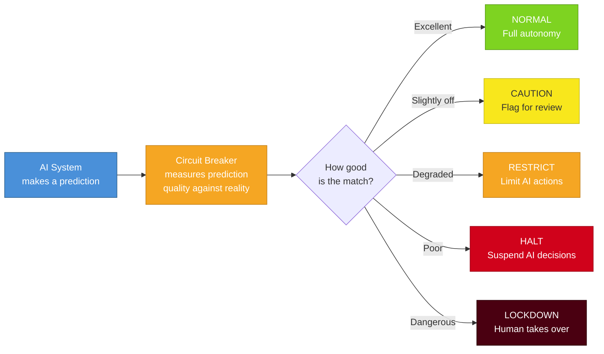
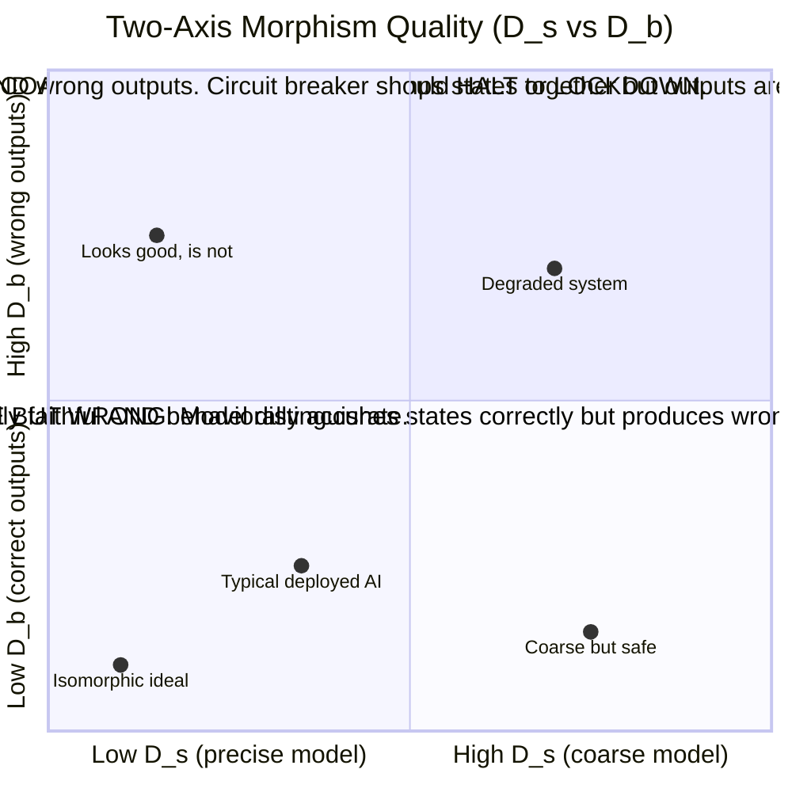
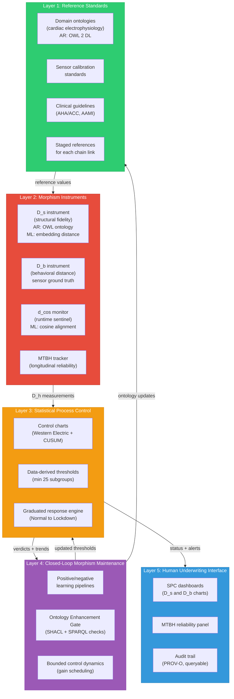
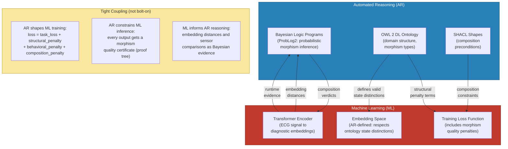
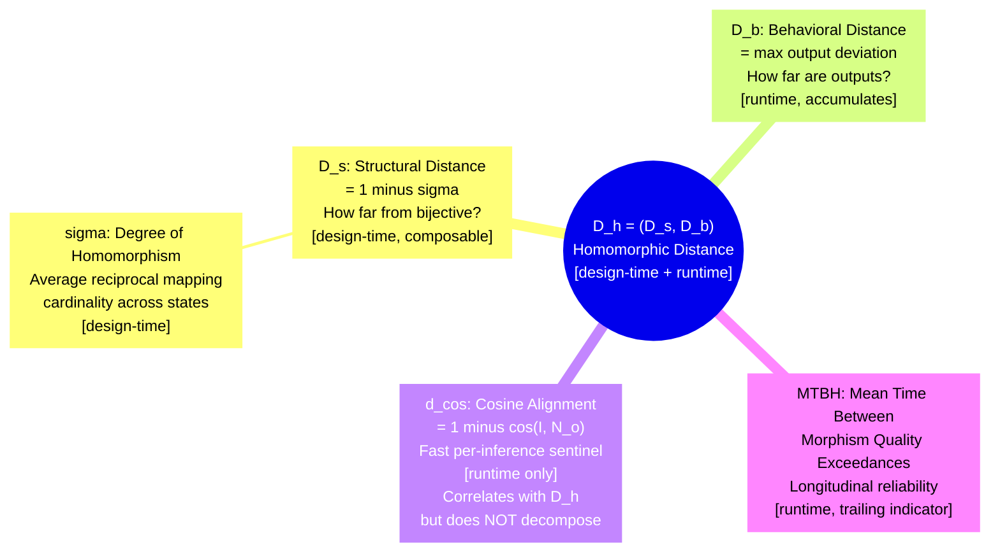
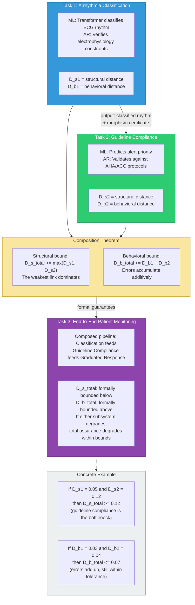

# DARPA CLARA Proposal Diagrams
# Morphism-Grounded Compositional Assurance for Autonomous AI Systems

All diagrams are valid Mermaid syntax. Render with any Mermaid-compatible tool
(VS Code preview, mermaid.live, GitHub markdown, etc.).

---

## Diagram 1: The Big Picture -- What Is the Circuit Breaker?

A high-level overview accessible to any audience. The AI Circuit Breaker
continuously measures how well an AI's internal model matches reality,
then triggers a graduated response when quality degrades.



---

## Diagram 2: The Morphism Chain (ECG Domain)

Shows how information flows from the patient's heart to a clinical
classification, passing through five transformation stages (h1 through h5).
Each link has its own morphism quality D_h = (D_s, D_b). The composition
theorem says the weakest structural link bounds the whole chain.

```mermaid
%% Diagram 2: The Morphism Chain (ECG Domain)
%% Each arrow is a morphism h_i with its own quality measure D_h

flowchart LR
    subgraph Chain["Morphism Chain: Heart to Classification"]
        direction LR
        Z1["Heart<br/>(physical system)"]
        Z2["Electrode Signal<br/>(sensor observation)"]
        Z3["Digital Signal<br/>(ADC output)"]
        Z4["Filtered Signal<br/>(processed)"]
        Z5["Features<br/>(extracted)"]
        Z6["Classification<br/>(diagnosis)"]

        Z1 -->|"h1<br/>D_h1 = (D_s1, D_b1)"| Z2
        Z2 -->|"h2<br/>D_h2 = (D_s2, D_b2)"| Z3
        Z3 -->|"h3<br/>D_h3 = (D_s3, D_b3)"| Z4
        Z4 -->|"h4<br/>D_h4 = (D_s4, D_b4)"| Z5
        Z5 -->|"h5<br/>D_h5 = (D_s5, D_b5)"| Z6
    end

    subgraph Theorem["Composition Theorem"]
        T1["D_s total >= max of all D_s_i<br/>(weakest structural link dominates)"]
        T2["D_b total <= sum of all D_b_i<br/>(behavioral errors accumulate)"]
    end

    Chain -.->|"bounds"| Theorem

    style Z1 fill:#e74c3c,stroke:#c0392b,color:#fff
    style Z6 fill:#2ecc71,stroke:#27ae60,color:#fff
    style T1 fill:#ecf0f1,stroke:#95a5a6,color:#333
    style T2 fill:#ecf0f1,stroke:#95a5a6,color:#333
```



---

## Diagram 3: Two-Axis Morphism Quality

Shows D_s (structural distance) and D_b (behavioral distance) as two
independent axes. Four quadrants characterize different failure modes.
The ideal is the bottom-left corner: D_h = (0, 0).



---

## Diagram 4: Five-Layer Architecture

The circuit breaker's five layers, stacked from foundational (Layer 1,
Reference Standards) to human-facing (Layer 5, Underwriting Interface).
Shows where AR and ML components sit, and data flow between layers.



---

## Diagram 5: AR-ML Tight Coupling

Shows the bidirectional relationship between Automated Reasoning (AR) and
Machine Learning (ML). This is NOT "AR bolted on" as a post-hoc filter.
AR shapes ML training through the loss function, and ML provides runtime
evidence that AR reasons over.



---

## Diagram 6: Terminology Hierarchy

Shows how all the morphism quality terms relate to each other.
D_h is the master vector. D_s and D_b are its two axes (design-time
and runtime). d_cos is a fast runtime proxy. MTBH is longitudinal.



---

## Diagram 7: Phase 1 / Phase 2 Workflow

24-month program timeline. Phase 1 (months 1-15) proves the composition
theorem on a single ECG task. Phase 2 (months 16-24) deepens with a
second ML kind, full pipeline, and domain-transfer analysis.

```mermaid
%% Diagram 7: Phase 1 / Phase 2 Workflow (24 months)
%% Key milestones, demos, and hackathons marked

gantt
    title CLARA Program Timeline (24 Months)
    dateFormat YYYY-MM
    axisFormat %b %Y

    section Phase 1: Prove Composition (15 mo, $1.1M)
    Kickoff + data access               :milestone, m1, 2027-01, 0d
    Theory + ECG ontology                :t1, 2027-01, 4M
    Progress report + SOA baselines      :milestone, m3, 2027-03, 0d
    Single-task AR+ML prototype          :t2, 2027-04, 5M
    Demo: initial AR-ML capability       :milestone, m6, 2027-06, 0d
    Composition experiments              :t3, 2027-08, 5M
    Demo: composed AR-ML capability      :milestone, m9, 2027-09, 0d
    Hackathon prep + inter-performer     :t4, 2027-09, 4M
    Hackathon 1                          :milestone, m12, 2027-12, 0d
    Progress report                      :milestone, m12b, 2027-12, 0d
    Phase 1 closeout                     :t5, 2027-12, 3M
    Phase 1 final deliverable            :milestone, m15, 2028-03, 0d

    section Phase 2: Deepen and Scale (9 mo, $0.75M)
    Second ML kind + AR-constrained training :t6, 2028-04, 3M
    Demo: extended AR-ML (3 kinds)       :milestone, m18, 2028-06, 0d
    Full ECG pipeline + generalization   :t7, 2028-07, 3M
    Demo: three-task composition         :milestone, m21, 2028-09, 0d
    Hackathon 2                          :milestone, m22, 2028-10, 0d
    Domain-transfer analysis + closeout  :t8, 2028-10, 3M
    Phase 2 final deliverable            :milestone, m24, 2028-12, 0d

    section Key Decision Points
    Phase 1/2 transition gate            :milestone, gate, 2028-03, 0d
```

---

## Diagram 8: Composition Theorem Visual

Shows two component tasks (Classification and Guideline Compliance),
each with their own morphism quality D_h, composing into an end-to-end
monitoring system. The composition bounds are shown explicitly.


