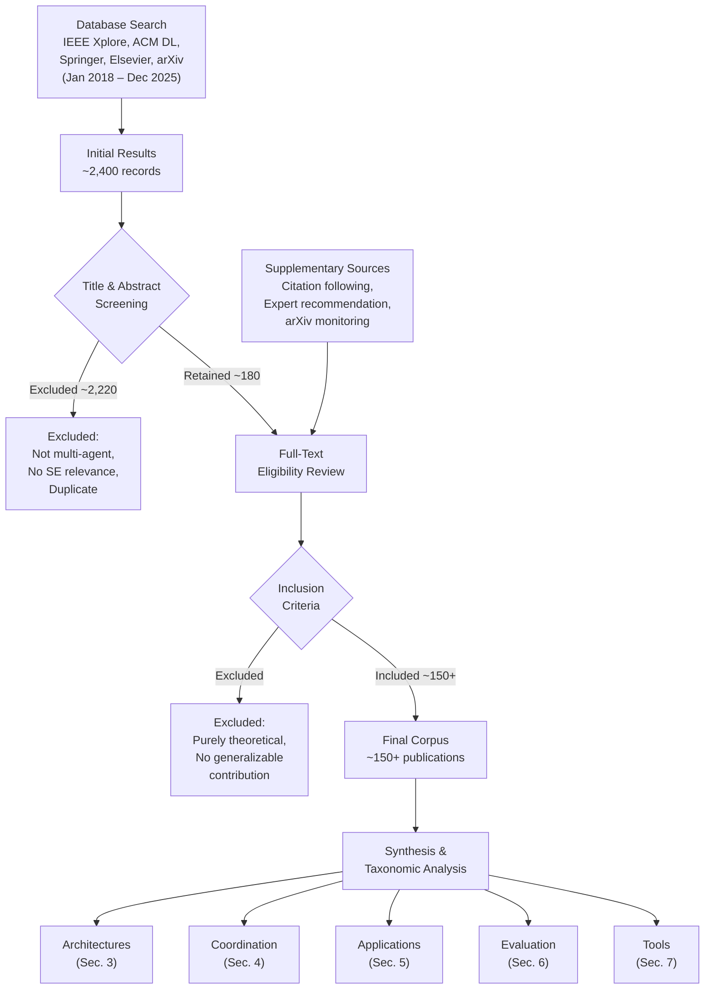

# Section 1: Introduction

**Target length:** ~500 words
**Status:** Draft v0.1

---

## 1. Introduction

### 1.1 Motivation for Survey

The convergence of multi-agent systems research, swarm intelligence, and large language model-based agentic AI creates unprecedented opportunities for augmenting systems engineering practice. Individual AI assistants already help engineers with specific tasks; coordinated multi-agent systems promise more comprehensive support spanning the engineering lifecycle.

Yet this emerging field lacks the systematic organization that mature research areas possess. Literature spans multiple communities—artificial intelligence, software engineering, systems engineering, human factors—with limited cross-referencing. Terminology varies; comparable approaches receive different names; gaps and opportunities remain uncharted. Researchers entering the field face difficulty understanding the landscape; practitioners struggle to assess applicability to their contexts.

This survey addresses these gaps by providing systematic organization of the field, synthesizing contributions across research communities, developing taxonomies of architectures and coordination mechanisms, mapping applications to systems engineering processes, and identifying challenges and research directions.

### 1.2 Scope and Boundaries

This survey covers multi-agent AI systems applicable to systems engineering—the domain-agnostic discipline addressing complex system development across the lifecycle [24, 25, 26]. We distinguish systems engineering (SE) from the narrower software engineering, though we include software engineering literature where relevant to broader SE application.

**Included:**
- Multi-agent systems architectures (classical and LLM-based)
- Coordination mechanisms for agent collaboration
- Applications to SE technical processes per ISO 15288
- Evaluation methods and benchmarks
- Tools and frameworks
- Challenges and research directions

**Excluded:**
- Single-agent AI assistants (covered in related surveys)
- General multi-agent systems without engineering application
- Domain-specific applications without generalizable insights
- Detailed treatment of underlying LLM architectures

### 1.3 Survey Methodology

This survey follows established systematic review practices, informed by PRISMA guidelines [83], adapted for a rapidly evolving field.

**Literature identification:** We searched IEEE Xplore, ACM Digital Library, Springer, Elsevier, and arXiv for publications from January 2018 through December 2025, using terms including "multi-agent systems," "swarm intelligence," "LLM agents," combined with "systems engineering," "requirements," "architecture," "verification," and related terms. The initial database search yielded approximately 2,400 results, which were reduced to approximately 180 after title and abstract screening against relevance criteria. We supplemented database searches with forward and backward citation following from key papers and with expert recommendation. Due to the rapid evolution of LLM-based agent research, we additionally monitored arXiv preprints and industry technical reports throughout the review period to capture significant contributions not yet appearing in peer-reviewed venues.

**Selection criteria:** We included peer-reviewed publications and significant preprints addressing multi-agent AI approaches with relevance to systems engineering processes. We excluded purely theoretical work without application consideration and purely domain-specific applications without generalizable contribution.

**Synthesis approach:** We organized findings according to taxonomic frameworks developed iteratively during review. We assessed application maturity based on evidence type (laboratory, field trial, production) and validation rigor.

**Limitations:** The field evolves rapidly; some recent work may be missed. LLM-based agent research moves faster than peer review; we include significant preprints while noting lower validation standards. Our SE perspective may underweight contributions from adjacent fields.

Figure 1 summarizes the survey methodology.

### 1.4 Paper Organization

The remainder of this paper is organized as follows:
- Section 2 provides background on multi-agent systems, swarm intelligence, LLM-based agents, and systems engineering processes
- Section 3 presents a taxonomy of agent architectures
- Section 4 surveys coordination mechanisms
- Section 5 maps applications to systems engineering process areas
- Section 6 examines evaluation methods and benchmarks
- Section 7 reviews tools and frameworks
- Section 8 analyzes challenges and open problems
- Section 9 proposes research directions
- Section 10 concludes

Different readers may benefit from different paths through this material. Researchers new to multi-agent systems may benefit from reading Sections 2 through 4 sequentially to build foundational understanding before examining applications. Practitioners assessing applicability to their organizations should focus on Sections 5, 7, and 8, which map capabilities to SE processes, review available tools, and discuss adoption challenges. Those primarily seeking research opportunities should consult Sections 6, 8, and 9, which identify evaluation gaps, open problems, and future directions.

---

**Word count:** ~600 words
**Subsections:** 4

---

## Revision Notes

- [x] Update literature search details with actual search results
- [x] Add figure showing survey methodology
- [x] Consider adding reading guide for different audiences
- [x] Verify section numbering matches final organization

