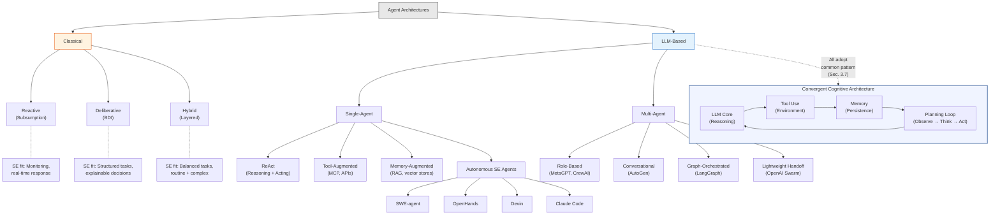

# Section 3: Taxonomy of Agent Architectures

**Target length:** ~1,500 words
**Status:** Draft v0.1

---

## 3. Taxonomy of Agent Architectures

This section presents a taxonomy of agent architectures relevant to systems engineering applications, tracing evolution from classical approaches through contemporary LLM-based designs.

### 3.1 Classification Framework

Agent architectures can be classified along several dimensions:

**Reasoning approach:** How does the agent decide what to do?
- Reactive: Stimulus-response mappings
- Deliberative: Explicit reasoning about goals and plans
- Hybrid: Combining reactive and deliberative elements

**Knowledge representation:** How does the agent represent its understanding?
- Implicit: Encoded in behavior rules or neural weights
- Explicit: Symbolic knowledge bases, ontologies
- Hybrid: Combining implicit and explicit representations

**Learning capability:** Can the agent improve from experience?
- Static: Fixed behavior after deployment
- Adaptive: Learning during operation
- Meta-learning: Learning how to learn

**Foundation model:** What provides core capabilities?
- Classical AI: Rule-based, search, optimization
- Machine learning: Statistical models, neural networks
- Large language models: Pre-trained transformer models

### 3.2 Reactive Architectures

Reactive architectures eschew explicit world models and deliberation in favor of direct stimulus-response mappings. Brooks' subsumption architecture [29] demonstrated that intelligent behavior could emerge from layered reactive behaviors without symbolic reasoning.

**Characteristics:**
- Fast response to environmental changes
- Robust to model errors (no model to be wrong)
- Limited planning horizon
- Behavior emerges from interaction of simple rules

**SE applications:** Reactive architectures suit real-time monitoring and response—detecting anomalies, triggering alerts, managing routine workflows. They are less suited to complex reasoning tasks like trade studies or requirements analysis.

**Limitations for SE:** Systems engineering frequently requires reasoning about abstract concepts (requirements, architectures) that lack direct environmental correlates. Pure reactive approaches cannot address tasks requiring deliberation, planning, or explanation.

### 3.3 Deliberative Architectures

Deliberative architectures maintain explicit world models and reason about goals, plans, and actions. The Belief-Desire-Intention (BDI) model [30, 31] provides an influential framework where agents have beliefs about the world, desires (goals) they wish to achieve, and intentions (committed plans) they are executing.

**Characteristics:**
- Explicit goal representation and pursuit
- Planning and plan execution
- Reasoning about action consequences
- Explainable decision-making (in principle)

**SE applications:** BDI agents can model engineering roles with explicit goals (e.g., a requirements agent with goals of completeness, consistency, traceability) and plans for achieving them (analysis procedures, review protocols). Goal-directed behavior aligns with engineering objectives.

**Implementations:** JACK, Jadex, Jason provide BDI agent platforms [32, 33]. These frameworks support agent development with explicit belief bases, goal management, and plan libraries.

**Limitations for SE:** Classical BDI implementations require explicit knowledge engineering—defining beliefs, goals, and plans in advance. This limits adaptability to novel situations and requires substantial development effort to encode domain knowledge.

### 3.4 Hybrid Architectures

Hybrid architectures combine reactive and deliberative elements, typically in layered designs where reactive behaviors handle routine situations while deliberative reasoning addresses complex cases.

**Layered architectures** [34] organize agent capabilities hierarchically:
- Reactive layer: Immediate responses to environmental conditions
- Planning layer: Goal-directed reasoning and plan generation
- Cooperative layer: Social reasoning and coordination with other agents

**InteRRaP** [35] exemplifies layered hybrid design with behavior-based, planning, and cooperation layers, each with associated knowledge bases.

**SE applications:** Hybrid architectures can provide responsive behavior for routine engineering tasks while engaging deliberative reasoning for complex decisions. A requirements agent might reactively maintain traceability links while deliberatively analyzing completeness.

### 3.5 LLM-Based Agent Architectures

Large language model-based agents represent a paradigm shift, leveraging pre-trained foundation models rather than hand-crafted knowledge bases. Several architectural patterns have emerged:

**ReAct (Reasoning + Acting)** [36] interleaves reasoning traces with actions, enabling LLMs to reason about what action to take, execute it, observe results, and continue reasoning. ReAct provides a general pattern for LLM-based agency.

**Tool-augmented architectures** [37, 38] extend LLM capabilities through tool invocation. The LLM decides which tools to call, formulates inputs, interprets outputs, and integrates results into ongoing reasoning. Tools can include calculators, search engines, code interpreters, and domain-specific applications.

**Memory-augmented architectures** [39] provide persistent memory beyond the LLM's context window:
- Short-term memory: Recent interaction context
- Long-term memory: Persistent knowledge, accumulated experience
- Episodic memory: Records of past interactions and outcomes

**Retrieval-Augmented Generation (RAG)** [40] grounds LLM responses in retrieved documents, enabling access to domain knowledge, standards, and organizational practices without fine-tuning.

**Multi-agent LLM architectures** coordinate multiple LLM-based agents:
- Role-based: Agents assume specialized roles (researcher, coder, reviewer)
- Debate-based: Agents argue positions, refine through discourse
- Hierarchical: Manager agents coordinate worker agents
- Peer: Agents collaborate as equals with complementary capabilities

**SE-relevant frameworks:**
- **MetaGPT** [41]: Multi-agent software development with role-based specialization
- **AutoGen** [42]: Conversational agents with customizable patterns
- **CrewAI** [43]: Role-based agent crews for complex tasks
- **LangGraph** [44]: Graph-based agent orchestration

**Autonomous software engineering agents** represent a notable subclass of LLM-based architectures that target end-to-end task completion with minimal human intervention:
- **SWE-agent** [97]: An agent interface designed specifically for resolving GitHub issues. SWE-agent pairs an LLM with a custom shell environment and file editor, achieving strong performance on the SWE-bench benchmark [67]. Its architecture emphasizes agent-computer interface design, demonstrating that how an LLM interacts with tools matters as much as the model's intrinsic capability.
- **OpenHands** [98] (formerly OpenDevin): An open-source platform for autonomous software development agents that execute within sandboxed environments. OpenHands provides a runtime architecture separating the agent's planning loop from code execution, enabling safe exploration of solution strategies without compromising the host system.
- **Devin** [99] (Cognition, 2024): Marketed as the first "AI software engineer," Devin integrates a code editor, web browser, terminal, and planner within a persistent agent environment. Its architecture demonstrated commercial viability of fully autonomous coding agents, though independent evaluations have shown performance varies substantially across task domains.
- **Claude Code** [100] (Anthropic): An agentic coding tool providing the LLM with direct access to file editing, terminal execution, and web search tools. Claude Code operates in an extended thinking mode with tool use, representing an architecture where a single powerful model orchestrates complex multi-step engineering tasks through iterative tool invocation.
- **OpenAI Swarm** [101]: An experimental framework for lightweight multi-agent orchestration. Swarm introduces the concept of "handoffs" between specialized agents, each defined by instructions and tool sets, with minimal coordination overhead. Its architecture favors simplicity—agents are essentially functions with LLM-backed decision-making—making it suitable for prototyping multi-agent workflows.

Figure 3 presents the taxonomy of agent architectures, showing the evolution from classical designs to the convergent LLM-based cognitive architecture pattern.

### 3.6 Architecture Comparison

Table 1 compares architectural approaches across key dimensions.

| Architecture | Reasoning | Knowledge | Learning | Planning | Explainability | Autonomy Level | SE Fit |
|--------------|-----------|-----------|----------|----------|----------------|----------------|--------|
| Reactive | Stimulus-response | Implicit | Limited | None | Low | Low | Monitoring |
| BDI | Goal-directed | Explicit | Limited | Yes | High | Moderate | Structured tasks |
| Hybrid | Layered | Mixed | Moderate | Partial | Moderate | Moderate | Balanced tasks |
| LLM-based | Emergent | Implicit + RAG | In-context | Via prompting | Moderate | Moderate | Flexible tasks |
| LLM + Tools | Augmented | Hybrid | Adaptive | Via reasoning | Moderate | High | Complex tasks |
| Multi-agent LLM | Distributed | Distributed | Collective | Coordinated | Variable | High | Full lifecycle |
| Autonomous SE agent | End-to-end | Hybrid + tools | In-context + feedback | Iterative | Low-Moderate | Full | Software tasks |
| Lightweight swarm | Delegated | Per-agent | Handoff-based | Orchestrated | Low | High | Prototyping |

### 3.7 Architectural Convergence

A striking observation across recent LLM-based agent frameworks is their convergence toward a common cognitive architecture pattern. Despite diverse origins and application domains, nearly all contemporary systems adopt the same structural template: an LLM core providing reasoning and natural language understanding, augmented with tool use interfaces for acting on the environment, memory systems for maintaining state across interactions, and a planning loop that iterates between reasoning, action, and observation [26].

This convergence stands in sharp contrast to classical agent architectures, where reactive, deliberative, and hybrid systems differed fundamentally in their internal structures—subsumption layers bore no resemblance to BDI belief bases, and neither resembled blackboard systems. In the LLM era, the architectural differences between MetaGPT, AutoGen, SWE-agent, and Claude Code are comparatively superficial: they share the same foundation model backbone and differ primarily in prompt design, tool configuration, coordination topology, and the granularity of human oversight [102]. The "cognitive architecture for language agents" pattern identified by Sumers et al. [26] thus functions as a de facto standard, with framework-specific innovations occurring at the integration layer rather than at the architectural core.

This convergence has practical implications for systems engineering adoption. Organizations evaluating multi-agent architectures need not choose between fundamentally incompatible paradigms; instead, selection criteria shift toward tool ecosystem maturity, coordination mechanism suitability, and the degree of autonomy appropriate for the engineering context [103].

### 3.8 Architectural Trends

Several trends characterize the evolution of agent architectures for engineering applications:

**Foundation model dominance.** LLM-based architectures increasingly dominate new development, leveraging pre-trained capabilities rather than hand-crafted knowledge. This shifts development effort from knowledge engineering to prompt engineering and tool integration.

**Hybrid knowledge integration.** Pure LLM approaches suffer from hallucination and knowledge gaps; production systems increasingly integrate retrieval (RAG), structured knowledge, and tool-based verification to ground LLM reasoning.

**Specialization through prompting.** Rather than architecturally distinct agent types, LLM-based systems achieve specialization through role prompts, system instructions, and tool configurations applied to a common foundation model.

**Emergent coordination.** Multi-agent LLM systems exhibit coordination patterns not explicitly programmed, emerging from agent interactions. This creates both opportunities (novel solutions) and challenges (unpredictable behavior).

**Continuous evolution.** Unlike classical agents with fixed architectures, LLM-based agents evolve as foundation models improve. Architectural patterns that leverage model capabilities will benefit from ongoing model advancement.

---

**Word count:** ~1,500 words
**Subsections:** 9
**Tables:** 1
**References cited:** [29]-[44], [67], [97]-[103]

---

## Revision Notes

- [x] Add more detail on specific LLM agent frameworks
- [x] Consider adding architecture diagram
- [x] Expand comparison table with more dimensions
- [x] Add citations for recent multi-agent frameworks

