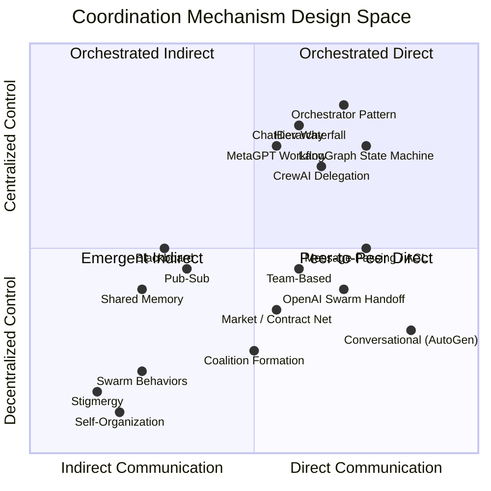

# Section 4: Coordination Mechanisms

**Target length:** ~1,200 words
**Status:** Draft v0.1

---

## 4. Coordination Mechanisms

Effective multi-agent systems require coordination—managing dependencies, resolving conflicts, and achieving coherent collective behavior. This section surveys coordination mechanisms applicable to AI swarms in systems engineering contexts.

### 4.1 Classification of Coordination Approaches

Malone and Crowston [45] define coordination as "managing dependencies between activities." Coordination mechanisms can be classified by:

**Communication directness:**
- Direct: Explicit message exchange between agents
- Indirect: Coordination through shared environment (stigmergy)

**Control structure:**
- Centralized: Coordinator manages agent activities
- Decentralized: Agents coordinate peer-to-peer
- Hierarchical: Multi-level coordination structure

**Temporal coupling:**
- Synchronous: Agents coordinate in real-time
- Asynchronous: Agents coordinate through persistent state

**Formality:**
- Structured: Defined protocols and interfaces
- Unstructured: Natural language or emergent patterns

### 4.2 Communication-Based Coordination

Communication-based approaches coordinate through explicit information exchange:

**Message passing** provides direct agent-to-agent communication. Agent communication languages (ACL) define message semantics [46]. FIPA-ACL specifies performatives (inform, request, propose) enabling structured dialogue. In LLM-based systems, natural language messages often replace formal ACLs.

**Blackboard systems** [47] coordinate through shared data structures. Agents post contributions to a shared "blackboard"; other agents observe and respond. This decouples agents temporally and reduces direct communication complexity. For SE, shared system models can serve as blackboards—agents contribute analyses, other agents incorporate findings.

**Publish-subscribe** patterns enable event-driven coordination [48]. Agents publish events; interested agents subscribe and receive notifications. This supports loose coupling and scalability. SE applications include change propagation—when requirements change, subscribed architecture agents receive notifications.

**Shared memory** provides coordination through common state access. Agents read and write shared data structures, observing each other's contributions. Vector databases in LLM systems serve as shared memory, enabling agents to store and retrieve information produced by other agents.

### 4.3 Organization-Based Coordination

Organization-based approaches structure agent relationships to manage coordination:

**Hierarchical organizations** arrange agents in authority structures [49]. Higher-level agents decompose tasks, assign work, and integrate results. This reduces coordination complexity—each agent coordinates primarily with its supervisor and subordinates. SE parallels: chief systems engineer coordinating IPT leads who coordinate discipline engineers.

**Market-based coordination** uses economic mechanisms [50]. The Contract Net Protocol [51] exemplifies market coordination: manager agents announce tasks; contractor agents bid; managers award contracts based on bids. This enables dynamic task allocation without centralized planning.

**Team-based coordination** groups agents into teams pursuing shared goals [52]. Teamwork theories (SharedPlans, Joint Intentions) formalize how agents commit to collective objectives and coordinate execution. SE teams naturally map to agent teams with shared project goals.

**Coalition formation** enables dynamic grouping for specific objectives [53]. Agents form coalitions when collaboration benefits exceed costs, dissolving when objectives are met. For SE, coalitions might form for specific trade studies or reviews, then dissolve.

### 4.4 Emergent Coordination

Emergent approaches achieve coordination without explicit protocols:

**Stigmergy** coordinates through environmental modification [12]. Agents leave traces (pheromones, markers) that influence other agents' behavior. No direct communication required; coordination emerges from accumulated environmental changes. SE applications: agents annotating shared models, with annotations guiding subsequent agent attention.

**Self-organization** produces coordinated structures from local interactions [54]. Agents following simple local rules generate global patterns without central control. This enables robust, scalable coordination but limits predictability.

**Swarm behaviors** exhibit collective intelligence through decentralized coordination [9]. Individual agents respond to local information; collective behavior emerges from aggregated responses. Swarm coordination suits exploration and optimization but may struggle with precision requirements.

### 4.5 Hybrid Approaches

Practical systems often combine coordination mechanisms:

**Hierarchical with market elements** uses hierarchy for task decomposition and markets for resource allocation within levels.

**Centralized planning with distributed execution** employs central coordinators for planning while agents execute autonomously, reporting status.

**Structured protocols with natural language** combines formal coordination protocols with natural language communication for flexibility.

### 4.6 Coordination in LLM-Based Systems

LLM-based multi-agent systems exhibit distinctive coordination patterns:

**Conversational coordination** uses natural language dialogue rather than formal protocols. Agents discuss, debate, and negotiate in natural language, leveraging LLM conversational capabilities. This enables flexibility but may sacrifice precision.

**Prompt-based role assignment** coordinates through role definitions in system prompts. Each agent's prompt defines its responsibilities, communication patterns, and coordination expectations.

**Orchestrator patterns** employ a central agent (often called "supervisor" or "manager") that routes tasks, manages workflow, and synthesizes outputs. This provides control but creates bottlenecks.

**Reflection and critique** patterns have agents review each other's outputs, providing feedback that drives iteration. Coordination emerges through iterative refinement.

**Memory-mediated coordination** uses shared memory systems (vector stores, knowledge graphs) as coordination substrate. Agents contribute to and query shared memory, achieving indirect coordination.

**Framework-specific coordination implementations** illustrate how these abstract patterns manifest in practice:
- **MetaGPT** [41] employs a "Software Company" metaphor in which agents assume roles (Product Manager, Architect, Engineer, QA) and coordinate through a shared message pool and structured document outputs. Each role publishes artifacts (PRDs, design documents, code) that downstream roles consume, enforcing a sequential dependency chain akin to a waterfall process [104].
- **AutoGen** [42] implements conversational turn-taking where agents exchange natural language messages in configurable interaction patterns. Speaker selection can be round-robin, random, or LLM-directed, enabling flexible coordination topologies from simple two-agent dialogues to complex group chats with dynamic participation [105].
- **CrewAI** [43] uses a "crew" metaphor with explicit task delegation. Agents are assigned roles with defined goals and backstories, and tasks flow through sequential or hierarchical process models. A hierarchical process designates a manager agent that delegates subtasks and synthesizes results [106].
- **LangGraph** [44] takes a graph-theoretic approach, modeling coordination as explicit state machines. Nodes represent agent actions or decision points; edges define transitions conditioned on state. This provides deterministic control flow while allowing individual nodes to invoke LLM reasoning, offering a balance between predictability and flexibility [107].
- **ChatDev** [108] simulates a software company with agents coordinating through waterfall-model phases (design, coding, testing, documentation). Phase transitions are explicitly structured, and within each phase, agents engage in role-playing dialogues to produce artifacts.

Figure 4 maps coordination mechanisms by control structure and communication directness, positioning framework implementations within the design space.

### 4.7 Comparison and Trade-offs

Table 2 compares coordination mechanisms across key dimensions.

| Mechanism | Coupling | Scalability | Predictability | Flexibility | SE Suitability |
|-----------|----------|-------------|----------------|-------------|----------------|
| Message passing | Tight | Moderate | High | Moderate | Structured workflows |
| Blackboard | Loose | Good | Moderate | High | Shared model updates |
| Hierarchy | Moderate | Good | High | Low | Large teams |
| Market | Loose | Good | Moderate | High | Resource allocation |
| Stigmergy | Loose | Excellent | Low | High | Exploration tasks |
| Conversational | Tight | Limited | Low | Excellent | Creative tasks |
| Orchestrator | Tight | Limited | High | Moderate | Controlled workflows |

**Trade-off considerations for SE:**

*Predictability vs. flexibility:* Safety-critical SE applications prioritize predictability; exploratory tasks benefit from flexibility. Coordination mechanism choice should align with task requirements.

*Scalability vs. control:* Larger swarms require scalable coordination (hierarchical, stigmergic) but may sacrifice fine-grained control. Task characteristics determine appropriate balance.

*Communication overhead:* Rich communication (conversational) enables nuanced coordination but incurs token costs and latency. Efficient protocols reduce overhead at the cost of expressiveness.

*Token economics:* In LLM-based systems, coordination carries direct financial cost through token consumption. Conversational coordination between N agents generates O(N^2) message pairs, each consuming inference tokens. As agent count grows, coordination token costs can dominate task-execution costs, creating economic pressure toward sparse communication topologies, hierarchical delegation, or shared-memory approaches that reduce pairwise message exchange [109].

*Emergence management:* Emergent coordination can produce beneficial novelty or harmful unexpected behavior. SE contexts may require bounds on emergence through hybrid approaches.

### 4.8 Coordination Failures and Mitigations

Multi-agent coordination introduces failure modes absent in single-agent systems. Understanding these failure patterns is essential for engineering reliable swarms.

**Agent echo chambers** occur when agents reinforce each other's errors through positive feedback loops. An agent producing an incorrect analysis may receive validation from peer agents that lack independent grounding, causing the error to propagate and become entrenched in the collective output [110].

**Degenerate consensus** arises when agents converge prematurely on a suboptimal solution. Group pressure dynamics—even among artificial agents—can suppress exploratory behavior, particularly when majority-voting or debate-based coordination mechanisms are employed without diversity safeguards.

**Coordination overhead exceeding task benefit** represents a practical failure where the computational and financial cost of multi-agent coordination surpasses the quality improvement over a single-agent baseline. This is especially prevalent in tasks with limited decomposability.

**Cascading failures** result from tight agent dependencies: when an upstream agent produces malformed output, downstream agents that depend on it may fail in sequence, potentially amplifying a minor error into a system-wide breakdown [111].

**Mitigations** include: diversity injection through varied model temperatures or distinct foundation models; independent verification where agents cross-check results against ground truth rather than peer output; graceful degradation that allows the system to produce partial results when individual agents fail; and circuit breakers that halt coordination when error indicators exceed defined thresholds.

---

**Word count:** ~1,200 words
**Subsections:** 8
**Tables:** 1
**References cited:** [45]-[54], [104]-[111]

---

## Revision Notes

- [x] Add specific examples from LLM multi-agent frameworks
- [x] Consider adding coordination diagram
- [x] Expand trade-off analysis with quantitative considerations
- [x] Add discussion of coordination failures and mitigations

