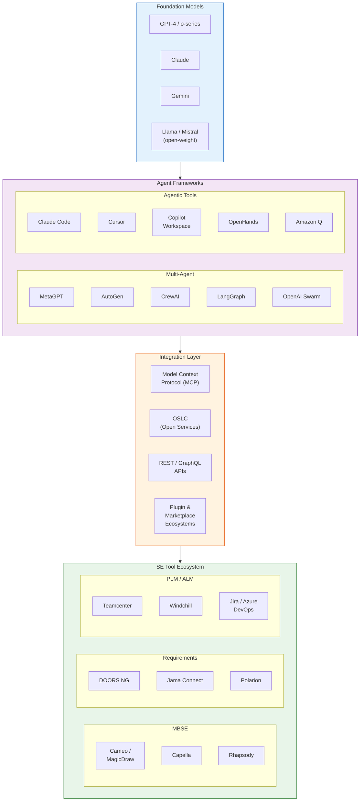

# Section 7: Tools and Frameworks

**Target length:** ~800-900 words
**Status:** Draft v0.2

---

## 7. Tools and Frameworks

This section surveys tools and frameworks enabling multi-agent AI system development, from classical MAS platforms through contemporary LLM-based frameworks, and examines integration with systems engineering tools.

### 7.1 Multi-Agent Platforms

Classical multi-agent platforms provide infrastructure for agent development and deployment:

**JADE (Java Agent DEvelopment Framework)** [71] provides FIPA-compliant agent infrastructure including agent lifecycle management, communication, and directory services. Widely used in research and education, JADE offers mature infrastructure but requires substantial development effort for sophisticated agents.

**SPADE (Smart Python Agent Development Environment)** [72] offers Python-based agent development with XMPP-based communication. Its Python foundation facilitates integration with modern AI libraries.

**Jason** [73] implements the AgentSpeak language for BDI agent development, providing declarative agent programming with explicit beliefs, goals, and plans. Jason suits applications requiring explainable agent reasoning.

**MASON** [74] provides a fast discrete-event multi-agent simulation library in Java, suited for large-scale agent-based modeling and simulation.

**Mesa** [75] offers Python-based agent-based modeling, providing accessible ABM capabilities with visualization support.

**Limitations for SE:** Classical platforms require explicit agent programming and lack native integration with LLM capabilities. They provide infrastructure but not the reasoning capabilities modern SE applications require.

### 7.2 LLM-Based Agent Frameworks

The emergence of LLMs has spawned frameworks specifically supporting LLM-based agents:

**LangChain** [76] provides abstractions for LLM application development including chains, agents, and tools. LangChain agents can use tools, maintain memory, and execute multi-step reasoning. Widely adopted with extensive tool ecosystem.

**LlamaIndex** [77] focuses on connecting LLMs with external data through indexing and retrieval, enabling RAG-based applications. Strong support for document processing and knowledge integration.

**AutoGPT** [78] pioneered autonomous LLM agents pursuing goals through iterative reasoning and action. Demonstrated potential for autonomous task completion but also limitations in reliability and control.

**MetaGPT** [79] implements multi-agent software development with specialized roles (product manager, architect, engineer). Demonstrates role-based multi-agent patterns for software engineering tasks.

**CrewAI** [80] provides framework for orchestrating role-based agent "crews" with defined roles, goals, and collaboration patterns. Emphasizes agent specialization and coordination.

**AutoGen** [81] from Microsoft supports conversational agents with customizable interaction patterns, enabling flexible multi-agent dialogue configurations.

**LangGraph** [82] extends LangChain with graph-based agent orchestration, supporting complex multi-agent workflows with explicit state management and control flow.

**OpenHands** (formerly OpenDevin) [98] provides an open-source agent platform for software engineering tasks with sandboxed execution environments, enabling agents to safely write, test, and debug code in isolated containers.

**Claude Code** (Anthropic) [100] is an agentic coding assistant with direct terminal access, file editing capabilities, and integration via the Model Context Protocol (MCP), allowing tool-augmented workflows within a developer's local environment.

**Cursor** [132] represents the AI-first code editor paradigm, deeply integrating LLM agents into the development workflow with context-aware code generation and multi-file editing.

**GitHub Copilot Workspace** [133] extends the Copilot ecosystem into a multi-agent workspace for planning and implementing changes across entire repositories, bridging issue tracking with automated code generation.

**Amazon Q Developer** [134] provides an AWS-integrated AI developer agent supporting code generation, transformation, and debugging within cloud-native development workflows.

**OpenAI Swarm** [101] offers a lightweight experimental multi-agent framework emphasizing agent handoffs and routines as first-class coordination primitives, prioritizing simplicity over infrastructure complexity.

#### 7.2.1 Emerging Patterns

Several cross-cutting patterns are emerging across LLM-based agent frameworks. The **Model Context Protocol (MCP)** is gaining traction as an open standard for tool-agent integration, providing a uniform interface through which agents discover and invoke external tools regardless of the underlying framework [100]. **Agent-computer interfaces** are diversifying beyond API calls to include terminal interaction, browser automation, and GUI manipulation, expanding the range of tasks agents can perform. **Sandboxed execution environments** — containerized or virtualized workspaces in which agents execute code and system commands — are becoming a standard safety mechanism, mitigating the risks of autonomous agent operation [98]. Finally, **agent marketplaces and plugin ecosystems** are emerging around major platforms, enabling composable agent capabilities and accelerating adoption through community-contributed integrations.

Figure 5 illustrates the layered tool and framework landscape, showing how agent frameworks connect to SE tooling through integration layers.

**Comparison considerations:**
- LangChain/LlamaIndex: General-purpose, extensive ecosystem
- MetaGPT/CrewAI: Role-based specialization, team metaphors
- AutoGen: Conversational patterns, research-oriented
- LangGraph: Workflow orchestration, state management
- OpenHands/Claude Code/Cursor: Developer-facing agentic tools with environment access
- Copilot Workspace/Amazon Q: Platform-integrated enterprise agents
- OpenAI Swarm: Minimalist multi-agent coordination

### 7.3 SE Tool Integration

Effective multi-agent SE applications require integration with existing engineering tools:

**MBSE tools:**
- Cameo Systems Modeler / MagicDraw (SysML modeling) — exposes a REST API for programmatic model element creation, query, and modification, enabling agents to read and update SysML diagrams
- IBM Engineering Systems Design Rhapsody
- Capella (MBSE for systems architects)
- Integration typically via APIs, model import/export, or direct database access

**Requirements management:**
- IBM DOORS Next Generation provides a RESTful OSLC-compliant API through which agents can query, create, and trace requirements across modules
- Jama Connect
- Polarion
- Integration enables AI agents to read, analyze, and potentially update requirements

**PLM/PDM systems:**
- Siemens Teamcenter
- PTC Windchill
- Dassault 3DEXPERIENCE
- Integration provides access to product data, configurations, and workflows

**ALM tools:**
- Jira (issue/task tracking)
- Azure DevOps
- GitLab
- Integration supports workflow coordination and artifact management

**Standards-based integration:** The Open Services for Lifecycle Collaboration (OSLC) specification provides a set of RESTful web service standards for lifecycle tool integration, offering a potential uniform interface layer through which agents can interact with heterogeneous SE tools. Digital thread platforms — which maintain linked traceability across requirements, design, implementation, and test artifacts — represent a promising integration substrate, as they aggregate the cross-lifecycle data that multi-agent SE systems require.

**Integration challenges:**
- Proprietary APIs and data formats
- Authentication and access control
- Data consistency and transaction management
- Performance at scale

### 7.4 Capability Comparison

Table 4 compares framework capabilities relevant to SE applications.

| Framework | Multi-Agent | Memory | Tools | Planning | SE Integration | Maturity |
|-----------|-------------|--------|-------|----------|----------------|----------|
| JADE | Native | Custom | Custom | Custom | Low | High |
| Jason | Native | BDI | Custom | BDI | Low | Moderate |
| LangChain | Via agents | Yes | Extensive | Via prompts | Moderate | High |
| AutoGen | Native | Yes | Moderate | Via dialogue | Low | Moderate |
| CrewAI | Native | Yes | Moderate | Role-based | Low | Moderate |
| MetaGPT | Native | Yes | Code-focused | Workflow | Low (SW only) | Moderate |
| LangGraph | Native | Yes | Via LangChain | Graph-based | Moderate | Emerging |
| OpenHands | Native | Yes | Sandboxed exec | Task-based | Low (SW only) | Emerging |
| Claude Code | Via MCP | Yes | MCP ecosystem | Agentic | Moderate | Emerging |
| Cursor | Via editor | Yes | Editor-native | Inline | Low (SW only) | Emerging |
| Copilot Workspace | Native | Yes | GitHub-native | Issue-to-PR | Low (SW only) | Emerging |
| Amazon Q | Via AWS | Yes | AWS services | Task-based | Low | Emerging |
| OpenAI Swarm | Native | Minimal | Custom | Handoff-based | Low | Experimental |

**Observations:**
- No framework provides native SE tool integration; custom development required
- LLM-based frameworks offer superior reasoning but less multi-agent infrastructure
- Classical platforms offer robust infrastructure but lack modern AI capabilities
- Gap exists for SE-specific multi-agent frameworks
- Newer agentic tools (OpenHands, Claude Code, Cursor) emphasize environment access and sandboxed execution but remain oriented toward software engineering rather than broader SE disciplines

**Emerging direction:** Hybrid approaches combining classical MAS infrastructure (coordination, lifecycle) with LLM-based reasoning capabilities may address current limitations.

**Framework selection criteria.** Practitioners evaluating frameworks for SE applications should consider several dimensions: (1) native multi-agent support and coordination mechanisms, (2) breadth of the tool ecosystem and extensibility via protocols such as MCP, (3) potential for integration with domain-specific SE tools (MBSE platforms, requirements managers, PLM systems), (4) scalability with respect to agent count and artifact volume, (5) cost structure including LLM inference costs, (6) open-source availability and licensing terms, and (7) community maturity and long-term maintenance trajectory. At present, no single framework satisfies all of these criteria simultaneously; SE-specific deployments will likely require composing capabilities from multiple frameworks or extending an existing platform with custom integrations.

---

**Word count:** ~890 words
**Subsections:** 4 (plus 7.2.1)
**Tables:** 1
**References cited:** [71]-[82], [98], [100]-[101], [132]-[134]

---

## Revision Notes

- [x] Add more recent frameworks (2024-2026 releases)
- [x] Expand SE tool integration section with specific APIs
- [x] Consider adding architecture diagrams for key frameworks
- [x] Add discussion of framework selection criteria

